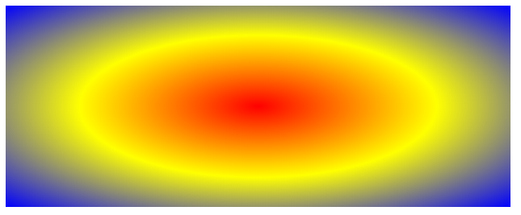
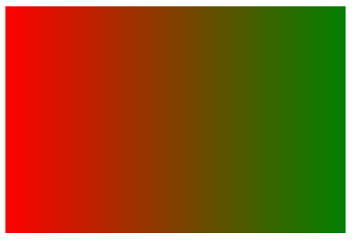
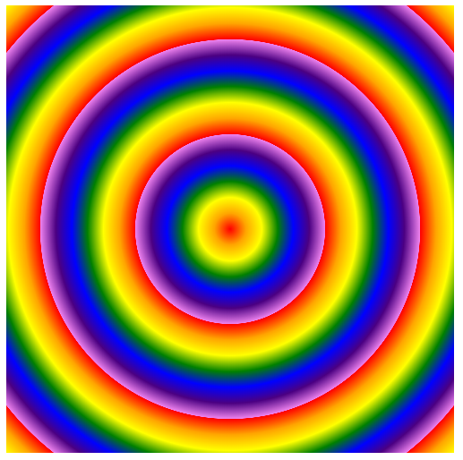
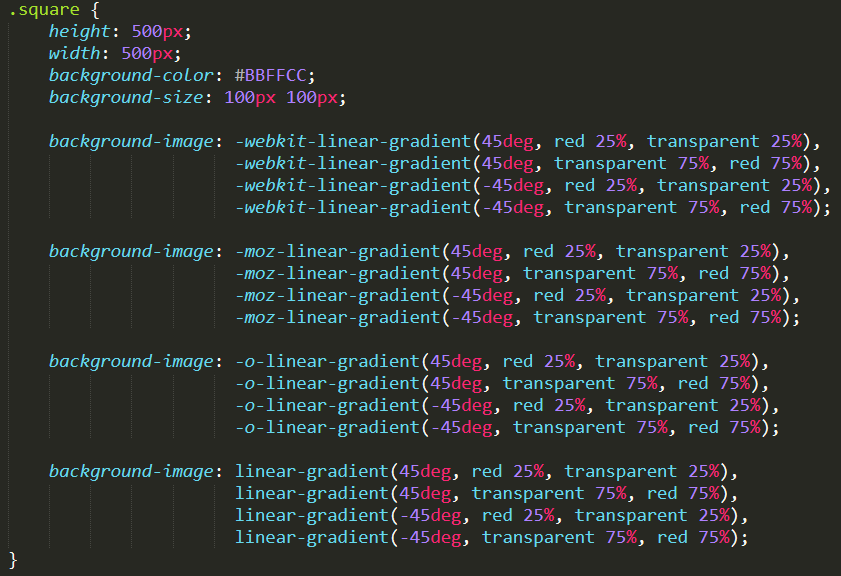

# CSS3


## 目录


1. [CSS3选择器](#1)

2. [CSS3边框与圆角](#2)

	- [CSS3圆角](#2a)
	- [CSS3盒阴影](#2b)
	- [CSS3边界图片](#2c)

3. [CSS3背景与渐变](#3)

	- [背景图像区域](#3a)
	- [背景图像定位](#3b)
	- [背景图像大小](#3c)
	- [多重背景图像](#3d)
	- [背景属性整合](#3e)
	- [CSS3线性渐变](#3f)
	- [CSS3径向渐变](#3g)
	- [低版本IE的渐变](#3h)
	- [彩虹和方格案例](#3i)

4. [CSS3转换](#4)

	- [Transform](#4a)
	- [2D转换](#4b)
	- [3D转换](#4c)
	- [Transform与坐标系统](#4d)
	- [矩阵](#4e)
	- [扩展属性](#4f)

5. [CSS3过渡](#5)

6. [CSS3动画](#6)

7. [CSS3图片切换特效](#7)


***


<a name="1">


## CSS3选择器


选择器汇总表:


IE8基本支持所有CSS2选择器。

对于CSS3选择器，IE8只支持 `element1~element2` 和 `[attr^=val]`、`[attr$=val]`、`[attr*=val]`。


关于选择器在各浏览器的兼容性，可以查看:[Can I Use](https://caniuse.com/#search=selector)


注意:

- `[attribute~=value]`: 选择attribute属性值中包含value单词的元素。注意这里，必须value单独是一个属性值。而`[attr*=val]`只需要一个属性值中包含val即可。

- `[attribute|=value]`: 选择attribute属性值为value，或者以`value-`开头的元素。


***


<a name="2">


## CSS3边框与圆角


<a name="2a">

### CSS3圆角


`border-radius`属性: 一个最多可指定四个`border-*-radius`属性的复合属性，这个属性允许你为元素添加圆角边框。


语法: `border-radius: 1-4 length|% / 1-4 length|%`

`border-radius: 100px/50px` : 一个椭圆

**兼容IE9+。**


**指定每个圆角:**

`border-top-left-radius`: 定义左上角的弧度。
`boder-bottom-right-radius`: 定义右下角的弧度。

简写属性:

- 一个值: 四个圆角值相同。
- 两个值: 第一个值为左上角与右下角，第二个值为右上角与左下角。
- 三个值: 第一个值为左上角，第二个值为右上角和左下角，第三个值为右下角。
- 四个值: 依次为左上角、右上角、右下角、左下角。


***


<a name="2b">


### CSS3盒阴影


`box-shadow`: 可以设置一个或多个下拉阴影的框。

语法: `box-shadow: h-shadow v-shadow blur spread color inset;`

**兼容IE9+。**


示例:


水平阴影50px，垂直阴影30px，模糊、扩展都为0:
```
div {
	width: 400px;
	height: 300px;
	background: red;
	margin: 0 auto;
	box-shadow: 50px 30px 0 0 yellow;
}
```


水平阴影50px，垂直阴影30px，模糊为0，扩展为30px:
```
div {
	width: 400px;
	height: 300px;
	background: red;
	margin: 0 auto;
	box-shadow: 50px 30px 0 30px yellow;
}
```


水平阴影50px，垂直阴影30px，模糊、扩展为0，阴影内置:
```
div {
	width: 400px;
	height: 300px;
	background: red;
	margin: 0 auto;
	box-shadow: 50px 30px 0 0 yellow inset;
}
```


***


<a name="2c">


### CSS3边界图片

`border-image`: 用来构建美观的可扩展按钮。

语法: `border-image: source slice width outset repeat`


**不兼容IE！目前使用得并不广泛**


**border-image-source**: 指定要使用的图像，而不是由`border-style`属性设置的边框样式。

语法: `border-image-source: none|image;`


**border-image-slice**: 指定图像的边界向内偏移。

语法: `border-image-slice: number|%|fill;`


**border-image-width**: 指定图像边界的宽度。

语法: `border-image-width: number|%|auto;`


**border-image-outset**: 指定在边框外部绘制`border-image-area`的量。

语法: `border-image-outset: length|number;`


**border-image-repeat**: 用于图像边界是否应重复(repeated)、拉伸(stretched)、或铺满(rounded)。

语法: `border-image-repeat: stretch|repeat|round|initial|inherit;`


***


<a name="3">


## CSS3背景与渐变


<a name="3a">


### 背景图像区域

`background-clip`属性，指定背景绘制区域。

语法: `background-clip: border-box|padding-box|content-box;`

兼容IE9+。

```
div {
	width: 800px;
	height: 400px;
	padding: 50px;
	border: 50px solid transparent;
	background: url('bg.jpg') no-repeat center center; // 默认是背景绘制在整个盒子中，包括padding和border
	background-clip: content-box; // 背景被裁剪到内容框
}
```


<a name="3b">


### 背景图像定位

`background-origin`属性，指定`background-position`属性应该是**相对位置**。

语法: `background-origin: padding-box|border-box|content-box;`

兼容IE9+。

- `background-origin: padding-box;`：背景图像相对于内边距框来定位。默认根据内边距框定位。
- `background-origin: border-box;`：背景图像相对于border边框来定位。
- `background-origin: content-box;`：背景图像相对于content内容区域的边界来定位。


<a name="3c">


### 背景图像大小

`background-size`属性，指定背景图片大小。

语法: `background-size: length|percentage|cover|contain;`

兼容IE9+。

```
background-size: 100%; // 如果只写一个，指定width，第二个默认为auto，根据原始比例自动缩放

backround-size: cover; // 即将背景图片等比缩放以填满整个容器，不留白，可能溢出。

background-size: contain; // 即将背景图片等比缩放至某一边紧贴容器边缘为止，可能留白。
```


<a name="3d">


### 多重背景图像

在CSS3中允许使用多个背景图像。

语法: `background-image: url(img1.jpg), url(img2.png);`

注意: 元素引用多个背景图片，**前面图片依次覆盖后面图片**！


<a name="3e">


### 背景属性整合


背景简写属性:

`background: color position size repeat origin clip attachment image;`

建议还是按照以前的简写方式，然后单独添加CSS3新增样式。

```
/*background: #bfc center 100% no-repeat content-box content-box fixed url(01.jpg);*/
background: #bfc url(01.jpg) no-repeat center;
background-size: 50%;
background-origin: content-box;
background-clip: content-box;

/*如果设置了fixed，那么size的百分比和position就是相对于浏览器窗口了！*/
/*background-attachment: fixed; 一般这个很少用，就算要用也是放在body中*/
```


***


<a name="3f">


渐变可以在两个或多个指定的颜色之间显示平稳的过渡。

### CSS3线性渐变


线性渐变(`Linear Gradients`)：沿着一根轴线改变颜色，从起点到终点颜色进行顺序渐变（从一边拉向另一边）

语法: `background: linear-gradient(direction, color-stop1, color-stop2,...);` (可以指定多个渐变色)

兼容性: IE10+，一些老版本的主流浏览器需要加上前缀。

```
div {
	background: -webkit-linear-gradient(red, blue);
	background:    -moz-linear-gradient(red, blue);
	background:      -o-linear-gradient(red, blue);
	background: 		linear-gradient(red, blue);
}
```

默认方向是**从上到下**。

**线性渐变-从左到右**(注意兼容性语法): 
```
background: -webkit-linear-gradient(begin-direction, color-stop1...);
background:    -moz-linear-gradient(  end-direction, color-stop1...);
background:      -o-linear-gradient(  end-direction, color-stop1...);
background: 		linear-gradient(to end-direction,color-stop1...);
```

例如，从左到右红色到蓝色渐变:
```
background: -webkit-linear-gradient(left, red, blue);
background:    -moz-linear-gradient(right, red, blue);
background:      -o-linear-gradient(right, red, blue);
background: 		linear-gradient(toright, red, blue);
```


**线性渐变-对角:**
```
background: -webkit-linear-gradient(begin-level begin-vertical, color-stop1...);
background:    -moz-linear-gradient(end-level end-vertical, color-stop1...);
background:      -o-linear-gradient(end-level end-vertical, color-stop1...);
background: 		linear-gradient(to end-level end-vertical, color-stop1...);
```

例如，从左上角到右下角渐变:
```
background: -webkit-linear-gradient(left top, red, yellow, blue);
background:    -moz-linear-gradient(right bottom, red, yellow, blue);
background:      -o-linear-gradient(right bottom, red, yellow, blue);
background: 		linear-gradient(to right bottom, red, yellow, blue);
```


**线性渐变-使用角度:**

语法: `background: linear-gradient(angle, color-stop1, color-stop2,...);`

`0deg`将创建一个从下到上的渐变，`90deg`将创建一个从左到右的渐变。

建议使用角度来控制方向，可以解决各浏览器对角渐变不一致写法的问题。


**线性渐变-颜色结点:**

语法: `background: linear-gradient(color1 length|percentage, color2 length|percentage...);`

第一个颜色不写默认0%，最后一个颜色不写默认100%。

可以制造出彩虹般的渐变效果。

七种颜色平均等分。
```
background: -webkit-linear-gradient(90deg, red, orange, yellow, green, blue, indigo, violet);
background:    -moz-linear-gradient(90deg, red, orange, yellow, green, blue, indigo, violet);
background:      -o-linear-gradient(90deg, red, orange, yellow, green, blue, indigo, violet);
background: 		linear-gradient(90deg, red, orange, yellow, green, blue, indigo, violet);
```

还可以设置不同颜色的比例:
```
background: -webkit-linear-gradient(90deg, red 10%, orange 15%, yellow 20%, green 50%, blue 70%, indigo 80%, violet 100%);
background:    -moz-linear-gradient(90deg, red 10%, orange 15%, yellow 20%, green 50%, blue 70%, indigo 80%, violet 100%);
background:      -o-linear-gradient(90deg, red 10%, orange 15%, yellow 20%, green 50%, blue 70%, indigo 80%, violet 100%);
background: 		linear-gradient(90deg, red 10%, orange 15%, yellow 20%, green 50%, blue 70%, indigo 80%, violet 100%);
```


**线性渐变-使用透明:**


```
background: -webkit-linear-gradient(90deg, red 10%, rgba(255, 0, 0, 0), rgba(255, 0, 0, .3), rgba(255, 0, 0, 1));
background:    -moz-linear-gradient(90deg, red 10%, rgba(255, 0, 0, 0), rgba(255, 0, 0, .3), rgba(255, 0, 0, 1));
background:      -o-linear-gradient(90deg, red 10%, rgba(255, 0, 0, 0), rgba(255, 0, 0, .3), rgba(255, 0, 0, 1));
background: 		linear-gradient(90deg, red 10%, rgba(255, 0, 0, 0), rgba(255, 0, 0, .3), rgba(255, 0, 0, 1));
```


**线性渐变-重复渐变:**

语法: `background: repeating-linear-gradient();`

重复了10次的红蓝渐变:
```
background: -webkit-repeating-linear-gradient(90deg, red 0%, blue 10%);
background:    -moz-repeating-linear-gradient(90deg, red 0%, blue 10%);
background:      -o-repeating-linear-gradient(90deg, red 0%, blue 10%);
background: 		repeating-linear-gradient(90deg, red 0%, blue 10%);
```


上面的重复渐变太过于尖锐，可以平稳过渡，让它柔和一点，类似霓虹灯的效果:
```
background: -webkit-repeating-linear-gradient(90deg, red 0%, blue 10%, red 20%);
background:    -moz-repeating-linear-gradient(90deg, red 0%, blue 10%, red 20%);
background:      -o-repeating-linear-gradient(90deg, red 0%, blue 10%, red 20%);
background: 		repeating-linear-gradient(90deg, red 0%, blue 10%, red 20%);
```


***


<a name="3g">


### CSS3径向渐变


径向渐变(`Radial Gradients`)，从起点到终点颜色从内到外进行圆形渐变(从中间向外拉)。

语法: `background: radial-gradient(center, shape size, start-color, ..., last-color);`


默认，颜色结点**均匀分布**:
```
background: -webkit-radial-gradient(red, yellow, blue);
background:    -moz-radial-gradient(red, yellow, blue);
background:      -o-radial-gradient(red, yellow, blue);
background:  		radial-gradient(red, yellow, blue);
```




**径向渐变-不均匀分布:**(百分比是以中心点到最远边界点的距离为基准)
```
background: -webkit-radial-gradient(red 50%, blue 70%);
background:    -moz-radial-gradient(red 50%, blue 70%);
background:      -o-radial-gradient(red 50%, blue 70%);
background:  		radial-gradient(red 50%, blue 70%);
```


**径向渐变-设置形状:**

`background: radial-gradient(shape, color-stop1, color-stop2,...);`


shape: `circle`——圆形、`ellipse`——椭圆（默认）

如果宽高一样，不论设置圆形还是椭圆，都显示为圆形。


**径向渐变-尺寸大小关键字:**

`background: radial-gradient(size, color-stop1, color-stop2,...);`


size: `closest-side`——最近边、`farthest-side`——最远边、`closest-corner`——最近角、`farthest-corner`——最远角


注意: 
- **shape和size是同一个参数，用空格隔开**

- **可以用第一个参数设置圆心的偏移量left和top**


效果图:


**径向渐变-重复渐变:**

`background: repeating-radial-gradient(color1 length|percentage, color2 length|percentage,...);`


```
background: -webkit-repeating-radial-gradient(red 0%, blue 10%, red 20% );
background:    -moz-repeating-radial-gradient(red 0%, blue 10%, red 20% );
background:      -o-repeating-radial-gradient(red 0%, blue 10%, red 20% );
background:         repeating-radial-gradient(red 0%, blue 10%, red 20% );
```


***


<a name="3h">


### IE的渐变

IE6~9不支持CSS3的渐变，要实现简单的渐变，只能通过`filter`滤镜实现。


语法: `filter: progid:DXImageTransform.Microsoft.gradient(startColorstr='startColor', endColorstr='endColor', GradientType=0);`


`GradientType`为0时，从上到下渐变，为1时从左到右渐变。


```
div.iegradent {
	height: 200px;
	width: 300px;
	filter: progid:DXImageTransform.Microsoft.gradient(startColorstr="red", endColorstr="green", GradientType=1);
}
```




若是较为复杂的渐变，则只能通过切图或者svg实现了。


***


<a name="3i">

### 两个小案例

彩虹棒棒糖:
```
height: 500px;
width: 500px;
background-image: -webkit-repeating-radial-gradient(red 0%, orange 5%, yellow 10%, green 15%, blue 20%, indigo 25%, violet 30%);
background-image:    -moz-repeating-radial-gradient(red 0%, orange 5%, yellow 10%, green 15%, blue 20%, indigo 25%, violet 30%);
background-image:      -o-repeating-radial-gradient(red 0%, orange 5%, yellow 10%, green 15%, blue 20%, indigo 25%, violet 30%);
background-image:         repeating-radial-gradient(red 0%, orange 5%, yellow 10%, green 15%, blue 20%, indigo 25%, violet 30%);
```




方格图案纸:




***


<a name="4">


## CSS3转换


<a name="4a">


### Transform 

让元素在一个坐标系统中变形。这个属性包含一系列变形函数，可以移动、旋转和缩放元素。

语法: `transform: none | <transform-function> [<transform-function>]*;`

默认值: `transform: none;`

兼容性: IE12+，较低版本浏览器需要加前缀


***

<a name="4b">


### 2D转换

- `rotate()` 旋转
	- `transform: rotate(<angle>);`
	- angle指旋转角度，正数顺时针旋转，负数逆时针旋转。

- `translate()`平移
	- `translateX(x)` 仅水平方向移动
	- `translateY(y)` 仅垂直方向移动
	- `translate(x, y)` 水平方向和垂直方向同时移动，第二个参数可以省略，默认为0。
	- 单位可以是px/em/rem/%... 单位为%时，是相对于自身的宽高来计算的。

- `scale()` 缩放
	- 不需要单位
	- `scaleX()` 水平方向矢量缩放，坐标原点在中心处
	- `scaleY()` 垂直方向矢量缩放，坐标原点在中心处
	- `scale()` 同时缩放，`scale(0.5)`，如果第二个参数省略，默认和第一个参数一致，保证等比例缩放，不变形。

- `skew()` 扭曲或斜切
	- `skewX()` 元素在水平方向扭曲变形，比如长方形变成平行四边形。注意`skewX`和`rotate`的参数deg相反，**当deg为正数时逆时针，负数时顺时针**
	- `skewY()` 垂直方向扭曲变形，而在Y轴上，deg为**正数时顺时针，负数时逆时针**。
	- `skew()` 同时扭曲，`skew(45deg)`如果第二个参数省略，默认为0。
	- 单位是角度`deg`，有效范围是-90deg~90deg，0deg和180deg一样。


- `matrix()` 矩阵或混合

	- 以一个含六值的(a,b,c,d,e,f)变换矩阵的形式指定一个2D变换。
	- 相当于直接应用一个[a,b,c,d,e,f]变换矩阵。

	语法: `transform: matrix(a,c,b,d,tx,ty)` tx、ty就是基于X和Y坐标重新定位元素。


***


<a name="4c">


### 3D转换

- `rotate3d()`
	- `rotateX()`在X轴上的旋转角度
	- `rotateY()`在Y轴上的旋转角度
	- `rotateZ()`在Z轴上的旋转角度
	- `rotate3d(x, y, z, angle);` 参数不允许省略 

- `translate3d()`
	- `transform: translate3d(x,y,z);`
	- 指定对象的3d位移

- `scale3d()`
	- `transform: scale3d(x,y,z);`
	- 指定对象的3d缩放


- `matrix3d()`
	- 以一个4x4矩阵的形式指定一个3d变换


***


<a name="4d">


### Transform与坐标系统

`transform-origin`属性，允许更改转换元素的位置。

`transform-origin: x-axis y-axis z-axis;`

默认50%


***


<a name="4e">


### 矩阵


`transform: matrix(a, c, b, d, tx, ty);`

x、y表示转换元素的坐标，那么目标矩阵:
- `ax+cy+e`为变换后的水平坐标。
- `bx+dy+f`为变换后的垂直坐标。

例如: `transform: matrix(1,0,0,1,30,30)`

根据这个矩阵偏移元素的中心点，假设是(0,0)，即x=0，y=0，变换后, 
`x=ax+cy+e=1*0+0*0+30=30`、`y=bx+dy+f=0*0+0*1+30=30`，于是，整个元素的中心点从(0,0)变成了(30,30)，
整个元素发生了平移，等同于`transform: translate(x,y);`

注意: matrix在FF浏览器下需要添加单位，webkit内核默认px，translate等方法需要加单位。

矩阵缩放:
- `matrix(sx, 0, 0, sy, 0, 0)`——`scale(sx, sy)`

矩阵旋转:
- `matrix(cosα, sinα, -sinα, cosα, 0, 0)`——`rotate(αdeg)`

矩阵拉伸:
- `matrix(1, tanαy, tanαx, 1, 0, 0)`——`skew(αxdeg, αydeg)`


***


<a name="4f">


### 扩展属性

- `transform-style: flat|preserve-3d;`
	- 指定嵌套元素怎样在三维空间中呈现

- `perspective: number|none;` 
	- 指定观察者与z=0平面的距离，使元素产生透视效果
	

- `perspective-origin: x-axis y-axis`
	- 指定透视点的位置
	- 默认为50%

- `backface-visibility: visible|hidden;`
	- 指定元素背向用户时是否可见


***


<a name="5">


## CSS3过渡


