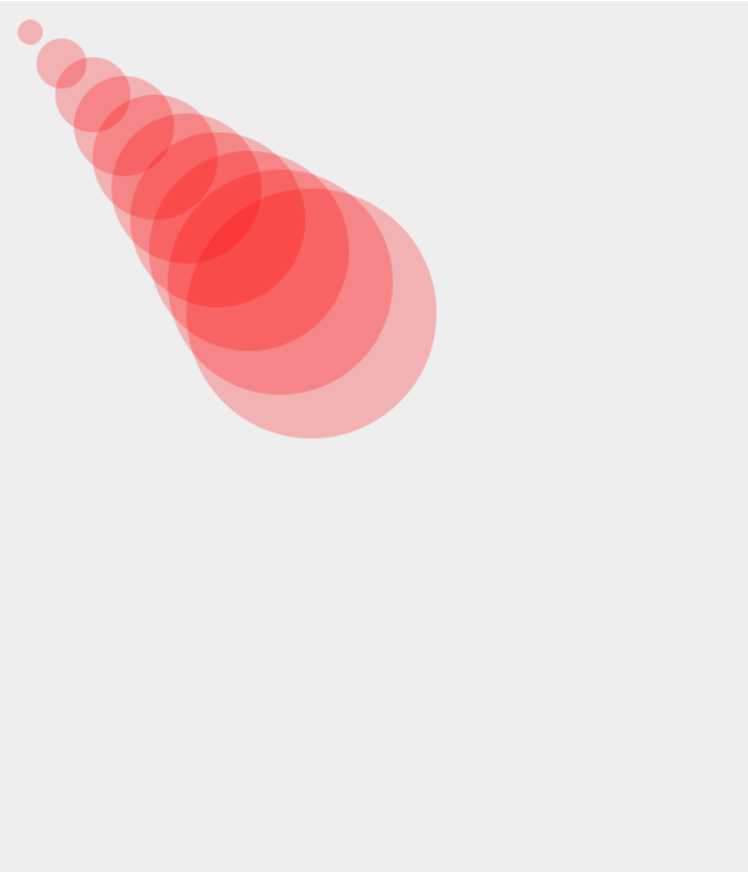
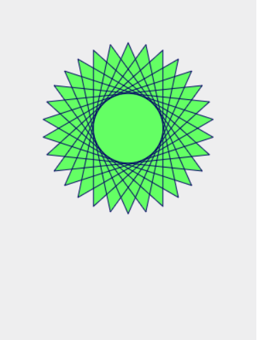
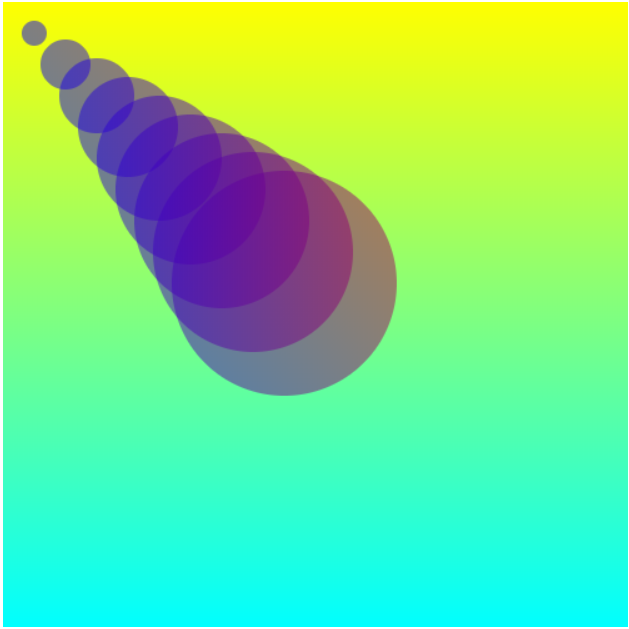
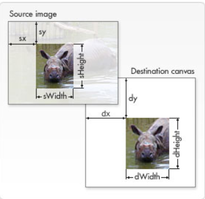

# HTML5


## 目录


1. [HTML5与HTML4的区别](#1)
2. [HTML5新增的结构元素](#2)
3. [表单新增元素与属性](#3)
4. [HTML5改良的input元素种类及表单验证](#4)
5. [HTML5增强的页面元素](#5)
6. [HTML5中编辑API中的Range对象](#6)
7. [HTML5音频视频](#7)
8. [HTML5拖放](#8)
9. [canvas使用](#9)
	- [canvas绘制图形与图片](#9a)
	- [canvas使用路径](#9b)
	- [canvas渐变与变形](#9c)
	- [图形绘制处理](#9d)
10. [SVG](#10)
11. [HTML5 File API](#11)
12. [HTML5 Web存储](#12)
13. [HTML5 应用缓存与Web Workers](#13)
14. [HTML5服务器推送事件](#14)
15. [响应式布局](#15)


***


<a name="1">


## HTML5与HTML4的区别


- 意图解决一些Web上存在的问题
	- Web浏览器之间的兼容性很低
	- 文档结构不够明确
	- Web应用程序的功能受到了限制

- IE9+以及各大浏览器都已经支持HTML5


### 语法的改变

- DOCTYPE声明
- 指定字符编码
	- HTML4: `<meta http-equiv="content-type" content="text/html;charset=UTF-8">`
	- HTML5: `<meta charset="UTF-8">`
- 可以省略标记的元素
- 具有boolean值的属性
	- 为真:
		- `<input type="checkbox" checked>`
		- `<input type="checkbox" checked="">`
		- `<input type="checkbox" checked="checked">`
	- 为假:
		- `<input type="checkbox">`
- 省略引号
	- 属性值的引号可以省略


### 新增元素和废除元素

- 新增的结构元素:

	- `section`、`article`、`aside`、`header`、`hgroup`、`footer`、`nav`、`figure`

- 新增的其他元素:

	- `video`、`audio`、`embed`、`mark`、`progress`、`meter`、`time`、`ruby`、`rt`、`rp`、`wbr`、`canvas`、`command`、`details`、`datalist`、`datagrid`、`keygen`、`output`、`source`、`menu`

- 新增的input元素的类型:

	- `email`、`url`、`number`、`range`、`Date Pickers`

- 废除的元素:

	- 能使用CSS替代的元素: `basefont`、`big`、`center`、`font`、`s`、`tt`、`u`等

	- 不再使用frame框架
	
	- 只有部分浏览器支持的元素
	
	- 其他被废除的元素


### 新增的属性和废除的属性

- 新增的属性
	- 表单相关的属性
	- 链接相关的属性
	- 其他属性
- 废除的属性


### 全局属性


> H5新增了全局属性的概念，指可以对任何元素添加的属性。


- `contentEditable`
	- 值为布尔类型，指定元素内容是否可编辑，可继承。

- `designMode`
	- 用来指定整个页面是否可编辑，当为on时，所有的`contentEditable`都变为可编辑状态。

- `hidden`
	- 值为布尔类型，通知浏览器不渲染该元素，即处于隐藏状态，可以通过js取消隐藏。

- `spellcheck`
	- 针对`input`和`textarea`文本输入框提供拼写检查。

- `tabindex`
	- 敲击tab键对当前页面中的内容元素进行遍历时，按照指定的`tabindex`属性值作为顺序来获得焦点，如果为值为-1则不能获取焦点
	- 默认情况下只能对链接元素和表单元素进行tab遍历，如果要遍历其他元素，可以指定一个`tabindex`值


***


<a name="2">


## HTML5新增的结构元素


### 新增的主体结构元素

- `article`
	- 代表文档、页面或应用程序中独立的、完整的、可以独自被外部引用的内容。它可以是一篇博客或者文章，一篇论坛帖子、一段用户评论或独立的插件，或其他任何独立的内容。
	- 可以嵌套使用
	- 可以用来表示插件

- `section`
	- 用于对网站或应用程序中页面上的内容进行分块
	- 一个section元素通常由内容及其**标题**组成
	- 但section元素并非一个普通的容器元素，当一个容器需要被直接定义样式或通过脚本定义行为时，推荐使用div而非section元素
	- 如果article、aside、nav元素更符合使用条件，则不要使用section元素

- `nav`
	- 是一个可以用作页面导航的链接组，其中的导航元素链接到其他页面或当前页面的其他部分
	- 并不是所有的链接组都要被放进nav元素，只需要将主要的、基本的链接组放进nav元素即可
	- 应用场景：
		- 传统导航条
		- 侧边栏导航
		- 页内导航
		- 翻页操作
	- 不要使用menu元素代替nav元素

- `aside`
	- aside元素用来表示当前页面或文章的附属信息部分，可以包含与当前页面或主要内容相关的引用、侧边栏、广告、导航条，以及其他类似的有区别于主要内容的部分
	- 可包含在article中，作为附属信息部分
	- 全局aside，作为当前站点全局的附属信息

- `time`
	- 用来无歧义、明确地对机器的日期和时间进行编码，并且以让人易读的方式来展现它
	- `<time datetime="2018-10-10">2018-10-10</time>`
	- `<time datetime="2018-10-10T20:00">2018-10-10</time>`
	- `<time datetime="2018-10-10T20:00Z">2018-10-10</time>`
	- `<time datetime="2018-10-10T20:00+09:00">2018-10-10</time>`
	- 发布日期:
		- `<time datetime="2018-10-10" pubdate>2018-10-10</time>`


### 新增的非主体结构元素

- `header`
	- 一种具有引导和导航作用的结构元素，通常用来放置整个页面或页面内的一个内容区块的标题。
	- 也可以包含其他内容，例如导航栏、数据表格、搜索表单或相关的logo图片。
	- 可以在页面中出现多次，出现在article中。

- `footer`
	- 可以作为其上层父级内容区块或是一个根区块的脚注，通常包括相关区块的脚注信息，如作者、相关链接及版权信息等。
	- 可以在页面中出现多次。

- `hgroup`
	- 将标题及其子标题进行分组的元素，通常会将h1~h6元素进行分组，譬如一个内容区块的标题及其子元素算一组。
	- `<hgroup><h1></h1><h2></h2></hgroup>`

- `address`
	- 用来在文档中呈现所有的联系信息，包括文档作者或文档维护者的名字、他们的网站链接、电子邮箱、真实地址、电话号码等。


### 网页编排实例

```
<body>
	<header>
		<h1>网页标题</h1>
		<nav>
			<ul>
				<li><a href="#">首页</a></li>
				<li><a href="#">帮助</a></li>
			</ul>
		</nav>
	</header>
	
	<article>
		<hgroup>
			<h1>文章主标题</h1>
			<h2>文章子标题</h2>
		</hgroup>
		<p>文章正文</p>
		<section>
			<div>
				<article>
					<h1>评论标题</h1>
					<p>评论正文</p>
				</article>
			</div>
		</section>
	</article>
	
	<footer>
		<small>版权所有</small>
	</footer>
</body>
```


***


<a name="3">


## 表单新增元素与属性


### 表单内元素的`form`属性

在HTML4中，表单中的从属元素必须写在表单内部，
而在HTML5中，可以把他们书写在页面的任何地方，然后为该元素指定一个form属性，属性值为该表单的id，这样就可以声明该元素从属于指定表单了。


### 表单内元素的`formaction`属性

在HTML4中，一个表单内的所有元素只能通过表单的action属性被统一提交到另一个页面，
而在HTML5中，可以为所有的提交按钮增加不同的formaction属性，使单击不同的按钮时可以将表单提交到不同的页面。


### 表单内元素的`formmethod`属性

在HTML4中，一个表单中只能有一个action属性用来对表单内的所有元素统一指定提交页面，所以每个表单内也只有一个method属性来统一指定提交方法，
在HTML5中，可以使用formmethod属性来对每一个表单元素分别指定不同的提交方法。


### 表单内元素的`formenctype`属性

在HTML4中，表单元素具有一个enctype属性，该属性用于指定在表单发送到服务器之前应该如何对表单内的数据进行编码，
HTML5中，可以使用formenctype属性对表单元素分别指定不同的编码方式。

- `text/plain`
- `multipart/form-data`
- `application/x-www-form-urlencoded`


### 表单内元素的`formtarget`属性

在HTML5中可以分别指定以不同的方式打开页面:

- `_blank`
- `_self`
- `_parent`
- `_top`
- `framname`


### 表单内元素的`autofocus`属性

在HTML5中可以指定给某个输入元素优先自动获取光标焦点。


### 表单内元素的`required`属性

HTML5新增的required属性可以应用在大多数输入元素上，在提交时，如果元素中内容为空白，则不允许提交，同时在浏览器中显示信息提示文字。


### 表单内元素的`labels`属性

在HTML5中，为所有可使用标签的表单元素、button、select元素等等，定义一个labels属性，属性值为一个NodeList对象，代表该元素所绑定的标签元素所构成的集合。

利用labels属性可以操控表单中某个项的所有label

```
var form = document.getElementById("testform"); //获取表单
var txtName = document.getElementById("txt_name"); //获取文本输入框
var button = document.getElementById("validate"); // 获取验证输入是否为空的按钮

if (txtName.value.trim() === "") {
	var label = document.createElement("label");
	
	label.setAttribute("for", "txt_name");
	
	form.insertBefore(label, button); // 把提示信息的label标签插入到按钮之前
	
	txtName.labels[0].innerHTML = "请输入姓名"; // 这里是textName的第几个label，就在labels中取对应索引的元素
	
	txtName.labels[0].setAttribute("style", "font-size:9px"); //可以设置提示信息更醒目
}

```


### 表单内元素的`control`属性

在HTML5中，可以在标签内部放置一个表单元素，并且通过该标签的control属性来访问该表单元素。

这样可以间接的操控表单元素:

```
// HTML代码块

<form>
	<label id="label">
		邮编:
		<input id="text_zip" maxlength="6">
		<small>请输入六位数字</small>
	</label>
	<input type="button" value="设置默认值" onclick="setValue()">
</form>

// js代码块

function setValue() {
	var label = document.getElementById("label");
	var textbox = label.control;
	textbox.value = "010010";
}
```


### 文本框的`placeholder`属性

指当文本框处于未输入状态时显示的输入提示。当文本框处于未输入状态且未获取光标焦点时，模糊显示输入提示文字。


### 文本框的`list`属性

- 对于单行文本框增加了一个list属性，该属性的值为某个`datalist`元素的id。

- `datalist`元素也是HTML5中新增的元素，该元素类似于选择框，但是当用户想要设定的值不在选择列表之内时，允许自行输入。

- `datalist`本身并不显示，而是当文本框获得焦点时以提示输入的方式显示。

```
<form>
	<input type="text" name="greeting" list="greetings">
	<datalist id="greetings" style="display:none"> //尽管默认不显示，为了一些兼容性问题还是加上
		<option value="HTML学习">HTML学习</option>
		<option value="CSS学习">CSS学习</option>
		<option value="JavaScript">JS学习</option>
	</datalist>	
</form>
```


### 文本框的`autocomplete`属性

帮助输入所用的自动完成功能，是一个既节省输入时间又十分方便的功能。有on和off两个值，如果值为空，则默认on的效果。

在HTML5之前，因为谁都可以看见输入的值，所以在安全方面存在缺陷，只要使用`autocomplete`属性，安全性也可以得到很好的控制。

这个属性需要配合上面的list一起使用。貌似datalist默认就有自动补全的效果。


### 文本框的`pattern`属性

在HTML5中对input元素使用pattern属性，并且将属性值设为某个格式的正则表达式，在提交时会针对这些进行检查，检查其内容是否符合给定格式。
当输入的内容不符合给定格式时，则不允许提交，同时在浏览器中显示信息提示文字，提示输入的内容必须符合给定格式。

`<input pattern="[A-z]{3}" name="part">`


### 文本框的`selectionDirection`属性

对于input和textarea元素，当用户在其中用鼠标选取文字时，可以使用该属性来获取方向。
当用户正向选择（从左到右）时，该属性值为`forward`，反向选取时，为`backward`，用户没有选取任何文字时，属性值为`forward`。


```
<form>
	<input type="text" name="test">
	<input type="button" value="点击我" onclick="myclick()">
</form>

function myclick() {
	var control = document.forms[0]['test'];
	var direction = control.selectionDirection;
	alert(direction); //显示forward或backward
}
```


### 复选框的`indeterminate`属性

对于复选框`checkbox`元素，过去只有选取和非选取两种状态。

在HTML5中，可以在JavaScript脚本代码中对该元素使用`indeterminate`属性，以说明复选框处于尚未明确是否选取状态。


### image提交按钮的height属性和width属性

针对类型为image的input提交元素，用来指定图片按钮的高度和宽度，点击即提交。

`<input type="image" src="img.gif" width="30" height="30" >`


***


<a name="4">


## HTML5改良的input元素种类及表单验证


### HTML5 input类型

url类型、email类型、date类型、time类型、datetime类型、datetime-local类型、month类型、week类型、number类型、range类型、search类型、tel类型、color类型。

- `url`类型，点击提交时，会自动验证是否是url地址，不是的话会给出提示。
- `email`类型，点击提交时，会自动验证是否是邮箱，不是的话会给出提示。
- `date`类型，`<input type="date" name="date" value="">`用户在输入日期时，可以弹出日历供选择。
- `time`类型，会对时间有效性进行检查。
- `datetime`类型，UTC标准时间，和time类似。
- `datetime-local`类型，本地时间。
- `month`类型，只能选择年月。
- `week`类型，选择某年的某一周。
- `number`类型，数字输入框`<input type="number" value="15" min="10" max="100" step="10">`，可以利用`valueAsNumber`取出元素的数值。
- `range`类型，一个有范围的拖动条，也可以像number类型一样设置min、max和step
- `search`类型，专门用来搜索关键字的输入框
- `tel`类型，电话号码输入，不强制格式。
- `color`类型，颜色选取器，`<input type="color" onchange="document.body.style.backgroundColor = document.getElementById('idname').textContent = this.value;">`。
- `output`元素的追加，通常和range类型的input一起使用，在拖动条的后面显示拖动的进度，需要通过js实时设置数值。`<output id="output">10</output>`。


### 表单验证


> 可以设置novalidate="true"取消表单默认验证，自己来处理结果，dom.checkValidity()验证方法，如果input元素中的输入是合法则返回true。


```
<form id="testform" onsubmit="check()" novalidate="true"> <!--取消自动验证，手动添加函数-->
	<label for="email">Email</label>
	<input name="email" type="email" id="email"><br />
	<input type="submit">
</form>

<script>
	function check() {
		var email = document.getElementById("email");
		if(email.value==""){
			alert("请输入email!");
			return false;
		} else if (!email.checkValidity()) {
			alert("请输入正确的email");
			return false;
		}
	}
<script>
```


***


<a name="5">


## HTML5增强的页面元素


### 新增的figure元素和figcaption元素

figure元素表示网页上一块独立的内容，可以是图片、图表、统计表格或者代码实例等。

figcaption从属于figure元素，表示figure的标题。一个figure中只应有一个figcaption。

```
<figure>
	
	
	
	<figcaption>好看的图片</figcaption>
</figure>
```


### 新增的details元素和summary元素

```
// js代码

function detail_onclick(detail) {
	var p = document.getElementById("p");
	if(detail.open){
		p.style.visibility = "hidden";
	} else {
		p.style.visibility = "visible";
	}
}

// html结构

<details onclick="detail_onclick(this)"> // 点击时会展示出详细内容
	<summary>速度与激情<summary> //如果没有写summary，会出现默认的字样，比如：详细信息
	<p id="p">这里是一大段介绍内容。。。。。。。。。。</p>
</details>
```


### 新增的mark元素

`<p>这是一段文字，这个部分需要<mark>高亮</mark></p>`


### 新增的progress元素

代表一个任务的完成进度。

```
//js代码

function btn() {
	var i = 0;
	function thread_one() {
		if(i<100){
			i++;
			updateProgress(i);
		}
	}
	setInterval(thread_one, 100);
}

function updateProgress(newValue) {
	var progressBar = document.getElementById("p");
	progressBar.value = newValue;
	progressBar.getElementsByTagName("span")[0].innerText = newValue;
}


// html结构
<section>
	<h2>progress元素的使用</h2>
	<p>完成的百分比<progress id="p" max='100'><span>0</span>%</progress></p>
	<input type="button" onclick="btn()" value="点击">
</section>
```


### 新增的meter元素

规定范围内的数值量。

```
<meter value="40" min="0" max="100" low="10" high="90" optimum="80"></meter>

<meter>40/100</meter>
```


### 改良的ol列表和dl列表

为ol添加了start和reverse属性。

`<ol start="5" reversed>`

H5对dl进行重新定义，表示多个名字的列表项，每项包含一条或多条带有名字的dt元素。不允许有相同的dt元素。

```
<dl>
	<dt></dt>
		<dd></dd>
	<dt></dt>
		<dd></dd>
</dl>
```

### 严格限制的cite元素和重新定义的small元素

cite表示作品的标题。

small变成专门用来标识小字印刷体的展示元素。

***


<a name="6">


## HTML5中编辑API中的Range对象


一个Range对象代表页面上的一段连续区域，通过Range对象，可以获取或修改网页上的任何区域。

### selection对象

```
// js代码
function rangeTest(){
	var html;
	var showRangeDiv = document.getElementById("showRange");
	var selection = document.getSelection();
	if(selection.rangeCount > 0){
		html = "你选取了" + selection.rangeCount + "内容<br/>";
		for(var i=0; i<selection.rangeCount; i++){
			var range = selection.getRangeAt(i);
			html+="第"+(i+1)+"段内容为:"+range+"<br/>"; // 谷歌浏览器只支持选择一段内容
		}
		showRangeDiv.innerHTML = html;
	}
}

// html结构
<p>Selection对象和Range对象的使用</p>
<input type="button" value="点击我" onclick="rangeTest()"/>
<div id="showRange"></div>
```


### `selectNode` 、 `selectNodeContent` 和 `deleteContents`

```
//js代码

function deleteRangeContent(onlyContent) {
	var div = document.getElementById("div");
	var rangeObj = document.createRange();
	if(onlyContent) {
		rangeObj.selectNodeContents(div);
		rangeObj.deleteContents();
	} else {
		rangeObj.selectNode(div);
		rangeObj.deleteContents();
	}
}

// html结构
<div id="div" style="background-color: #BBFFCC;width: 300px;height: 50px;">
	元素中的内容
</div>

<button onclick="deleteRangeContent(true)">删除内容</button>
<button onclick="deleteRangeContent(false)">删除元素</button>
```


### `setStart`、 `setEnd`、 `setStartBefore`、 `setStartAfter`、 `setEndBefore`和 `setEndAfter`


```
// js代码

function deleteChar() {
	var div = document.getElementById("myDiv");
	var textNode = div.firstChild;
	var rangeObj = document.createRange();
	rangeObj.setStart(textNode, 0);
	rangeObj.setEnd(textNode, 4);
	rangeObj.deleteContents();
}


// html结构

<div id="myDiv" style="color: red;">
	这段文字是用来删除的
</div>
<button onclick="deleteChar()">删除文字</button>
```


使用`setStartBefore`和`setEndAfter`:


```
// js代码
function deleteRow() {
	var table = document.getElementById("myTable");
	if(table.rows.length > 0) {
		var row = table.rows[0];
		var rangeObj = document.createRange();
		rangeObj.setStartBefore(row);
		rangeObj.setEndAfter(row);
		rangeObj.deleteContents();
	}
}


// html结构

<table id="myTable" border="1" cellspacing="0" cellpadding="0">
	<tr>
		<td>内容1</td>
		<td>内容2</td>
	</tr>
	<tr>
		<td>内容3</td>
		<td>内容4</td>
	</tr>
</table>
<button onclick="deleteRow()">删除第一行</button>
```


### `cloneRange`、`cloneContents` 和 `extractContents`

- cloneRange的使用:

	```
	// js代码
	function cloneRange() {
		var rangeObj = document.createRange();
		rangeObj.selectNodeContents(document.getElementById("p"));
		var rangeClone = rangeObj.cloneRange();
		alert(rangeClone);
	}
	
	// html结构
	<p id="p">这里是一段随便的内容</p>
	<button onclick="cloneRange()">克隆</button>
	```

- cloneContents的使用:

	```
	// js代码
	function cloneContent() {
		var div = document.getElementById("div");
		var rangeObj = document.createRange();
		rangeObj.selectNodeContents(div);
		var docFragment = rangeObj.cloneContents();
		div.appendChild(docFragment);
	}
	 
	// html结构
	<div id="div">
		你好吗？<br />
		<button onclick="cloneContent()">克隆</button> <br />
	</div>
	```

- extractContents的使用:

```
// js代码
function moveContent() {
	var srcDiv = document.getElementById("srcDiv");
	var disDiv = document.getElementById("distDiv");
	var rangeObj = document.createRange();
	rangeObj.selectNodeContents(srcDiv);
	var docFregment = rangeObj.extractContents();
	disDiv.appendChild(docFregment);				
}

// html结构
<div id="srcDiv" style="background-color: #BBFFCC;width: 300px; height: 50px;">
	您好呀
</div>
<div id="distDiv" style="background-color: yellow;width: 300px; height: 50px;"></div>
<button onclick="moveContent()">移动元素</button>
```


### `insertNode` 和 `compareBoundaryPoints`

- insertNode的使用

	```
	// js代码
	function moveButton() {
		var btn = document.getElementById("button");
		var selection = document.getSelection();
		if(selection.rangeCount > 0) {
			var range = selection.getRangeAt(0);
			range.insertNode(btn); // 可以将btn插入到range对象的起点处
		}
	}
	
	// html结构
	<div onmouseup="moveButton()" style="width: 400px; background-color: #BBFFCC;">
		这里是一些随便的文字这里是一些随便的文字这里是一些随便的文字这里是一些随便的文字
	</div>
	<button id="button">按钮</button>
	```


- compareBoundaryPoints的使用

	`compare = range.compareBoundaryPoints(how, sourceRange);`
	- -1、1、0分别代表range内容在sourceRange的前面，后面，相等。（在how的比较方式下）
	- `Range.START_TO_END` compares the start boundary-point of sourceRange to the end boundary-point of Range.
	- `Range.START_TO_START` 等同理。

	```
	// js代码
	function testPlace() {
		var boldText = document.getElementById("boldTest");
		var boldRange = document.createRange();
		boldRange.selectNodeContents(boldText.firstChild);
		var selection = document.getSelection();
		if(selection.rangeCount > 0) {
			var selRange = selection.getRangeAt(0);
			if(selRange.compareBoundaryPoints(Range.START_TO_END, boldRange) < 0) {
				alert("选取内容在粗体前方");
			} else {
				if(selRange.compareBoundaryPoints(Range.END_TO_START, boldRange) > 0) {
					alert("选取内容在粗体后方");
				}
			}
		}
	}
	
	// html结构
	<p>这是一段文字，<b id="boldTest">比比看</b>彼此的边界吧</p><br />
	<button onclick="testPlace()">位置比较</button>
	```


### `collapse` 和 `detach`

```
// js代码
var rangeObj = document.createRange();
function selectRangeContents() {
	var div = document.getElementById("div");
	rangeObj.selectNode(div);
}
function unselect() {
	// A boolean value: true collapses the Range to its start, false to its end. 
	// If omitted, it defaults to false .
	rangeObj.collapse(false); // 折叠range对象
	
	//释放range对象
	//rangeObj.detach();
}
function showRange() {
	alert(rangeObj);
}

// html结构
<div id="div" style="background-color: bisque; width: 300px; height: 50px;">
	元素中的内容
</div>
<button onclick="selectRangeContents()">选择元素</button>
<button onclick="unselect()">取消元素</button>
<button onclick="showRange()">显示Range内容</button>
```

***


<a name="7">


## HTML5音频视频


### 音频播放

自带播放控件controls:
```
<audio src="1.mp3" controls="controls">您的浏览器不支持</audio>
```

也可以自己自定义:

```
// js代码
var a = document.getElementById("audio");
function clickA() {
	if(a.paused) {
		a.play();
	} else {
		a.pause();
	}
}

// html结构
<button onclick="clickA()"> 播放/暂停</button>
<audio id="audio" src="1.mp3">您的浏览器不支持</audio>
```


### 视频编码格式转换

一些浏览器不支持mp4格式的视频文件，需要将其转换为ogg后缀的文件。

使用`ffmpeg`: 在安装路径下，使用命令 `ffmpeg -i 1.mp4 -acodec libvorbis 1.ogg` 可以将1.mp4转换为1.ogg。


### 视频播放


```
<video src="1.mp4" controls="controls">您的浏览器不支持</video>
```

为了兼容多种浏览器的视频播放:

```
<video controls="controls">
	<source src="1.mp4">
	<source src="1.ogg">
	您的浏览器不支持
</video>

```

同样也可以使用自定义设置:

```
// html结构
<video id="video">
	<source src="1.mp4">
	<source src="1.ogg">
	您的浏览器不支持
</video>
<br/>
<button onclick="clickV()">播放/暂停</button>
<button onclick="clickBig()">放大</button>

// js代码
var v = document.getElementById("video");
function clickV() {
	if(v.paused){
		v.play();
	} else {
		v.pause();
	}
}
function clickBig() {
	v.width = 800; // 因为video标签有width和height属性，可以直接设置。
}
```


***


<a name="8">


## HTML5拖放


### HTML5拖放

1. HTML5拖放: drag和drop是HTML5标准的组成部分。

2. 拖动开始: `ondragstart` 调用了一个函数drag(event)，它规定了被拖动的数据。

3. 设置拖动数据: `setData()` 设置被拖数据的数据类型和值。

4. 放入位置: `ondragenter`、`ondragover` 事件规定在何处放置被拖动的数据。

5. 放置: `ondrop` 当放置被拖动数据时，会发生drop事件。

```
var box1Div = document.getElementById("box1");
var box2Div = document.getElementById("box2");
var img1 = document.getElementById("img1");

//				box1Div.ondragenter = function(e){
//					showObj(e);
//				};

box1Div.ondragover = function(e){
	e.preventDefault(); //取消默认拖拽行为
};
box2Div.ondragover = function(e){
	e.preventDefault(); //取消默认拖拽行为
};

img1.ondragstart = function(e) {
	e.dataTransfer.setData("imgId", "img1"); // 设置被拖数据的数据类型和值
};

box1Div.ondrop = dropImgHandler;
box2Div.ondrop = dropImgHandler;

function dropImgHandler(e){
	e.preventDefault();
	var img = document.getElementById(e.dataTransfer.getData("imgId"));
	e.target.appendChild(img);
}
```


### HTML5拖放本地数据

大致步骤和普通的拖放一致，只是添加了FileReader读取的步骤。

```
function dropLocalImg(e){
	e.preventDefault(); // 不取消就会在浏览器打开图片
	//showObj(e);
	var f = e.dataTransfer.files[0]; // 获取拖拽进来的文件
	var fileReader = new FileReader(); // 让FileReader监听
	fileReader.onload = function(e){
		//showObj(e.target);
		box2Div.innerHTML = "";
	};
	fileReader.readAsDataURL(f); // 读取文件
}


```


***

<a name="9">


## Canvas使用


HTML5`<canvas>`元素用于在网页上绘制图形，该元素强大之处在于可以直接在HTML上进行图形操作，通过脚本来完成。

`<canvas>`标签只是图形的容器，必须用脚本来绘制图形。可以通过多种方法使用Canvas绘制路径、盒、圆、字符及添加图像。

详细API接口，请查阅[MDN文档](https://developer.mozilla.org/zh-CN/docs/Web/API/CanvasRenderingContext2D)


<a name="9a">


### canvas绘制图形和图片


```
var CANVAS_WIDTH = 500, CANVAS_HEIGHT = 500;
var mycanvas, context;

function createCanvas(id){
	document.body.innerHTML = "<canvas id='mycanvas' width="+ CANVAS_WIDTH +" height="+ CANVAS_HEIGHT +" ></canvas>"
	mycanvas = document.getElementById(id);
	context = mycanvas.getContext("2d"); // 获取canvas内容对象
}

function drawRect(){
	context.fillStyle = "#FF0000"; // 填充颜色
	//context.rotate(45); // 旋转45度
	//context.translate(200, 200); // 沿x,y轴平移
	context.scale(2, 0.5); // 分别沿x,y轴缩放
	context.fillRect(0, 0, 200, 200); // 矩形填充
}

function drawImage(){
	var img = new Image(); // 新建图片
	img.onload = function(){
		context.drawImage(img, 0, 0); // 绘制图片
	};
	img.src = "image.png"; // 引入图片
}
```


<a name="9b">


### canvas使用路径


- 绘制圆: `ctx.arc(x, y, radius, startAngle, endAngle, anticlockwise);`

	```
	function drawArc(id) {
		var canvas = document.getElementById(id);
		if(canvas == null){
			return false;
		}
		var context = canvas.getContext("2d");
		context.fillStyle = "#eeeeef";
		context.fillRect(0,0,600,700);
		for(var i = 0; i <= 10; i++){
			context.beginPath(); // 开始绘制路径
			// 第一二个参数代表圆心的坐标，第3个参数代表半径。
			// 4、5个参数代表圆弧的起始弧度和终止弧度，第6个参数是可选布尔值，如果为true，则是逆时针。
			context.arc(i*25, i*25, i*10, 0, Math.PI*2, true); // 绘制圆
			context.closePath(); // 必须关闭路径，否则在绘制下一个图形的时候，这个图还会重复绘制。
			context.fillStyle = "rgba(255, 0, 0, 0.25)";
			context.fill(); // 绘制完毕
		}
	}
	```


	


- `moveTo`与`lineTo`:


	- 使用 beginPath() 绘制路径的起始点， 使用 moveTo()移动画笔， 使用 stroke() 方法真正地画线。


	```
	function draw(id){
		var canvas = document.getElementById(id);
		var context = canvas.getContext("2d");
		context.fillStyle = "#eeeeef";
		context.fillRect(0,0,300,400);
		var dx = 150;
		var dy = 150;
		var s = 100;
		context.beginPath();
		context.fillStyle = "rgb(100,255,100)";
		context.strokeStyle = "rgb(0,0,100)"; // 图形边框的样式
		var x = Math.sin(0);
		var y = Math.cos(0);
		var dig = Math.PI / 15 * 11;
		for(var i = 0; i < 30; i++){
			var x = Math.sin(i*dig);
			var y = Math.cos(i*dig);
			context.lineTo(dx+x*s, dy+y*s);
		}
		context.closePath();
		context.fill();
		context.stroke();
	}
	```


	


- `bezierCurveTo`


	```
	function drawBe(id){
		var canvas = document.getElementById(id);
		var context = canvas.getContext("2d");
		context.fillStyle = "#eeeeef";
		context.fillRect(0,0,300,400);
		var dx = 150;
		var dy = 150;
		var s = 100;
		context.beginPath();
		context.fillStyle = "rgb(100,255,100)";
		context.strokeStyle = "rgb(0,0,100)";
		var x = Math.sin(0);
		var y = Math.cos(0);
		var dig = Math.PI / 15 * 11;
		context.moveTo(dx, dy);
		for(var i = 0; i < 30; i++){
			var x = Math.sin(i*dig);
			var y = Math.cos(i*dig);
			//context.lineTo(dx+x*s, dy+y*s);
			context.bezierCurveTo(dx+x*s, dy+y*s-100, dx+x*s+100, dy+y*s, dx+x*s, dy+y*s);
		}
		context.closePath();
		context.fill();
		context.stroke();
	}
	```


	


<a name="9c">


### canvas渐变和变形


#### 绘制线性渐变图形

- `context.createLinearGradient(xstart, ystart, xend, yend)`创建一个沿参数坐标指定的直线的渐变。

- 创建成功后， 你就可以使用 CanvasGradient.addColorStop() 方法，根据指定的偏移和颜色定义一个新的终止。 

- 如例子所示，渐变允许赋值给当前的fillStyle，使用fillRect() 方法时，在 canvas 上绘制出效果。


```
function draw(id) {
	var canvas = document.getElementById(id);
	var context = canvas.getContext("2d");
	var g1 = context.createLinearGradient(0,0,0,500);
	g1.addColorStop(0,"rgb(255,255,0");
	g1.addColorStop(1,"rgb(0,255,255");
	
	//将沿直线渐变的颜色效果赋给fillStyle
	context.fillStyle = g1; 
	context.fillRect(0,0,500,500);

	//还可以同时指定给路径渐变效果
	var g2 = context.createLinearGradient(0,0,500,0);
	g2.addColorStop(0,"rgba(0,0,255,0.5)");
	g2.addColorStop(1,"rgba(255,0,0,0.5)");
	for(var i = 0; i < 10; i++){
		context.beginPath();
		context.fillStyle = g2;
		context.arc(i*25, i*25, i*10, 0, Math.PI*2, true);
		context.closePath();
		context.fill();
	}
}
```





#### 绘制径向渐变

```
function draw(id){
	var canvas = document.getElementById(id);
	if(canvas == null){
		return false;  // 更严谨的应该加上这一步
	}
	var context = canvas.getContext("2d");
	var g1 = context.createRadialGradient(400,0,0,400,0,400); // 参数分别为开始和结束的圆心坐标、半径
	g1.addColorStop(0.1,"rgb(255,255,0");
	g1.addColorStop(0.3,"rgb(255,0,255");
	g1.addColorStop(1,"rgb(0,255,255");
	context.fillStyle = g1;
	context.fillRect(0,0,500,500);
}
```


#### 绘制变形图形


```
function draw(id){
	var canvas = document.getElementById(id);
	if(canvas == null){return null;}
	var context = canvas.getContext("2d");
	context.fillStyle = "#eeeeef";
	context.fillRect(0,0,500,500);
	context.translate(250, 100);
	context.fillStyle = "rgba(255,0,0,0.25)";
	for(var i=0; i<30; i++){
		context.translate(20,20);
		context.scale(0.95, 0.95);
		context.rotate(Math.PI/15);
		context.fillRect(0,0,100,50);
	}
}
```


<a name="9d">


### 图形绘制处理


#### 图形组合

`globalCompositeOperation = type` 属性

- `source-atop`, 只绘制新图层遮盖的部分和原图层的其他部分。
- `source-in`, 只显示新图层与原图层重叠的部分。
- `source-out`, 只显示新图形与原图形不重叠的部分。
- `source-over`, 默认值，表示新图层覆盖在原图层之上。
- `destination-atop`, 只绘制原有图形中被覆盖的部分与新图形的其他部分。
- `destination-in`, 只显示原有图形中被覆盖的部分，其余部分透明。
- `destination-out`, 只显示原有图形中未被遮盖的部分，其余部分透明。
- `destination-over`, 原图形覆盖新图形。
- `lighter`, 原图形与新图形均绘制，重叠的部分加色处理。
- `copy`, 只绘制新图形，原图形未重叠的部分变为透明。
- `xor`，只绘制新图形与原图形不重叠的部分，重叠部分透明。


```
function draw(id){
	var canvas = document.getElementById(id);
	var context = canvas.getContext("2d");
	var oprtns = new Array(
		"source-atop", 
		'source-in', 
		'source-out', 
		'source-over', 
		'destination-atop', 
		'destination-in', 
		'destination-out', 
		'destination-over', 
		'lighter', 
		'copy', 
		'xor'
	);
	var i = 0; // 通过改变i的值，来体会不同组合的效果
	context.fillStyle = "blue";
	context.fillRect(10,10,60,60);
	context.globalCompositeOperation = oprtns[i];
	context.beginPath();
	context.fillStyle = "red";
	context.arc(60, 60, 30, 0, Math.PI*2, false);
	context.closePath();
	context.fill();
}
```


#### 给图形绘制阴影

- shadowOffsetX，阴影横向位移
- shadowOffsetY，阴影纵向位移
- shadowColor，阴影颜色
- shadowBlur，阴影模糊范围


```
function draw(id){
	var canvas = document.getElementById(id);
	var context = canvas.getContext("2d");
	context.fillStyle = "#eeeeef";
	context.fillRect(0,0,500,500);
	context.shadowOffsetX = 10;
	context.shadowOffsetY = 10;
	context.shadowColor = "rgba(100,100,100,0.5)";
	context.shadowBlur = 8;
	
	for(var i=0; i<3; i++){
		context.translate(60,60);
		create5Star(context);
		context.fill();
	}
}

function create5Star(context){
	var dx = 100;
	var dy = 100;
	var s = 50;
	context.beginPath();
	context.fillStyle = "rgba(255,0,0,0.5)";
	var x = Math.sin(0);
	var y = Math.cos(0);
	var dig = Math.PI / 5 * 4;
	for(var i=0; i<5; i++){
		var x = Math.sin(i*dig);
		var y = Math.cos(i*dig);
		context.lineTo(dx+x*s, dy+y*s);
	}
	context.closePath();
}
```


#### 绘制图像

- `context.drawImage(img, x, y);`
- `context.drawImage(img, x, y, w, h);`
- `context.drawImage(img, sx, sy, sw, sh, dx, dy, dw, dh);`

- 第三个方法所带的参数，是对已有的图像进行选取区域，并复制。




```
function drawImage(context, image){
	context.drawImage(image, 0, 0, 200, 200);
	context.drawImage(image, 0, 0, 100, 100, 150, 150, 300, 300);
}

function draw(id){
	var canvas = document.getElementById(id);
	var context = canvas.getContext("2d");
	context.fillStyle = "#eeeeef";
	context.fillRect(0,0,500,500);
	var image = new Image();
	image.src = "image.png";
	image.onload = function(){
		drawImage(context, image);
	};
}
```


<a name="10">

***


## SVG


什么是SVG？
- SVG指可伸缩矢量图形
- SVG用来定义用于网络的基于矢量的图形
- SVG使用XML格式定义图形
- SVG图像在放大或改变尺寸的情况下其图形质量不会有损失
- SVG是W3C的标准

SVG的优势
- SVG图像可通过文本编辑器来创建和修改
- SVG可被搜索、索引、脚本化或压缩
- SVG是可伸缩的，可在任何的分辨率下被高质量的打印


SVG绘制矢量图形:
```
<svg width="120" height="120" viewBox="0 0 120 120" version="1.1">
	<circle cx="50" cy="50" r="50"></circle>
</svg>
```


引入外部SVG文件:
```
<iframe src="demo.svg" width="500" height="500" frameboder="no"></iframe>
```


***

<a name="11">


## HTML5 File API


HTML5 File API协议族

- Directories and System 文件系统和目录读取

- FileWriter 写入文件

- FileReader 读取文件

- File API 页面选择文件处理


***


<a name="12">


## HTML5 Web存储


客户端浏览器储存数据：两种方式

- localStorage 没有时间限制的数据存储
- sessionStorage 针对一个session的数据存储

与cookie对比，cookie不适合大量数据的存储，因为它们由每个对服务器的请求来传递，这使得cookie速度很慢且效率不高。


### localStorage

存储的数据没有时间限制，关闭浏览器、几天几月或者下一年，数据依然可用。

```
var txt = document.getElementById("textarea");
if(localStorage.text){
	txt.value = localStorage.text; //如果有存储数据，就填充使用
}
btn.onclick = function(){
	localStorage.text = txt.value; // 将文本域中的内容储存
};

```


### sessionStorage

针对一个session进行数据存储，当用户关闭浏览器窗口后，数据就会被删除。

页面会话在浏览器打开期间一直保持，并且重新加载或恢复页面仍会保持原来的页面会话。在新标签或窗口打开一个页面会初始化一个新的会话，
这点和 session cookies 的运行方式不同

```
var txt = document.getElementById("textarea");
if(sessionStorage.text){
	txt.value = sessionStorage.text; // 如果有存储数据，就填充使用
}
btn.onclick = function(){
	sessionStorage.text = txt.value; // 将文本域中的内容储存
};
```


***


<a name="13">


## HTML5 应用缓存与Web Workers


### 应用缓存

HTML5引入了应用程序缓存，这意味着web应用可进行缓存，并可在没有因特网链接时进行访问。

应用缓存的优势：
- 离线浏览。用户可在应用离线时使用它们。
- 速度。已缓存资源加载得更快。
- 减少服务器负载。浏览器将只从服务器下载更新过或更改过的资源。

实现缓存:
- 如果需要启动应用程序缓存，在html标签中包含`manifest`属性，manifest文件的建议扩展名是`.appcache`。

manifest文件:
- `CACHE` 在此标题下列出的文件将在首次下载后进行缓存。
- `NETWORK` 在此标题下列出的文件需要与服务器的连接，且不会被缓存。
- `FALLBACK` 在此标题下列出的文件规定当页面无法访问时的回退页面（比如404页面）。


```
<html manifest="index.appcache"> // 设置启动缓存

// 编写index.appcache文件

CACHE MANIFEST

CACHE: // 设置需要缓存的数据
index.html
index.js

NETWORK: // 设置不要缓存的数据
style.css
```


### Web Workers

Web Worker是运行在后台的JavaScript，独立于其他脚本，不会影响页面的性能。

方法:
- `postMessage()` 它用于向HTML页面传回一段消息。

- `terminate()` 终止web worker，并释放浏览器/计算机资源。

事件: `onmessage`


```
var numDiv = document.getElementById("numdiv");
var work = new Worker("js/count.js");
work.onmessage = function(e){ // 监听事件
	numDiv.innerHTML = e.data; // 接受web worker发送过来的数据
};

document.getElementById("stop").onclick = function() {
	if(work){
		work.terminate();
		work = null;
	}
};

// count.js:

var countNum = 0;
function count(){
	postMessage(countNum);
	countNum++;
	setTimeout(count, 1000);
}
count(); 
```


***


<a name="14">


## HTML5服务器推送事件


服务器推送事件是HTML5规范中的一个组成部分，可以用来从服务端实时推送数据到浏览器端。

传统的服务器推送数据技术:

- WebSocket: 使用套接字连接，基于TCP协议，建立连接后，可以进行双向的数据传输。WebSocket的功能是很强大的，使用起来也比较灵活，可以适用于不同的场景。不过WebSocket技术也比较复杂，包括服务器端和浏览器端的实现都不同于一般的Web应用。

- HTTP协议: 简易轮询，即浏览器定时向服务器端发出请求，来查询是否有数据更新，这种做法比较简单。对于轮询的时间间隔需要仔细考虑，过长会导致用户不能及时接受到更新的数据，过短会导致查询请求过多，增加服务器的负担。


HTML5服务器推送事件的实现:


```
// index.php
<?php

header('Content-Type:text/event-stream');

for($i=0; $i<100; $i++){
	date_default_timezone_set("Asia/Shanghai");
	echo 'data:'.date('Y-m-d H-i-s');
	echo "\n\n";
	flush();
	sleep(1);
}

// index.js
var SERVER_URL = "index.php";
var serverData = document.getElementById("dataDiv");
var statusDiv = document.getElementById("statusDiv");
startlistenServer();

function startlistenServer(){
	statusDiv.innerHTML = "start Connect Server...";
	var es = new EventSource(SERVER_URL);
	es.onopen = openHandler;
	es.onerror = errorHandler;
	es.onmessage = messageHandler;
}

function openHandler(e){
	statusDiv.innerHTML = "Server Open";
}

function errorHandler(e){
	statusDiv.innerHTML = "Error";
}

function messageHandler(e){
	serverData.innerHTML = e.data;
}
```


***


<a name="15">


## 响应式布局


响应式布局，简而言之，就是一个网站能够兼容多个终端，而不是为每个终端做一个特定的版本。这个概念是为解决移动互联网浏览而诞生的。其目的是为用户提供更加舒适的界面和更好的用户体验。

优点:
- 面对不同分辨率设备灵活性强。
- 能够快捷解决多设备显示适应问题。

缺点:
- 兼容各种设备工作量大，效率低下。
- 代码累赘，会出现隐藏无用的元素，加载时间加长。


### 响应式布局基本实现:

CSS3中的Media Query(媒介查询):

- 设备宽高: `device-width`、`device-height`

- 渲染窗口的宽和高: `width`、`height`

- 设备的手持方向: `orientation`

- 设备的分辨率: `resolution`


使用方法: 外联、内嵌样式

```
// 初始默认缩放为1
<meta name="viewport" content="width=device-width,initial-scale=1">

// 窗口宽度在600px以下采用这种样式
<link href="style.css" type="text/css" rel="stylesheet" media="only screen and (max-width:600px)">

<style>
	// 窗口宽度在960px以上采用这种样式
	@media screen and (min-width:960px){
		body {
			background-color: green;
		}
	}
	
	// 窗口在600px以上，960px以下时采用这种样式
	@media screen and (min-width: 600px) and (max-width: 960px){
	
	}
</style>
```


### 响应式布局之Bootstrap


简洁、直观、灵活的前端开发框架，小而强大，响应式布局，跨平台等。


