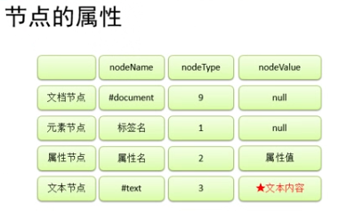

# 前端知识查漏补缺

## JavaScript篇

## 目录


1. [JS数据类型](#1)
2. [强制类型转换](#2)
3. [运算符](#3)
4. [变量、函数和对象](#4)
	- [变量及对象存储](#41)
	- [隐式全局变量](#42)
	- [预解析](#43)
	- [函数定义](#44)
	- [声明提前](#45)
	- [匿名函数](#46)
	- [函数的调用](#47)
	- [作用域](#48)
	- [对象操作](#49)
	- [对象创建](#410)
	- [构造函数](#411)
	- [原型](#412)

5. [数组](#5)
6. [字符串](#6)
7. [正则表达式](#7)
8. [DOM](#8)
	- [DOM查询](#81)
	- [DOM增删改](#82)
	- [DOM操作CSS](#83)
	- [事件](#84)
		- [事件对象](#841)
		- [event兼容性问题](#842)
		- [scrollTop和scrollLeft兼容性问题](#843)
		- [事件的冒泡](#844)
		- [事件的委派](#845)
		- [事件的绑定](#846)
		- [事件的传播](#847)
		- [元素的拖拽事件](#848)
		- [鼠标滚轮事件](#849)
		- [键盘事件](#8410)

9. [BOM](#9)
	- [BOM对象](#91)
	- [定时调用](#92)
	- [延时调用](#93)
	- [用定时器写一个可以执行简单动画的函数](#94)


***

<a name="1" />

## JS数据类型

- **数据类型指的就是字面量的类型, 在JS中一共有六种数据类型**
	- String 字符串
	- Number 数值
	- Boolean 布尔值
	- Null 空值
	- Undefined 未定义
	- Object 对象

	其中String Number Boolean Null Undefined属于基本数据类型, 而Object属于引用数据类型

- **在JS中所有的数值都是Number类型, 包括整数和浮点数（小数）**
	- JS中可以表示的数字的最值:
		- Number.MAX_VALUE
			- 1.7976931348623157e+308

		- Number.MIN_VALUE (大于0的最小值)
			- 5e-324

	- 如果使用Number表示的数字超过了最大值, 则会返回:
		- Infinity 表示正无穷
		- -Infinity 表示负无穷
	- 使用typeof检查Infinity也会返回number
	- NaN 是一个特殊的数字, 表示Not A Number
		 使用typeof检查一个NaN也会返回number	

- **Null和undefined**
	- Null（空值）类型的值只有一个, 就是null
		- null这个值专门用来表示一个为空的对象
		- 使用typeof检查一个null值时, 会返回object
	- Undefined（未定义）类型的值只有一个, 就undefind
		- 当声明一个变量, 但是并不给变量赋值时, 它的值就是undefined
		- 使用typeof检查一个undefined时也会返回undefined

- **Math**
	- Math.abs();       取绝对值
	- Math.floor();      向下取整
	- Math.ceil();       向上取整
	- Math.round();     四舍五入取整
	- Math.random();   随机数0-1

- **Date**

```
var d = new Date();
console.log(d);

var d2 = new Date("12/25/2015 12:12:12");
console.log(d2);

// 获取当前日期对象 是几日
var date1 = d.getDate();
console.log("date="+date1);

// 0是周日 1是周一
var date2 = d.getDay();
console.log("day="+date2);

// 返回月份, 0表示1月
var date3 = d.getMonth();
console.log("month="+date3);

// 获取当前日期的年份
var date4 = d.getFullYear();
console.log("year="+date4);

// 时间戳,从格林威治1970年1月1日, 0时0分0秒开始到现在的毫秒数
var time = d.getTime();
console.log("time="+time/1000/60/60/24/365);
 
//获取当前的时间戳
var start = Date.now();	
```

***

<a name="2" />

## 强制类型转换

- **强制类型转换**
	- 指将一个数据类型强制转换为其他的数据类型
		- 类型转换主要指, 将其他的数据类型, 转换为
			- String Number Boolean
	
- **将其他的数据类型转换为String**
	1. 方式一：
		- 调用被转换数据类型的toString()方法
		- 该方法不会影响到原变量, 它会将转换的结果返回
		- 但是注意：null和undefined这两个值没有toString()方法, 如果调用他们的方法, 会报错
	
				注意:
				-	无参数, 转化为字符串
				-	如果有参数, 就会将数值转化为对应参数的进制
					- 如 num.toString(2) 转化为2进制数字符串

	2. 方式二：
		- 调用String()函数, 并将被转换的数据作为参数传递给函数
		- 使用String()函数做强制类型转换时, 
			1. 对于Number和Boolean实际上就是调用的toString()方法
			2. 但是对于null和undefined, 就不会调用toString()方法
				- 它会将 null 直接转换为 "null"
				- 将 undefined 直接转换为 "undefined"

- **将其他的数据类型转换为Number**
	1. 转换方式一：
		- 使用Number()函数
		- 字符串 --> 数字
			1. 如果是纯数字的字符串, 则直接将其转换为数字
			2. 如果字符串中有非数字的内容, 则转换为NaN
			3. 如果字符串是一个空串或者是一个全是空格的字符串, 则转换为0
		- 布尔 --> 数字
			- true 转成 1
			- false 转成 0
			- null --> 数字     0
			- undefined --> 数字 NaN

	2. 转换方式二：
		- 这种方式专门用来对付字符串
		- parseInt() 把一个字符串转换为一个整数
		- parseFloat() 把一个字符串转换为一个浮点数
		
		- 如果对非String使用parseInt()或parseFloat(), 它会先将其转换为String然后再提取出有效数字
	
	3. 在js中:
		- 如果需要表示16进制的数字, 则需要以0x开头
		- 如果需要表示8进制的数字, 则需要以0开头
		- 如果要要表示2进制的数字, 则需要以0b开头
		- 但并不是所有的浏览器都支持

- **将其他的数据类型转换为Boolean**
	- 使用Boolean()函数
	- 数字 ---> 布尔
		- 除了0和NaN, 其余的都是true
	
	- 字符串 ---> 布尔
		- 除了空串, 其余的都是true
	
	- null和undefined都会转换为false
	
	- 对象也会转换为true
	
***

<a name="3" />

## 运算符

- 运算符也叫操作符, 通过运算符可以对一个或多个值进行运算,并获取运算结果
		- 比如：typeof就是运算符, 可以来获得一个值的类型
		- 它会将该值的类型以字符串的形式返回
		- number string boolean undefined object function

- **算数运算符**
		- 当对非Number类型的值进行运算时, 会将这些值转换为Number然后再运算
		- 任何值和NaN做运算都得NaN
	- +可以对两个值进行加法运算, 并将结果返回
	- 如果对两个字符串进行加法运算, 则会做拼串, 会将两个字符串拼接为一个字符串, 并返回
	- 任何的值和字符串做加法运算, 都会先转换为字符串, 然后再和字符串做拼串的操作
	- 因为精度丢失问题, **不要判断计算后的两个浮点数是否相等**, js中, 小数计算, 会出现精度丢失, 比如0.1+0.2=0.300000000004

- **任何值和字符串相加都会转换为String, 并做拼串操作**
	- 我们可以利用这一特点, 来将一个任意的数据类型转换为String
	- 我们只需要为任意的数据类型 + "" 即可将其转换为String
	- 这是一种隐式的类型转换, 由浏览器自动完成, 实际上它也是调用String()函数
	
- **任何值做- * /运算时都会自动转换为Number**
	- 我们可以利用这一特点做隐式的类型转换
	- 可以通过为一个值 -0 *1 /1来将其转换为Number
	- 原理和Number()函数一样, 使用起来更加简单

- **% 在循环中利用求余的小技巧**

	```
	//判断索引是否超过最大索引, 若超过则将index设置为0
	/*if(index >= imgArr.length){
	 * 
	 *	index = 0;
	}*/
	
	index %= imgArr.length;
	```


- **一元运算符, 只需要一个操作数**
		+ 正号
			- 正号不会对数字产生任何影响
		- 负号
			- 负号可以对数字进行负号的取反

		- 对于非Number类型的值, 
			它会将先转换为Number, 然后再运算
			可以对一个其他的数据类型使用+, 来将其转换为number
			它的原理和Number()函数一样

- **逻辑运算符**
	- JS中为我们提供了三种逻辑运算符
	- ! 非
		- !可以用来对一个值进行非运算
		- 所谓非运算就是值对一个布尔值进行取反操作, 
				true变false, false变true
		- 如果对一个值进行两次取反, 它不会变化
		- 如果对非布尔值进行运算, 则会将其转换为布尔值, 然后再取反,
				所以我们可以利用该特点, 来将一个其他的数据类型转换为布尔值
		- 可以为一个任意数据类型**取两次反**, 来将其转换为布尔值: `!!x`, 原理和Boolean()函数一样

	- && 与
		- &&可以对符号两侧的值进行与运算并返回结果
		- 运算规则
			- 两个值中只要有一个值为false就返回false, 
					只有两个值都为true时, 才会返回true
			- JS中的“与”属于[短路的与], 
					如果第一个值为false, 则不会看第二个值
		- **可以用来写一些 "如果有就执行，没有就不执行" 的功能:**
			- 如: `obj.setCapture && obj.setCapture();`
			- `event.preventDefault && event.preventDefault();`

	- || 或
		- ||可以对符号两侧的值进行或运算并返回结果
		- 运算规则：
			- 两个值中只要有一个true, 就返回true
				如果两个值都为false, 才返回false
			- JS中的“或”属于[短路的或], 
			如果第一个值为true, 则不会检查第二个值
		- **可以用来写一些 "如果没有就执行另一个" 的功能:**
			- 如: `event = event || window.event;`

- **关系运算符**
	- 通过关系运算符可以比较两个值之间的大小关系, 如果关系成立它会返回true, 如果关系不成立则返回false
	- 非数值的情况
		- 对于非数值进行比较时, 会将其转换为数字然后在比较
		- 如果符号两侧的值**都是字符串**时, 不会将其转换为数字进行比较,而会分别比较字符串中字符的Unicode编码
	- 如果比较的两个字符串型的数字, 可能会得到不可预期的结果!
		- 注意：在**比较两个字符串型的数字时, 一定一定一定要转型**
			```console.log("11123123123123123123" < "5"); //true```
		- 转一个即可, 只要不全是字符串, 就可以自动转化为数字
			```console.log("11123123123123123123" < +"5"); //False```

<a name="31">

- **相等运算符**
	- 相等和不相等：== !=
		- 如果一个操作数是布尔值, 那么在比较相等性前先将其转换为数值
		- 如果一个操作数是字符串, 另一个操作数是数值, 比较相等性前先将字符串转换为数值
		- 如果一个操作数是对象, 另一个操作数不是, 则调用对象的valueOf()方法, 用得到的基本类型按前面的规则进行比较
	
	- 注意：
		- null和undefined是相等的
		- 比较相等性之前, 不能将null和undefined转换为其他任何值
		- 如果有一个操作数是NaN, 则相等操作符返回false, 即使两个操作数都是NaN, 相等操作符也返回false
		- 如果两个操作数都是对象, 则比较它们是不是指向同一个对象
		- 可以通过isNaN()函数来判断一个值是否是NaN, 如果该值是NaN则返回true, 否则返回false
	
	- eg:
		- null == undefined //true
		- "NaN" == NaN //false
		- undefined == 0 //false     
			 null == 0 //false		
		- undefined == false //false     
			 null == false //false				
		- [] == ![] //true

	- 注意，在进行相等比较的时候，类型转换的规则要和Boolean转换规则区分开来

**JavaScript原始类型转换表**


	
- **条件运算符**
	- 条件运算符也叫三元运算符
	- 语法：条件表达式?语句1:语句2;
	- 执行的流程：
		- 条件运算符在执行时, 首先对条件表达式进行求值, 如果该值为true, 则执行语句1, 并返回执行结果, 如果该值为false, 则执行语句2, 并返回执行结果
		- 如果条件的表达式的求值结果是一个非布尔值, 会将其转换为布尔值然后在运算
		
	- 求3个数中的最大值:
	
	```
	function getMaxThree(a,b,c){
		var d = a>b?a:b;
		return d>c?d:c;
	}	
	```


**运算符优先级**


***

<a name="4" />

## 变量、函数和对象

<a name="41" />

- **JS中的变量保存到栈内存中**

	- 基本数据类型的值直接在**栈内存**中存储, 值与值之间是独立存在, 修改一个变量不会影响其他的变量

- **JS中的对象保存到堆内存中**
	- 每创建一个新的对象, 就会在**堆内存**中开辟出一个新的空间, 而变量保存的是对象的内存地址（对象的引用）, 如果两个变量保存的是同一个对象引用, 当一个通过一个变量修改属性时, 另一个也会受到影响

- **参数赋值的时候**: 
	- 简单数据类型传数值（栈中）而不是栈中的同一个地址, 所以修改不了栈中的原数值
	- 复杂数据类型传地址（堆中）（修改的同一片内存空间）
	- 当修改成员变量中的简单数据类型时, 不要通过参数传递, 要在函数中直接修改

<a name="42" />

- **隐式全局变量**
	- 在函数体内声明变量要注意
	
	```
	function fn(){
		var a=b=c=1; // b和c是隐式全局变量
		var d=1;e=1;f=1; // e和f是隐式全局变量（分号相当于换行）
		var g=1,h=1,i=1; // 都是局部的
	}
	```
	
<a name="43" />

- **预解析：**

	- js的解析器在页面加载的时候：
		1. 查看语法错误
		2. 变量声明提升和函数整体提升（变量, 提升变量名而不提升变量值；用function定义的函数是整体提升）
		3. 函数范围内, 照样适用
	```
	var num = 10;
	fun();
	function fun(){
		console.log(num);
		var num = 20;
	}
	
	// undefined
	```
	
	- 变量的获取和使用符合就近原则

<a name="44" />

- **函数 function**
	- 函数也是一个对象
	- 函数中可以封装一些功能（代码）, 在需要时可以执行这些功能（代码）
	- 函数中可以保存一些代码在需要的时候调用
	- 使用typeof检查一个函数对象时, 会返回**function**

- **函数的3种定义方式：**
	- 函数声明: `function fn1(){}`
	
	- 函数表达式, 即匿名函数: `var fn2 = function(){};`
	
	- 构造函数: `var fn3 = new Function();`
	
	第一种定义方法最强大, 在哪里定义完都可以直接使用, 后两种要先定义, 后面再使用

<a name="45" />

- **声明提前**
	- 变量的声明提前
		- 使用var关键字声明的变量, 会在所有的代码执行之前被声明（但是不会赋值）
		- 但是如果声明变量时不使用var关键字, 则变量不会被声明提前
		
	- 函数的声明提前
		- 使用**函数声明形式**创建的函数 function 函数(){}
		- 它会在所有的代码执行之前就被创建, 所以我们可以在函数声明前来调用函数
		- 使用**函数表达式**创建的函数, **不会**被声明提前, 所以不能在声明前调用	
	
	- 函数声明提前优先级更高于变量的声明提前


<a name="46" />

- **匿名函数用法：**
	1. `(function(){...})();` // 直接调用
	2. `document.onclick = function(){...}` // 绑定事件
	3. `setInterval(function(){...}, 1000);` // 计时器

<a name="47" />

- **函数的调用**
	- **call()和apply()**
		- 这两个方法都是函数对象的方法, 需要通过函数对象来调用
		- 当对函数调用call()和apply(), 都会调用函数执行
		- 在调用call()和apply()时, 可以将一个对象指定为第一个参数, 此时这个对象将会成为函数执行时的this
		- call()方法可以将实参在对象之后**依次传递**
		- apply()方法需要将实参封装到一个**数组中统一传递**
		
	- **调用函数时解析器不会检查实参的类型**
		- 所以要注意, 是否有可能会接收到非法的参数, 如果有可能则需要对参数进行类型的检查
		- 函数的实参可以是任意的数据类型
	- **调用函数时, 解析器也不会检查实参的数量**
		- 多余实参不会被赋值
		- 如果实参的数量少于形参的数量, 则没有对应实参的形参将是undefined

	- 如果函数return语句后不跟任何值就相当于返回一个undefined, 如果函数中不写return, 则也会返回undefined

- **在调用函数时, 浏览器每次都会传递进两个隐含的参数**: 
	1. 函数的上下文对象 **this**
		- this指向的是一个对象, 这个对象我们称为函数执行的 **上下文对象**
		- 根据函数的调用方式的不同, this会指向不同的对象
			1. 以函数的形式调用时, this永远都是window
			2. 以方法的形式调用时, this就是调用方法的那个对象 
			3. 当以构造函数的形式调用时, this就是新创建的那个对象 
			4. 使用call和apply调用时, this是指定的那个对象 

	2. 封装实参的对象 **arguments**
		- arguments是一个**类数组对象**, 它也可以通过索引来操作数据, 也可以获取长度
		- 在调用函数时, 我们所传递的实参都会在arguments中保存
		- arguments只在函数中使用, 是一个伪数组, 不能修改长短, 不能添加删除元素, 但是可以修改元素
		- arguments.length可以用来获取实参的长度
		- 我们即使不定义形参, 也可以通过arguments来使用实参, 只不过比较麻烦
			- arguments[0] 表示第一个实参
			- arguments[1] 表示第二个实参 
		- 它里边有一个属性叫做callee, 这个属性对应一个函数对象, 就是当前正在指向的函数的对象
			- `console.log(arguments.callee)`  打印指向的函数对象

<a name="48" />

- **作用域(Scope)**
	- 作用域指一个变量的作用的范围
	- 在JS中一共有两种作用域：
		1. 全局作用域
			- 直接编写在script标签中的JS代码, 都在全局作用域
			- 全局作用域在页面打开时创建, 在页面关闭时销毁
			- 在全局作用域中有一个**全局对象window**, 它代表的是一个浏览器的窗口, 它由浏览器创建我们可以直接使用
			- 在**全局作用域**中：
				- 创建的变量都会作为window对象的属性保存
				- 创建的函数都会作为window对象的方法保存
				- 全局作用域中的变量都是全局变量, 在页面的任意的部分都可以访问的到
		2. 函数作用域
			- 调用函数时创建函数作用域, 函数执行完毕以后, 函数作用域销毁
			- 每调用一次函数就会创建一个新的函数作用域, 他们之间是互相独立的
			- 在函数作用域中可以访问到全局作用域的变量, 但在全局作用域中无法访问到函数作用域的变量
			- 当在函数作用域操作一个变量时, 它会先在自身作用域中寻找, 如果有就直接使用
			- 如果没有则向上一级作用域中寻找, 直到找到全局作用域, 
			- 如果全局作用域中依然没有找到, 则会报错ReferenceError
			- 在函数中要访问全局变量可以使用window对象

<a name="49" />

- **对象属于一种复合的数据类型**
	- 在对象中可以保存多个不同数据类型的属性, 对象的分类：
		1. 内建对象
			- 由ES标准中定义的对象, 在任何的ES的实现中都可以使用
			- 比如：Math String Number Boolean Function Object....
		
		2. 宿主对象
			- 由JS的运行环境提供的对象, 目前来讲主要指由浏览器提供的对象
			- 比如 BOM DOM
		
		3. 自定义对象
			- 由开发人员自己创建的对象

	- 向对象添加属性
		- 语法：对象.属性名 = 属性值;
	- 读取对象中的属性
		- 语法：对象.属性名
		- 如果读取对象中没有的属性, 不会报错而是会返回undefined, 这点和变量不同, 当沿着作用域往上, 找不到变量时, 会报错
	- 修改对象的属性值
		- 语法：对象.属性名 = 新值
	- 删除对象的属性
		- 语法：delete 对象.属性名


- **如果要使用特殊的属性名, 不能采用.的方式来操作**
	- 需要使用另一种方式：
	- 语法：对象["属性名"] = 属性值
	- 读取时也需要采用这种方式
		- obj["123"] = 789;
		- obj["nihao"] = "你好";
	
	- 使用[ ]这种形式去操作属性, 更加的灵活
	- 在[ ]中可以直接传递一个**变量**, 这样变量值是多少就会读取那个属性

- **in 运算符**
	- 通过该运算符可以检查一个对象中是否含有指定的属性, 如果有则返回true, 没有则返回false
	- 语法："属性名" in 对象
	- 记住属性名要加引号
	- 使用in检查对象中是否含有某个属性时, 如果对象中没有但是原型中有, 也会返回true

- **枚举对象中的属性**
	- 使用for ... in 语句
	- 语法：
		```
		for(var 变量 in 对象){
		
		}
		```
	- for...in语句, 对象中有几个属性, 循环体就会执行几次, 每次执行时, 会将对象中的一个属性的名字赋值给变量

<a name="410" />

- **对象字面量**
	- 使用对象字面量, 可以在创建对象时, 直接指定对象中的属性
	- 语法：{属性名:属性值,属性名:属性值....}
	- 对象字面量的属性名可以加引号也可以不加, 建议不加
	- 如果要使用一些特殊的名字, 则必须加引号
	- 注意：
		- 属性名和属性值是一组一组的名值对结构, 
		- 名和值之间使用 : 连接, 多个名值对之间使用 , 隔开
		- 如果一个属性之后没有其他的属性了, 就不要写逗号


- **使用工厂方法创建对象**
  - 通过该方法可以大批量的创建对象

  	``		
  function createPerson(name , age ,gender){
  	//创建一个新的对象 
  	var obj = new Object();
  	//向对象中添加属性
  	obj.name = name;
  	obj.age = age;
  	obj.gender = gender;
  	obj.sayName = function(){
  		alert(this.name);
  	};
  	//将新的对象返回
  	return obj;
  }
  ```
  - 使用工厂方法创建的对象, 使用的构造函数都是Object, 所以创建的对象都是Object这个类型, 这就导致我们无法区分出多种不同类型的对象
  ```

<a name="411" />

- **构造函数**
	- 使用new关键字调用的函数, 是构造函数constructor
	- 构造函数是专门用来创建对象的函数, 它与一般的函数区别是用new来调用
	- `var obj = new Object();`
	- 可以将要封装的代码以字符串的形式传递给构造函数
	
		`var fun = new Function("console.log('Hello 这是我的第一个函数');");`


	- **构造函数的执行流程**:（用关键字new调用的函数）
		1. 立刻创建一个新的对象
		2. 将新建的对象设置为函数中this,在构造函数中可以使用this来引用新建的对象
		3. 逐行执行构造函数中的代码
		4. 将新建的对象作为返回值返回
	
	- **使用同一个构造函数创建的对象, 我们称为一类对象, 也将一个构造函数称为一个类**
		- 我们把通过一个构造函数创建的对象, 称为是该类的实例
		- 使用instanceof可以检查一个对象是否是一个类的实例
		- 语法: 对象 instanceof 构造函数
		- 所有的对象都是Object的后代, 所以任何对象和Object做instanceof检查时都会返回true

<a name="412" />

- **原型 prototype**
	
	- 我们所创建的每一个函数, 解析器都会向函数中添加一个属性prototype
	- 这个属性对应着一个对象, 这个对象就是我们所谓的**原型对象**
	- 如果函数作为普通函数调用, prototype没有任何作用
	- 当函数以构造函数的形式调用时, 它所创建的对象中都会有一个隐含的属性, 指向该构造函数的原型对象, 我们可以通过 \_\_proto\_\_ 来访问该属性
		- 原型对象就相当于一个公共的区域, 所有同一个类的实例都可以访问到这个原型对象, 我们可以将对象中共有的内容, 统一设置到原型对象中。
			
		- 当我们访问对象的一个属性或方法时, 它会先在对象自身中寻找, 如果有则直接使用, 如果没有则会去原型对象中寻找, 如果找到则直接使用
		
		- 以后我们创建构造函数时, 可以将这些对象共有的属性和方法, 统一添加到构造函数的原型对象中, 这样不用分别为每一个对象添加, 也不会影响到全局作用域, 就可以使每个对象都具有这些属性和方法了
	- `console.log(mc.__proto__ == MyClass.prototype); // true`
	- 使用in检查对象中是否含有某个属性时, 如果对象中没有但是原型中有, 也会返回true
	- 可以使用对象的hasOwnProperty()来检查对象自身中是否含有该属性, 使用该方法只有当对象自身中含有属性时, 才会返回true

- **原型对象也是对象, 所以它也有原型**
	- 当我们使用一个对象的属性或方法时, 会先在自身中寻找, 自身中如果有, 则直接使用, 如果没有则去原型对象中寻找, 如果原型对象中没有, 则继续往上
	- 直到找到Object对象的原型
		 Object对象的原型没有原型, 如果在Object原型中依然没有找到, 则返回undefined			
		 `console.log(mc.__proto__.__proto__.__proto__) // null`	object对象的原型没有原型

- **对象的toString**

	- 当我们直接在页面中打印一个对象时, 实际上是输出对象的toString()方法的返回值, 
	- 如果我们希望在输出对象时不输出[object Object], 可以为对象添加一个toString()方法
	- 修改Person原型的toString
	
		```
		Person.prototype.toString = function(){
			return "Person[name="+this.name+",age="+this.age+",gender="+this.gender+"]";
		};
		```
- **通过对象字面量重写原型对象**
	- 很多时候, 为了书写的方便以及直观上的“封装性”, 往往采用对象字面量直接重写整个原型对象
		
		```
		function Student(){
			Student.prototype = {
				constructor : Student, //constructor属性也是一个指针, 指向prototype所在的函数
				name : "easy",
				age : 20,
				alertName : function(){alert(this.name);}
			};
		}
		```
	- 这里相当于用对象字面量重新创建了一个Object对象, 然后使Student的prototype指针指向该对象, 

	- 该对象在创建的过程中, 自动获得了新的constructor属性, 该属性指向Object的构造函数, 因此需要显式指定constructor属性为Student, 使其重新指向Student构造函数

		 在构造函数中定义实例属性, 在原型中定义共享属性的模式, 是目前引用最广泛的方式, 通常使用这种方式来定义引用类型变量	

- **JS中的包装类**

	在JS中为我们提供了三个**包装类**, 通过这三个包装类可以将基本数据类型的数据转换为对象
	- String(), 可以将基本数据类型字符串转换为String对象
	- Number(), 可以将基本数据类型的数字转换为Number对象
	- Boolean(), 可以将基本数据类型的布尔值转换为Boolean对象
		 但是注意：我们在实际应用中**不会使用**基本数据类型的对象, 如果使用基本数据类型的对象, 在做一些比较时可能会带来一些不可预期的结果			
	
		- 浏览器底层自己用包装类, 我们一般不用
		- 方法和属性只能添加给对象, 不能添加给基本数据类型
			 当我们对一些基本数据类型的值去调用属性和方法时, 浏览器会临时使用包装类将其转换为对象, 然后在调用对象的属性和方法, 调用完以后, 再将其转换为基本数据类型	
		
		```
		var b = new Boolean(false);			
		if(b){
			alert("我运行了~~~"); //运行
		}
		```

***

<a name="5" />

## 数组

- **length**
	- JS数组中的length可以被赋值, 而其他语言中length是只读

- **清空数组**
	- array.splice(0,array.length); //删除数组中所有项目 
	- array.length = 0; //length属性可以赋值
	- array = [];  //推荐

### 数组内置方法

- **push()** 
	- 该方法可以向数组的末尾添加一个或多个元素, 并返回数组的新的长度
	- 可以将要添加的元素作为方法的参数传递, 这样这些元素将会自动添加到数组的末尾
	- 该方法会将数组新的长度作为返回值返回

- **pop()**
	- 该方法可以删除数组的最后一个元素, 并将被删除的元素作为返回值返回

- **unshift()**
	- 向数组开头添加一个或多个元素, 并返回新的数组长度
	- 向前边插入元素以后, 其他的元素索引会依次调整

- **shift()**
	- 可以删除数组的第一个元素, 并将被删除的元素作为返回值返回

- **排序:**
	- reverse()
		- 翻转数组, **会改变数组本身，并返回原数组的引用**
	
	- sort()
		- 对数组进行排序，**返回排序后的数组, 原数组也已经被排序后的数组代替**
		- 根据数字或字符, Unicode编码从小到大排序, 如果数字的位数不同, 只会对数字的第一位进行排列,  1 12 13 2 4 6...
		- 可以通过回调函数来改变排序规则：（sort函数底层是通过冒泡排序来实现的）

		```
		arr.sort(function(a,b){
			return a-b; //数值升序
			return b-a; //数值降序
		});
		function bubble(arr){
			for(i=0; i<arr.length-1; i++){
				for(j=0; j<arr.length-1-i; j++){
					if(arr[j] > arr[j+1]){
						var temp = arr[j];
						arr[j] = arr[j+1];
						arr[j+1] = temp;
					}
				}
			}
		}
		```
	
- **join()**
	- 该方法可以将数组转换为一个字符串
	- 该方法不会对原数组产生影响, 而是将转换后的字符串作为结果返回
	- 在join()中可以指定一个字符串作为参数, 这个字符串将会成为数组中元素的连接符
	- 如果不指定连接符, 则默认使用,作为连接符

- **slice()**
	- 可以用来从数组提取指定元素
	- 该方法不会改变元素数组, 而是将截取到的元素封装到一个新数组中返回
	- 参数：
		1. 截取开始的位置的索引,包含开始索引
		2. 截取结束的位置的索引,不包含结束索引
			- 第二个参数可以省略不写,此时会截取从开始索引往后的所有元素
			- 索引可以传递一个负值, 如果传递一个负值, 则从后往前计算

- **splice()**
	- 可以用于删除数组中的指定元素
	- 使用splice()会影响到原数组, 会将指定元素从原数组中删除
	- 并将被删除的元素作为返回值返回
	- 参数：
		- 第一个, 表示开始位置的索引
		- 第二个, 表示删除的数量
		- 第三个及以后。。
			- 可以传递一些新的元素, 这些元素将会自动插入到开始位置索引前边
			- `arr.splice(2,0,"孙悟空", "猪八戒", "红孩儿");` 在索引为2的元素之前插入后面这些内容

- **concat()**
	- 可以连接两个或多个数组, 并将新的数组返回
	- 该方法不会对原数组产生影响
	- `var result = arr.concat(arr2,arr3,"牛魔王","铁扇公主");`


### 数组的API方法

- 由我们创建但是不由我们调用的, 我们称为**回调函数**
- 浏览器会在回调函数中传递三个参数：
	1. 第一个参数, 就是当前正在遍历的元素
	2. 第二个参数, 就是当前正在遍历的元素的索引
	3. 第三个参数, 就是正在遍历的数组

#### 以下方法不支持IE8及以下浏览器

- **every**：参数是回调函数, 返回一个boolean类型值, 对于每个元素, 只要运行结果有一个是false, 停止遍历, 返回false
	- `res = arr.every(function(element, index, obj){...})`

- **some**: 参数是回调函数, 对数组中每一项运行该函数, 只要有一项返回true, 则some返回true
	- `res = arr.some(..)`

- **filter**: 参数是回调函数, 返回一个新数组(return为true的数组)
	- `res = arr.filter(..)`

- **forEach**: 参数是回调函数, 纯遍历数组, 无返回值
	- `res = arr.foreach(...)`
	
- **map**: 参数是回调函数, 返回该函数的结果组成的新数组, 返回什么都添加到新数组中
	- `res = arr.map(..)`


### indexOf

```
var numArr1 = [1,3,4,56,66,78,90];
var objArr1 = [[1,3,4,6,8],{id: 1,name:'long',url:'http://www.baidu.com'},{id:2,name:'google'},{id:34,name:'jobs'},10,24,{id:88,name:'papa'}];

var ret1 = objArr1.indexOf(10);
console.log(ret1);
//output 4

var ret2 = objArr1.indexOf({id:34,name:'jobs'});
console.log(ret2);
//output -1   a fail result

objArr1.push(numArr1);
var ret3 = objArr1.indexOf(numArr1);			
console.log(ret3);								
//output 7 a success result						
													
var numArr2 = [1,3,4,56,66,78,90];
var ret4 = objArr1.indexOf(numArr2);
console.log(ret4);
//output -1 a fail result				   

var ret5 = objArr1.lastIndexOf(numArr1);
console.log(ret5);
//output 7 a success result

var ret6 = objArr1.lastIndexOf([1,3,4,56,66,78,90]);
console.log(ret6);
//output -1 a fail result
```

**虽然看起来和数组里的元素相同, 但由于是引用数据类型,每次新建一个对象, 都重新开辟了一块内存, 所以实际上比较内存地址, 并不相等！**

***

<a name="6">

## 字符串

- 在底层字符串是以字符数组的形式保存的
	- ["H","e","l"]
	
- **length**属性
	- 可以用来获取字符串的长度

- **charAt()**
	- 可以返回字符串中指定索引位置的字符

- **charCodeAt()**
	- 获取指定位置字符的字符编码（Unicode编码）
	
- **String.formCharCode()**
	- 可以根据字符编码去获取字符
		- `result = String.fromCharCode(0x2692);`	

- **concat()**
	- 可以用来连接两个或多个字符串
	- 作用和+一样
	
- **indexof()**
	- 该方法可以检索一个字符串中是否含有指定内容
	- 如果字符串中含有该内容, 则会返回其第一次出现的索引
	- 如果没有找到指定的内容, 则返回-1
	- 可以指定第二个参数, 指定开始查找的位置

- **lastIndexOf();**
	- 该方法的用法和indexOf()一样, 
	- 不同的是indexOf是从前往后找, 而lastIndexOf是从后往前找
		 也可以指定开始查找的位置	 

- **slice()**
	- 可以从字符串中截取指定的内容
	- 不会影响原字符串, 而是将截取到内容返回
	- 参数：
		- 第一个, 开始位置的索引（包括开始位置）
		- 第二个, 结束位置的索引（不包括结束位置）
		- 如果省略第二个参数, 则会截取到后边所有的
		- 也可以传递一个负数作为参数, 负数的话将会从后边计算
	
- **substring()**
	- 可以用来截取一个字符串, 和slice()类似
	- 参数：
		- 第一个：开始截取位置的索引（包括开始位置）
		- 第二个：结束位置的索引（不包括结束位置）
		- 不同的是这个方法**不接受负值**作为参数, 如果传递了一个负值, 则默认使用0
			 而且他还自动调整参数的位置, 如果第二个参数小于第一个, 则自动交换	 
	
- **substr()**
	- 用来截取字符串
	- 参数：
		1. 截取开始位置的索引
		2. 截取的长度
	
- **split()**
	- 可以将一个字符串拆分为一个数组
	- 参数：
		-需要一个字符作为参数, 将会根据该字符去拆分成数组	 
		- 可以传递一个**正则表达式**作为参数
		- 如果传递一个空串作为参数, 则会将每个字符都拆分为数组中的一个元素

- **trim()**
	- 去除字符串前后的空白，包括换行，制表符等
	- 返回新的字符串，不影响原字符串

- **toUpperCase()**
	- 将一个字符串全部转换为大写并返回

- **toLowerCase()**
	- 将一个字符串转换为小写并返回

- `str = str.split("").reverse().join(""); //可以这样翻转字符串`


***

<a name="7">

## 正则表达式

```	
var reg = new RegExp('ab', i);
var str = "aBsdeF";

var result = reg.test(str); //true
```

- 使用**字面量**来创建正则表达式
	- 语法：var 变量 = /正则表达式/匹配模式	
	- 使用 | 表示或者的意思
		- reg = /a|b|c/;
	- \[ \]里的内容也是或的关系
	- [^ ] 除了
		- reg = /[^0-9]/;
	
- **search()**
	- 可以搜索字符串中是否含有指定内容
	- 如果搜索到指定内容, 则会返回第一次出现的索引, 如果没有搜索到返回-1
	- 它可以接受一个正则表达式作为参数, 然后会根据正则表达式去检索字符串
		 search()**只会查找第一个**, 即使设置全局匹配也没用!		
	
- **match()**
	- 可以根据正则表达式, 从一个字符串中将符合条件的内容提取出来
	- 默认情况下我们的match只会找到第一个符合要求的内容, 找到以后就停止检索
	- 我们可以设置正则表达式为全局匹配模式, 这样就会匹配到所有的内容
	- 可以为一个正则表达式设置多个匹配模式, 且顺序无所谓
		 match()会将匹配到的内容**封装到一个数组**中返回, 即使只查询到一个结果		
	
	```
	str = "1a2a3a4a5e6f7A8B9C"; 
	result = str.match(/[a-z]/ig);
	console.log(result[2]); //a
	```
	
- **replace()**
	- 可以将字符串中指定内容替换为新的内容
	- 参数：
		1. 第一个, 被替换的内容, 可以接受一个正则表达式作为参数
		2. 第二个, 新的内容
		
			默认只会替换第一个, 可以通过指定匹配模式g来全局替换		
	- `result = str.replace(/[a-z]/gi , "");`
	
- 正则匹配邮箱

`^[a-zA-Z0-9_-]+@[a-zA-Z0-9_-]+(\.[a-zA-Z0-9_-]+)+$`

***

<a name="8" />

## DOM

### document
- 浏览器已经为我们提供了 **文档节点** 对象document, 这个对象是window属性
- 可以在页面中直接使用, 文档节点代表的是整个网页

- 浏览器在加载一个页面时, 是按照自上向下的顺序加载的, 读取到一行就运行一行
- 如果将script标签写到页面的上边, 在代码执行时, 页面还没有加载, 那么DOM对象也没有加载, 会导致无法获取到DOM对象

- onload事件会在整个页面加载完成之后才触发
- 为window绑定一个onload事件
- 该事件对应的响应函数将会在页面加载完成之后执行, 这样可以确保我们的代码执行时所有的DOM对象已经加载完毕了
```
window.onload = function(){
	//获取id为btn的按钮
	var btn = document.getElementById("btn");
	//为按钮绑定一个单击响应函数
	btn.onclick = function(){
		alert("hello");
	};
};
```

<a name="81">

### dom查询

- **.innerHTML**
	- 用于获取元素内部的HTML代码
	- 对于自结束标签, 这个属性没有意义

- **.innerText**
	- 获取节点内部的所有文本

- **getElementById()**
	- 根据标签的id属性来找到唯一的一个节点对象

- **getElementsByTagName()**
	- 可以根据标签名来获取一组元素节点对象
	- 这个方法会给我们返回一个类数组对象, 所有查询到的元素都会封装到对象中
	- 即使查询到的元素只有一个, 也会封装到数组中返回

- **getElementsByName()**
	- 根据属性名来查找节点
	- 也会返回一组元素节点

- **.childNodes**
	- 返回元素的所有子节点(包括空白文本节点)

- **.children**
	- 返回元素的所有子元素节点

- **.firstChild**
	- 返回第一个子节点
	- 可能返回空白文本节点
	- lastChild 同理

- **.firstElementChild**
	- 获取当前元素的第一个子元素
	- 不兼容IE8及以下浏览器
	
- **.parentNode**
	- 返回父节点

- **.previousSibling**
	- 返回前一个兄弟节点
	- 可能是空白文本节点
	- nextSibling 同理

- **.previousElementSibling**
	- 返回前一个兄弟元素节点
	- nextElementSibling同理
	- IE8及以下不支持

### dom查询的其他方法

- **document.body** 保存的是body的引用

- **document.documentElement** 保存的是html根标签

- **document.all** 代表页面中所有的元素

	```
	length1 = document.all.length;
	length2 = document.getElementsByTagName("*").length;
	console.log(length1 === length2); //true
	```

- **getElementsByClassName()**
	- 可以根据class属性值获取一组元素节点对象, 
	- 但是该方法不支持IE8及以下的浏览器

- **document.querySelector()**
	- 需要一个选择器的字符串作为参数, 可以根据一个**CSS选择器**来查询一个元素节点对象
	- 虽然IE8中没有getElementsByClassName(), 但是可以使用querySelector()代替
	- 使用该方法总会返回唯一的一个元素, 如果满足条件的元素有多个, 那么它只会返回第一个

- **document.querySelectorAll()**
	- 该方法和querySelector()用法类似, 不同的是它会将符合条件的元素封装到一个数组中返回
	- 即使符合条件的元素只有一个, 它也会返回一个NodeList

<a name="82">

### dom增删改

- **document.createElement()**
	- 可以用于创建一个元素节点对象
	- 它需要一个**标签名**作为参数, 将会根据该标签名创建元素节点对象, 并将创建好的对象作为返回值返回

- **document.createTextNode()**
	- 可以用来创建一个文本节点对象
	- 需要一个**文本内容**作为参数, 将会根据该内容创建文本节点, 并将新的节点返回

- **appendChild()**
	- 向一个父节点中添加一个新的子节点
	- 用法：父节点.appendChild(子节点);

- **insertBefore()**
	- 可以在指定的参考节点前插入新的子节点
	- 语法：父节点.insertBefore(新节点,旧节点);
	- 如果参考节点为**null**, 那么将在节点最后插入一个节点

- **replaceChild()**
	- 可以使用指定的子节点替换已有的子节点
	- 语法：父节点.replaceChild(新节点,旧节点);
	- 注意这里是新在前旧在后, 而字符串方法replace()中是旧在前新在后

- **cloneNode()**
	- 想要复制的节点调用函数cloneNode(), 得到一个新节点
	- 新节点 = oldNode.cloneNode()
	- 可以传入参数, true深复制(复制节点及其所有子节点),  false浅复制(复制节点本身, 不复制子节点)

- **removeChild()**
	- 可以删除一个子节点
	- 语法：父节点.removeChild(子节点);
	- 子节点自己删除自己：子节点.parentNode.removeChild(子节点);

- 使用**innerHTML**也可以完成DOM的增删改的相关操作
	- `city.innerHTML += "<li>北京</li>";`
	- 相当于把原来的标签都删除然后重置, 可能会影响绑定的事件
	- 一般我们会两种方式结合使用
	
	```
	var li = document.createElement("li");
	li.innerHTML = "北京";
	city.appendChild(li);
	```

- **如果需要读取元素节点属性**
	- 直接使用 元素.属性名
	- 例：元素.id 元素.name 元素.value
	- 注意：class属性不能采用这种方式, 读取class属性时需要使用 元素.className
	- 也可以用方法:
		- 获取：getAttribute(名称)
		- 设置：setAttribute(名称, 值)
		- 删除：removeAttribute(名称)
		- 注意：IE6、7不支持。


- **获取元素内部的文本**
	- 可以innerHTML
	- 可以innerText
	- obj.firstChild.nodeValue
		- 对于文本节点来说, nodeValue就是文本内容



- **nodeType**
	- 1是标签,2是属性,3是文本


<a name="83">

### 使用DOM操作CSS

- **通过style修改元素的样式**
	- 语法：元素.style.样式名 = 样式值
	- 注意：如果CSS的样式名中含有-
		- 这种名称在JS中是不合法的比如background-color
		- 需要将这种样式名修改为驼峰命名法
		- 去掉-, 然后将-后的字母大写: backgroundColor
	- 通过style属性设置的样式都是内联样式
	- 而内联样式有较高的优先级, 所以通过JS修改的样式往往会立即显示
	- 但是如果在样式中写了!important, 则此时样式会有最高的优先级, 即使通过JS也不能覆盖该样式, 将会导致JS修改样式失效
	- 所以尽量不要为样式添加!important

- **currentStyle 和 getComputedStyle**
	- style设置和读取的样式都是内联样式, 样式表中的不能读取
	- IE可以通过 .currentStyle.样式名 来读取当前样式（其他浏览器都不支持！！）
		- .currentStyle读取当前元素正在显示的样式
		- .currentStyle.name 或 .currentStyle[name]
		- 如果当前元素没有设置该样式, 则获取它的默认值

	- 其他浏览器可以通过 window的方法 getComputedStyle(obj, null)来获取样式对象
		- 但是该方法不兼容IE8及以下的浏览器
		- getComputedStyle()需要两个参数
			- 第一个：要获取样式的元素
			- 第二个：可以传递一个伪元素, 一般都传null
		- 该方法会返回一个对象, 对象中封装了当前元素对应的样式
			- 可以通过对象.样式名来读取样式
			- getComputedStyle().name 或 getComputedStyle()[name]
		- 如果获取的样式没有设置, 则会获取到真实的值, 而不是默认值
			- 比如：没有设置width, 它不会获取到auto, 而是一个长度值
	
		- 注意：
			obj.currentStyle 和 getComputedStyle都只能读取样式, 不能修改, 要修改只能用style
		- 兼容解决方法：

		```
		function getStyle(obj , name){
				
				if(window.getComputedStyle){
					//正常浏览器的方式，具有getComputedStyle()方法
					return getComputedStyle(obj , null)[name];
				}else{
					//IE8的方式，没有getComputedStyle()方法
					return obj.currentStyle[name];
				}
				
				//return window.getComputedStyle?getComputedStyle(obj , null)[name]:obj.currentStyle[name];
				
			}
		```

		- 单独一个getComputedStyle是变量, 如果全局都没找到, 会报错, 但是如果写成 `window.getComputedStyle`, 是对象的属性方法, 没找到只会弹出undefined

#### 注意:

- 通过style属性来修改元素的样式，每修改一个样式，浏览器就需要重新渲染一次页面, 
这样的执行的性能是比较差的，而且这种形式当我们要修改多个样式时，也不太方便

- 我们可以通过修改元素的class属性来间接的修改样式, 这样一来，我们只需要修改一次，即可同时修改多个样式，浏览器只需要重新渲染页面一次，性能比较好，并且这种方式，可以使表现和行为进一步的分离

```
function removeClass(obj, cn) {
	var reg = new RegExp('\\b' + cn + '\\b');
	obj.className = obj.className.replace(reg, '');
}

function hasClass(obj, cn) {
	var reg = new RegExp('\\b' + cn + '\\b');
	return reg.test(obj.className);
}

function addClass(obj, cn) {
	if(!hasClass(obj, cn)) {
		obj.className += " " + cn;
	}
}

function toggleClass(obj, cn) {
	if(hasClass(obj, cn)) {
		removeClass(obj, cn);
	} else {
		addClass();
	}
}
```

#### 其他样式操作的属性

- **clientWidth**
	- **clientHeight**
	- 这两个属性可以获取元素的可见宽度和高度
	- 这些属性都是不带px的, 返回都是一个数字, 可以直接进行计算
	- 会获取元素宽度和高度, 包括内容区和内边距, **不包括边框**
	- 这些属性都是只读的, 不能修改

- **offsetWidth**
	- **offsetHeight**
		 获取元素的整个的宽度和高度, 包括内容区、内边距和边框	

- **offsetParent**
	- 可以用来获取当前元素的定位父元素
	- 会获取到离当前元素最近的**开启了定位**的祖先元素
		 如果所有的祖先元素都没有开启定位, 则返回body	

- **offsetLeft**
	- 当前元素相对于其定位父元素的**水平**偏移量
	- **offsetTop**
	- 当前元素相对于其定位父元素的**垂直**偏移量

- **scrollWidth**
	- **scrollHeight**
	- 可以获取元素整个滚动区域的宽度和高度

- **scrollLeft**
	- 可以获取水平滚动条滚动的距离
	- **scrollTop**
		 可以获取垂直滚动条滚动的距离				 

- 当满足`scrollHeight - scrollTop == clientHeight`
		说明垂直滚动条滚动到底了
	
- 当满足`scrollWidth - scrollLeft == clientWidth`
		说明水平滚动条滚动到底
- **应用场合**：可以在用户协议时, 判断是否阅读完成, 没有完成, 就将checkbox等表单项的 disabled属性设置为disabled（js中设置为false值为不禁用, 若为true则禁用）

- **当垂直滚动条滚动到底时使表单项可用**
	- **onscroll**
	- 该事件会在元素的滚动条滚动时触发
	- 可以在每次滚动的时候, 都判断是否`scrollHeight - scrollTop == clientHeight`

<a name="84">

### 事件

<a name="841">

#### 事件对象

- 当事件的响应函数被触发时, 浏览器每次都会将一个事件对象作为实参传递进响应函数
- 在事件对象中封装了当前事件相关的一切信息, 比如：鼠标的坐标  键盘哪个按键被按下  鼠标滚轮滚动的方向...


- **clientX**
	- **cilentY** 
	- 可以获取鼠标指针在当前**可见窗口**的坐标


- **pageX**
	- **pageY**
	- 可以获取鼠标指针相对于**整个页面**的坐标
	- 但是这两个属性在IE8中不支持, 所以如果需要兼容IE8, 则不要使用

<a name="842">

#### event兼容性问题

```
areaDiv.onmousemove = function(event){
		
	/*
	 * 在IE8中, 响应函数被触发时, 浏览器不会传递事件对象, 
	 * 	在IE8及以下的浏览器中, 是将事件对象作为window对象的属性保存的
	 */
	/*if(!event){
		event = window.event;
	}*/
	
	//解决事件对象的兼容性问题
	event = event || window.event;
	
	/*
	 * clientX可以获取鼠标指针的水平坐标
	 * cilentY可以获取鼠标指针的垂直坐标
	 */
	var x = event.clientX;
	var y = event.clientY;
}
```

<a name="843">

#### scrollTop和scrollLeft的兼容性问题

- **div跟随鼠标移动**

	```
	//获取box1
	var box1 = document.getElementById("box1");
		
	//绑定鼠标移动事件
	document.onmousemove = function(event){
		
		//解决兼容问题
		event = event || window.event;
		
		//获取滚动条滚动的距离
		/*
		 * chrome认为浏览器的滚动条是body的, 可以通过body.scrollTop来获取
		 * 火狐等浏览器认为浏览器的滚动条是html的
		 */
		var st = document.body.scrollTop || document.documentElement.scrollTop;
		var sl = document.body.scrollLeft || document.documentElement.scrollLeft;
		
		//获取到鼠标的坐标
		/*
		 * clientX和clientY
		 * 	用于获取鼠标在当前的可见窗口的坐标
		 * 而div的偏移量, 是相对于整个body页面的
		 * 
		 * pageX和pageY可以获取鼠标相对于当前页面的坐标
		 * 	但是这个两个属性在IE8中不支持, 所以如果需要兼容IE8, 则不要使用
		 */
		var left = event.clientX;
		var　top = event.clientY;
		
		//设置div的偏移量
		box1.style.left = left + sl + "px";
		box1.style.top = top + st + "px";
		
	};
	```

<a name="844">

#### 事件的冒泡(Bubble)
- 所谓的冒泡指的就是事件的向上传导, 当后代元素上的事件被触发时, 其祖先元素的相同事件也会被触发
- 在开发中大部分情况冒泡都是有用的,如果不希望发生事件冒泡可以通过事件对象来取消冒泡

- **取消冒泡**
	- 可以将事件对象的cancelBubble设置为true, 即可取消冒泡
	- `window.event.cancelBubble = true;` （IE中）
	- `event.stopPropagation();`


<a name="845">

#### 事件的委派
- 我们希望, 只绑定一次事件, 即可应用到多个的元素上, 即使元素是后添加的, 可以尝试将其绑定给元素的共同的祖先元素

- 事件委派, 指将事件统一绑定给元素的共同的祖先元素, 这样当后代元素上的事件触发时, 会一直冒泡到祖先元素
- 从而通过祖先元素的响应函数来处理事件
- 事件委派是利用了冒泡, 通过委派可以减少事件绑定的次数, 提高程序的性能

	```
	u1.onclick = function(event){
		event = event || window.event;
		
		/*
		 * target
		 *	event中的target表示的触发事件的对象 // IE用srcElement获取事件源
		 */
		//alert(event.target);
		
		//如果触发事件的对象是我们期望的元素, 则执行, 否则不执行
		if(event.target.className == "link"){
			alert("我是ul的单击响应函数");
		}
		
	};
	```

<a name="846">

#### 事件的绑定

- 使用 对象.事件 = 函数 的形式绑定响应函数, 它只能同时为一个元素的一个事件绑定一个响应函数, 不能绑定多个, 如果绑定了多个, 则后边会覆盖掉前边的

- **addEventListener()**
	- 通过这个方法也可以为元素绑定响应函数
	- 参数：
		1. 事件的字符串, **不要on**
		2. 回调函数, 当事件触发时该函数会被调用
		3. 是否在捕获阶段触发事件, 需要一个布尔值, 一般都传false

	- 使用addEventListener()可以同时为一个元素的相同事件同时绑定多个响应函数, 这样当事件被触发时, 响应函数将会按照函数的绑定**顺序执行**

	- 这个方法不支持IE8及以下的浏览器

	```
	btn01.addEventListener("click",function(){
		alert(1);
	},false);
	
	btn01.addEventListener("click",function(){
		alert(2);
	},false);
	
	btn01.addEventListener("click",function(){
		alert(3);
	},false);
	```

- **attachEvent()**
	- 在IE8中可以使用attachEvent()来绑定事件
	- 参数：
		1. 事件的字符串, **要有on**
		2. 回调函数
	- 这个方法也可以同时为一个事件绑定多个处理函数, 不同的是它是**后绑定先执行**, 执行顺序和addEventListener()相反


- **注意**:
- addEventListener()中的this, 是**绑定事件的对象**
- attachEvent()中的this, 是**window**
- 需要在兼容处理中统一两个方法的this


- 可以定义一个函数, 用来为指定元素绑定响应函数, 作为**兼容性处理方案**:
- 参数:
	- obj 要绑定的对象
	- eventStr 事件的字符串
	- callback 回调函数
		
```
	function bind(obj, eventStr, callback){
		if(obj.addEventListener){
			//大部分浏览器兼容的方式
			obj.addEventListener(eventStr, callback, false);
		}else{
			/*
			 *	this是谁由调用方式决定
			 *	callback.call(obj)
			 *	但是回调函数不由我们控制, 而是浏览器决定
			 */
			
			//IE8及以下
			obj.attachEvent("on"+eventStr, function(){
				//浏览器控制调用匿名函数, 在匿名函数里调用回调函数
				callback.call(obj);
				//这样this就是指向绑定的事件对象
			});
		}
	}
```

**事件的解绑:**

将以上函数中的`addEventListener()`换成`removeEventListener()`, 
将`attachEvent()`换成`detachEvent()`即可.


<a name="847">

#### 事件的传播
- 关于事件的传播网景公司和微软公司有不同的理解
	- 微软公司认为事件应该是由内向外传播, 也就是当事件触发时, 应该先触发当前元素上的事件, 然后再向当前元素的祖先元素上传播, 也就说事件应该在冒泡阶段执行
	- 网景公司认为事件应该是由外向内传播的, 也就是当前事件触发时, 应该先触发当前元素的最外层的祖先元素的事件, 然后再向内传播给后代元素
	- W3C综合了两个公司的方案, 将事件传播分成了三个阶段
		1. 捕获阶段
			- 在捕获阶段时从最外层的祖先元素, 向目标元素进行事件的捕获, 但是默认此时不会触发事件
		2. 目标阶段
			- 事件捕获到目标元素, 捕获结束, 开始在目标元素上触发事件
		3. 冒泡阶段
			- 事件从目标元素向他的祖先元素传递, **由内向外**依次触发祖先元素上的事件
			- 如果希望在捕获阶段就触发事件, 可以将addEventListener()的第三个参数设置为true
			- 一般情况下我们不会希望在捕获阶段触发事件, 所以这个参数一般都是false

	- IE8及以下的浏览器中没有捕获阶段


<a name="848">

#### 元素的拖拽事件

- 拖拽的流程
	1. 当鼠标在被拖拽元素上按下时, 开始拖拽		**onmousedown**
		. 当鼠标移动时被拖拽元素跟随鼠标移动	**onmousemove**
		. 当鼠标松开时, 被拖拽元素固定在当前位置	**onmouseup**

- 注意:
	- 当我们拖拽一个网页中的内容时, 浏览器会默认去搜索引擎中搜索内容, 此时会导致拖拽功能的异常, 这个是浏览器提供的默认行为
	- 如果不希望发生这个行为, 则可以**通过return false来取消浏览器的默认行为**
		- 注意: 如果通过addEventListener绑定的事件, 取消浏览器默认行为需要使用`event.preventDefault()`方法来实现
	- 但是这对IE8不起作用

- 兼容IE8的处理方案:
	- 当调用一个元素的setCapture()方法以后, 这个元素将会把下一次所有的鼠标按下相关的事件捕获到自身上
	- releaseCapture()取消捕获

- **元素拖拽事件的兼容性处理函数:**

	```
	function drag(obj){
		//当鼠标在被拖拽元素上按下时, 开始拖拽  onmousedown
		obj.onmousedown = function(event){
			
			//设置obj捕获所有鼠标按下的事件(为了兼容处理IE8中浏览器默认拖拽行为)
			/*
			 * setCapture()
			 *	只有IE支持, 但是在火狐中调用时不会报错
			 *	而如果使用chrome调用, 会报错
			 */
			/*if(obj.setCapture){
				obj.setCapture();
			}*/
			obj.setCapture && obj.setCapture();
			
			event = event || window.event;
			
			//div的偏移量 鼠标.clentX - 元素.offsetLeft
			//div的偏移量 鼠标.clentY - 元素.offsetTop
			var ol = event.clientX - obj.offsetLeft;
			var ot = event.clientY - obj.offsetTop;
			
			
			//为document绑定一个onmousemove事件
			document.onmousemove = function(event){
				event = event || window.event;
				
				//当鼠标移动时被拖拽元素跟随鼠标移动 onmousemove
				//获取鼠标的坐标
				var left = event.clientX - ol;
				var top = event.clientY - ot;
				
				//修改box1的位置
				obj.style.left = left+"px";
				obj.style.top = top+"px";
				
			};
			
			//为document绑定一个鼠标松开事件
			document.onmouseup = function(){
			
				//取消document的onmousemove事件
				document.onmousemove = null;
				
				//取消document的onmouseup事件
				document.onmouseup = null;
				
				//当鼠标松开时, 取消对事件的捕获(为了兼容IE8)
				obj.releaseCapture && obj.releaseCapture();
			};

			return false;
			
		};
	}
	```

<a name="849">

#### 鼠标滚轮事件

- **onmousewheel** 绑定鼠标滚轮滚动的事件, 会在滚轮滚动时触发
	- 但是火狐不支持该属性

- 在火狐中需要使用 **DOMMouseScroll** 来绑定滚动事件
	- 注意该事件需要通过 `addEventListener()`函数来绑定

- **event.wheelDelta** 可以获取鼠标滚轮滚动的方向
	- wheelDelta这个值我们不看大小, 只看正负
	- 向上滚为**正值**, 向下滚为**负值**
	- wheelDelta这个属性火狐中不支持

- 在火狐中使用**event.detail**来获取滚动的方向
	- 向上滚为**负值**, 向下滚为**正值**

	```
	obj.onmousewheel = function(event){

		event = event || window.event;
		/*
		 * 实现效果:
		 * 当鼠标滚轮向下滚动时, obj变长
		 * 	当滚轮向上滚动时, obj变短
		 */
		//判断鼠标滚轮滚动的方向
		if(event.wheelDelta > 0 || event.detail < 0){
			//向上滚, obj变短
			obj.style.height = obj.clientHeight - 10 + "px";
			
		}else{
			//向下滚, obj变长
			obj.style.height = obj.clientHeight + 10 + "px";
		}

		/*
		 * 使用addEventListener()方法绑定响应函数, 取消默认行为时不能使用return false
		 * 需要使用event来取消默认行为event.preventDefault();
		 * 但是IE8不支持 event.preventDefault(); 如果直接调用会报错
		 */
		event.preventDefault && event.preventDefault();
		
		/*
		 * 当滚轮滚动时, 如果浏览器有滚动条, 滚动条会随之滚动, 
		 * 这是浏览器的默认行为, 如果不希望发生, 则可以取消默认行为
		 */
		return false;
	};

	//需要专门为火狐绑定如上的滚轮事件
	//bind函数在 事件的绑定 一节中已定义
	bind(obj,"DOMMouseScroll",obj.onmousewheel);

	```

<a name="8410">

#### 键盘事件

- **onkeydown**
	- 按键被按下
	- 对于onkeydown来说如果一直按着某个按键不松手, 则事件会一直触发
	- 当onkeydown连续触发时, 第一次和第二次之间会间隔稍微长一点, 其他的会非常的快, 这种设计是为了防止误操作的发生
		- 可以通过定时器控制移动，键盘控制方向来解决卡顿问题

- **onkeyup**
	- 按键被松开

- 键盘事件一般都会绑定给一些可以获取到焦点的对象或者是document

- 可以通过 **keyCode** 来获取按键的编码, 通过它可以判断哪个按键被按下
- 字母不论大小写, 统一按照小写字母的ASCII码来显示
- 除了keyCode, 事件对象中还提供了几个属性
	- **altKey**
	- **ctrlKey**
	- **shiftKey**
	- 这三个用来判断alt ctrl 和 shift是否被按下, 如果按下则返回true, 否则返回false

- 方向键的KeyCode值:
	- 左: 37
	- 上: 38
	- 右: 39
	- 下: 40

- 用方向键来控制box1移动: 
	```
	switch(event.keyCode){
		case 37:
			//alert("向左");
			box1.style.left = box1.offsetLeft - speed + "px";
			break;
		case 39:
			//alert("向右");
			box1.style.left = box1.offsetLeft + speed + "px";
			break;
		case 38:
			//alert("向上");
			box1.style.top = box1.offsetTop - speed + "px";
			break;
		case 40:
			//alert("向下");
			box1.style.top = box1.offsetTop + speed + "px";
			break;
	}
	```

- 限制文本框不能输入数字:

	```
	input.onkeydown = function(event){
		
		event = event || window.event;

		//数字的ASCII码: 48 - 57
		//使文本框中不能输入数字
		if(event.keyCode >= 48 && event.keyCode <= 57){
		
			//在文本框中输入内容, 属于onkeydown的默认行为
			//如果在onkeydown中取消了默认行为, 则输入的内容, 不会出现在文本框中
			return false;
		}
		
		
	};
	```

***

<a name="9">

## BOM

**浏览器对象模型**

- BOM可以使我们通过JS来操作浏览器
- 在BOM中为我们提供了一组对象, 用来完成对浏览器的操作

<a name="91">

### BOM对象

- **Window**
	- 代表的是整个浏览器的窗口, 同时window也是网页中的全局对象
- **Navigator**
	- 代表的当前浏览器的信息, 通过该对象可以来识别不同的浏览器
- **History**
	- 代表浏览器的历史记录, 可以通过该对象来操作浏览器的历史记录
	- 由于隐私原因, 该对象不能获取到具体的历史记录, 只能操作浏览器向前或向后翻页, 而且该操作只在当次访问时有效
- **Location**
	- 代表当前浏览器的地址栏信息, 通过Location可以获取地址栏信息, 或者操作浏览器跳转页面
- **Screen**
	- 代表用户的屏幕的信息, 通过该对象可以获取到用户的显示器的相关的信息

这些BOM对象在浏览器中都是作为**window对象的属性**保存的, 可以通过window对象来使用, 也可以直接使用, 使用的时候都是**小写**


#### Navigator
- 代表的当前浏览器的信息, 通过该对象可以来识别不同的浏览器
- 由于历史原因, Navigator对象中的大部分属性都已经不能帮助我们识别浏览器了
- 一般我们只会使用**userAgent**来判断浏览器的信息
	- userAgent是一个字符串, 这个字符串中包含有用来描述浏览器信息的内容
	- 不同的浏览器会有不同的userAgent

- IE11和其他版本的IE很大程度上不一样, 不能通过userAgent判断了
	- 如果通过UserAgent不能判断, 还可以通过一些浏览器中特有的对象, 来判断浏览器的信息
	- 比如：ActiveXObject

```
var ua = navigator.userAgent;
			
console.log(ua);

if(/firefox/i.test(ua)){
	alert("你是火狐");
}else if(/chrome/i.test(ua)){
	alert("你是Chrome");
}else if(/msie/i.test(ua)){
	alert("你是IE");
// 由于IE11内部原因, 在这里window.ActiveXObject对象若转换为Boolean类型, 不是true
// 所以不能通过 if(window.ActiveXObject) 来判断
}else if("ActiveXObject" in window){
	alert("你是IE11");
}
```


#### History

- 对象可以用来操作浏览器向前或向后翻页

- **history.length**
	- 属性，可以获取到当次访问的页面数量

- **history.back()**
	- 可以用来回退到上一个页面，作用和浏览器的回退按钮一样

- **history.forward()**
	- 可以跳转下一个页面，作用和浏览器的前进按钮一样

- **history.go()**
	- 可以用来跳转到指定的页面
	- 它需要一个整数作为参数
		- 1 表示向前跳转一个页面 相当于forward()
		- 2 表示向前跳转两个页面
		- -1 表示向后跳转一个页面
		- -2 表示向后跳转两个页面


#### Location

- 该对象中封装了浏览器的地址栏的信息

- 如果直接打印location，则可以获取到地址栏的信息（当前页面的完整路径）

- 如果直接将location属性修改为一个完整的路径，或相对路径, 则我们页面会自动跳转到该路径，并且会生成相应的历史记录
	- `location = "http://www.baidu.com";`

- location的属性:

	

- **assign()**
	- 用来跳转到其他的页面，作用和直接修改location一样
	- `location.assign("http://www.baidu.com");`

- **reload()**
	- 用于重新加载当前页面，作用和刷新按钮一样
	- 如果在方法中传递一个true，作为参数，则会强制清空缓存刷新页面
	- `location.reload(true);`

- **replace()**
	- 可以使用一个新的页面替换当前页面，调用完毕也会跳转页面
	- 不会生成历史记录，不能使用回退按钮回退
	- `location.replace("http://www.baidu.com");`


<a name="92">

### 定时调用

JS的程序的执行速度是非常非常快的, 如果希望一段程序，可以每间隔一段时间执行一次，可以使用定时调用。

- **setInterval()**
	- 定时调用
	- 可以将一个函数，每隔一段时间执行一次
	- 参数：
		1. 回调函数，该函数会每隔一段时间被调用一次
		2. 每次调用间隔的时间，单位是毫秒

	- 返回值：
		- 返回一个Number类型的数据
		- 这个数字用来作为定时器的**唯一标识**

- **clearInterval()**
	- 可以用来关闭一个定时器
	- 方法中需要一个定时器的标识作为参数，这样将关闭标识对应的定时器
	- `clearInterval(timer);`
	- 可以接收任意参数
		- 如果参数是一个有效的定时器的标识，则停止对应的定时器
		- 如果参数不是一个有效的标识，则什么也不做

	- 注意: 
		- 在一个元素上可以多个定时器同时运行
		- 为了避免不可控的情况，在开启一个定时器之前，需要将上一个定时器关掉(建议将timer设置为对象的属性)

	```
	var num = 1;
					
	var obj.timer = setInterval(function(){
		
		count.innerHTML = num++;
		
		if(num == 11){
			//关闭定时器
			clearInterval(obj.timer);
		}
		
	},1000);
	```

<a name="93">

### 延时调用

- **setTimeout()**

- **clearTimeout()**

- 延时调用一个函数不马上执行，而是隔一段时间以后在执行，而且只会执行一次

- 延时调用和定时调用的区别: 定时调用会执行多次，而延时调用只会执行一次

- 延时调用和定时调用实际上是可以互相代替的，在开发中可以根据自己需要去选择


```
var timer = setTimeout(function(){
	console.log(num++);
},3000);

//使用clearTimeout()来关闭一个延时调用
clearTimeout(timer);
```

<a name="94">

### 用定时器写一个可以执行简单动画的函数

```
/*
 * 参数：
 * 	obj:要执行动画的对象
 * 	attr:要执行动画的样式，比如：left top width height
 * 	target:执行动画的目标位置
 * 	speed:移动的速度
 *  callback:回调函数，这个函数将会在动画执行完毕以后执行
 */
function move(obj, attr, target, speed, callback) {
	//关闭上一个定时器
	clearInterval(obj.timer);

	//获取元素目前的样式值
	var current = parseInt(getStyle(obj, attr));

	//判断速度的正负值
	if(current > target) {
		//此时速度应为负值
		speed = -speed;
	}

	//开启一个定时器，用来执行动画效果
	//向执行动画的对象中添加一个timer属性，用来保存它自己的定时器的标识
	obj.timer = setInterval(function() {

		//获取obj的原来的属性样式值
		var oldValue = parseInt(getStyle(obj, attr));

		//在旧值的基础上增加或减少
		var newValue = oldValue + speed;

		if((speed < 0 && newValue < target) || (speed > 0 && newValue > target)) {
			newValue = target;
		}

		//将新值设置给obj
		obj.style[attr] = newValue + "px";

		//当元素移动到0px时，使其停止执行动画
		if(newValue == target) {
			//达到目标，关闭定时器
			clearInterval(obj.timer);
			//动画执行完毕，调用回调函数
			callback && callback();
		}

	}, 30);
}

/*
 * 定义一个函数，用来获取指定元素的当前的样式
 * 参数：
 * 		obj 要获取样式的元素
 * 		name 要获取的样式名
 */
function getStyle(obj, name) {

	if(window.getComputedStyle) {
		//正常浏览器的方式，具有getComputedStyle()方法
		return getComputedStyle(obj, null)[name];
	} else {
		//IE8的方式，没有getComputedStyle()方法
		return obj.currentStyle[name];
	}

}
```

可以将回调函数设置为匿名函数，然后在匿名函数中再次调用该move函数，赋予不同的参数，即可达到连续的动画效果


