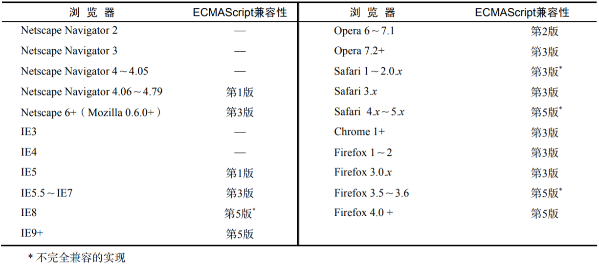
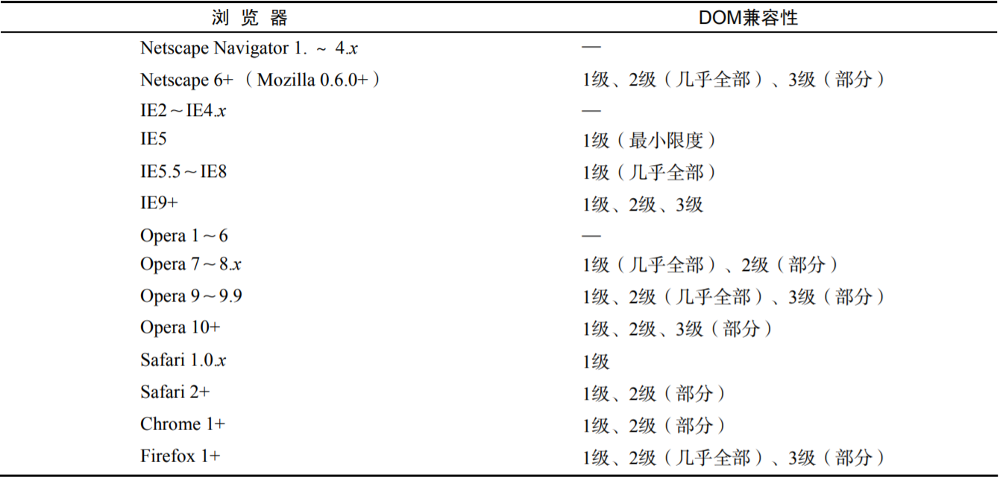
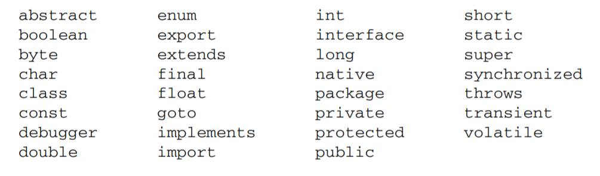

# JavaScript高级程序设计


## 简介

> 这是在学习《JavaScript高级程序设计》过程中记下的笔记，方便自己查漏补缺，温故知新。
>
> 本文中所有内容均摘录自原书。

## 目录

1. [第一章 JavaScript简介](#1)

2. [第二章 在HTML中使用JavaScript](#2)

	- [script元素](#2a)

	- [嵌入脚本与外部脚本](#2b)

	- [文档模式对JavaScript的影响](#2c)

	- [小结](#2d)

3. [第三章 基本概念](#3)

	- [语法](#3a)

	- [数据类型](#3b)

	- [操作符](#3c)

	- [语句](#3d)

	- [函数](#3e)

	- [小结](#3f)


***

<a name="1">

## 第一章 JavaScript简介

### JavaScript实现

1. 一个完整的JavaScript实现应该由以下三个不同部分组成:

	- 核心（ECMAScript）:提供核心语言功能
	- 文档对象模型（DOM）:提供访问和操作网页内容的方法和接口
	- 浏览器对象模型（BOM）:提供与浏览器交互的方法和接口

2. ECMAScript第5版于2009年发布，新功能包括:

	- 原生JSON对象（用于解析和序列化JSON数据）
	- 继承的方法和高级属性定义
	- 严格模式，对ECMAScript引擎解释和执行代码进行了补充说明

3. ECMAScript受主流Web浏览器支持情况:

	


4. **文档对象模型（DOM）**

	- 是针对XML但经过扩展用于HTML的应用程序编程接口（API）
	- 把整个页面映射为一个多层节点结构
	- 借助DOM提供的API，开发人员可以轻松的删除、添加、替换、修改任何节点

	- 由于Netscape和IE对DHTML各持己见，负责制定Web通信标准的W3C着手规划DOM
		1. DOM1级
			- 由两个模块组成:DOM核心和DOM HTML
			- DOM核心规定的是如何映射基于XML的文档结构，简化对文档中任意部分的操作
			- DOM HTML模块则是在DOM核心的基础上加以扩展，添加了针对HTML的对象和方法

		2. DOM2级
			- 如果说DOM1级的目标主要是映射文档的结构，那么DOM2级的目标就宽泛多了
			- DOM2 级在原来 DOM 的基础上又扩充了（DHTML 一直都支持的）鼠标和用户界面事件、范围、遍历（迭代 DOM文档的方法）等细分模块，而且通过对象接口增加了对 CSS的支持。
			- 引入了DOM视图、DOM事件、DOM样式、DOM遍历和范围 等新模块

		3. DOM3级
			- 进一步扩展了DOM，引入了以统一方式加载和保存文档的方法（DOM加载和保存模块）
			- 新增验证文档的方法（DOM验证模块）


	- Web浏览器对DOM的支持
		- 目前支持DOM已经成为浏览器开发商的首要目标，Mozilla开发团队的目标更是构建与标准100%兼容的浏览器
		- 主流浏览器对DOM标准的支持情况:
		- 


5. **浏览器对象模型（BOM）**

	- 开发人员可以使用BOM控制浏览器显示的页面以外的部分
	- BOM真正与众不同的地方（也是经常会导致问题的地方），是它作为JavaScript实现的一部分却没有相关的标准
	- 在HTML5中，这个问题得到了解决，HTML5致力于把BOM功能写入正式规范
	
	- BOM的一些部分：
		- 弹出新浏览器窗口的功能
		- 移动、缩放和关闭浏览器窗口的功能
		- 提供浏览器所加载页面的详细信息的location对象
		- 提供浏览器详细信息的navigator对象
		- 提供用户显示器分辨率详细信息的screen对象
		- 对cookies的支持
		- 像XMLHttpRequest和IE的ActiveXObject这样的自定义对象


***

<a name="2">


## 第二章 在HTML中使用JavaScript

<a name="2a">

### `<script>`元素

1. **`<script>`元素**
	- HTML 4.01 为其定义了6个属性:
		1. `async`, 可选，表示应立即下载脚本，但不应妨碍页面中其他操作，只对外部脚本文件有效
		2. `charset`, 可选，表示通过src属性指定的代码的字符集，由于大多数浏览器会忽略它的值，故很少用
		3. `defer`, 可选，表示脚本可以延迟到文档完全被解析和显示之后再执行，只对外部脚本文件有效
		4. `language`, 可选，原来用于表示编写代码使用的脚本语言，大多数浏览器会忽略这个属性，因此没有必要再用
		5. `src`, 可选，表示包含要执行代码的外部文件
		6. `type`, 可选， 可以看成是language的替代属性，表示编写代码使用的脚本语言的内容类型（也称为MIME类型）
			- 虽然`text/javascript`已经不被推荐使用，但人们一直以来使用的都还是它
			- 实际上，服务器在传送JavaScript文件时使用的MIME类型通常是`application/x-javascript`，但在type中设置这个值却可能导致脚本被忽略
			- 另外，在非IE浏览器中还可以使用`application/javascript`和`application/ecmascript`
			- 考虑到约定俗成和兼容，目前type的属性值依旧还是`text/javascript`，如果没有指定这个属性，其默认值仍是`text/javascript`

	- 使用`<script>`元素的方式有两种:
	
		- 直接在页面中嵌入。包含在其中的JavaScript代码将被从上而下依次解释，在浏览器对`<script>`元素内部的所有代码求值完毕之前，页面中的其余内容都不会被浏览器加载或显示
		
		- 包含外部JavaScript文件，那么src属性就是必须的了，这个属性的值是一个指向外部JavaScript文件的链接
	
	- 需要注意，带有src属性的`<script>`元素不应该在其内再包含额外的JavaScript代码，如果包含了嵌入的代码，则只会下载并执行外部脚本文件，嵌入的代码会被忽略

	- 通过src属性，还可以包含来自外部域的JS文件，这一点上，和img非常相似，即它的src属性可以是指向当前HTML页面所在域之外的某个域中的完整URL

	- 无论如何包含代码，只要不存在`defer`和`async`属性，浏览器都会按照script元素在页面中出现的先后顺序对其依次进行解析

2. **标签的位置**

	- 按照传统的做法，所有的script元素都应该放在页面的head元素中，这种做法的目的是把所有外部文件（包括CSS文件和JavaScript文件）的引用都放在相同的地方
	
	- 这意味着必须等到所有的js代码都被下载、解析和执行完成后，才能开始呈现页面的内容（浏览器在遇到body标签才开始呈现内容），这会导致浏览器呈现页面出现明显的延迟
	
	- 为了避免延迟的问题，现在Web应用程序一般都把全部JavaScript引用放在`body`元素中页面内容的后面

3. **延迟脚本**

	- script标签defer属性的用途是表明脚本在执行时，不会影响页面的构造，也就是说，脚本会被延迟到整个页面都解析完毕后再运行
	- 因此，在`<script>`元素中设置defer属性，相当于告诉浏览器立即下载，但延迟执行
	- `<script type="text/javascript" defer="defer" src="example1.js"></script>`
	- 该延迟脚本会等浏览器遇到</html>标签后再执行，但会先于 `DOMContentLoaded` 事件执行（详见第13章）
	- 现实中，多个延迟脚本不一定会按照顺序执行，也不一定会在`DOMContentLoaded`事件触发前执行，因此最好只包含一个延迟脚本
	
4. **异步脚本**

	- async属性告诉浏览器立即下载文件，但与defer不同的是，标记为async的脚本并不保证按照指定它们的先后顺序执行，因此确保多个async脚本之间互不依赖非常重要
	- 指定async属性的目的是不让页面等待脚本下载和执行，从而异步加载页面其他内容，为此，建议异步脚本不要在加载期间修改DOM
	- `<script type="text/javascript" async src="example1.js"></script>`
	- 异步脚本一定会在页面的`load`事件前执行，但可能会在`DOMContentLoaded`事件触发之前或之后执行
	- 在XHTML文档中，要把async属性设置为`async="async"`(defer同理)


<a name='2b'>

### 嵌入脚本与外部脚本

1. 在HTML中嵌入 JavaScript 代码虽然没有问题，但一般认为最好的做法还是尽可能使用外部文件来包含 JavaScript 代码

2. 使用外部脚本有以下优点:
	- 可维护性: 不触及HTML标记的情况下集中精力编辑js代码
	- 可缓存: 加快页面加载的速度
	- 适应未来: 通过外部文件来包含js无须使用XHTML或注释hack。HTML和XHTML包含外部文件的语法是相同的


<a name="2c">

### 文档模式对JavaScript的影响

1. 文档模式，通过文档类型（doctype）切换实现

2. 最初的两种文档模式是**混杂模式**和**标准模式**

3. 如果在文档开始处没有发现文档类型声明，则所有浏览器都会默认开启混杂模式，不同浏览器在这种模式下的行为差异非常大，如果不使用某些hack技术，跨浏览器的行为根本没有一致性可言

4. 虽然这两种模式主要影响CSS内容的呈现，但在某些情况下也会影响到JavaScript执行的情况


<a name="2d">


### 小结

把 JavaScript 插入到 HTML 页面中要使用`<script>`元素。使用这个元素可以把 JavaScript 嵌入到 HTML 页面中，让脚本与标记混合在一起；也可以包含外部的 JavaScript 文件。而我们需要注意的地方有：

- 在包含外部 JavaScript 文件时，必须将 src 属性设置为指向相应文件的 URL。而这个文件既可以是与包含它的页面位于同一个服务器上的文件，也可以是其他任何域中的文件。

- 所有`<script>`元素都会按照它们在页面中出现的先后顺序依次被解析。在不使用 `defer` 和 `async` 属性的情况下，只有在解析完前面`<script>`元素中的代码之后，才会开始解析后面`<script>`元素中的代码。

- 由于浏览器会先解析完不使用 `defer` 属性的`<script>`元素中的代码，然后再解析后面的内容，所以一般应该把`<script>`元素放在页面最后，即主要内容后面，`</body>`标签前面。

- 使用 `defer` 属性可以让脚本在文档完全呈现之后再执行。延迟脚本总是按照指定它们的顺序执行。

- 使用 `async` 属性可以表示当前脚本不必等待其他脚本，也不必阻塞文档呈现。不能保证异步脚本按照它们在页面中出现的顺序执行。


***


<a name="3">

## 第三章 基本概念

<a name="3a">

### 语法

1. 区分大小写: ECMAScript中的一切（变量、函数名、操作符）都区分大小写

2. 标识符: 指变量、函数、属性的名字，或者函数的参数
	- 第一个字符必须是一个字母、下划线、或者一个美元符号
	- 其他字母可以是字母、下划线、美元符号或数字
	- 按照惯例，标识符采用驼峰大小写格式
	- 不能把关键字、保留字、true、false和null用作标识符

3. 严格模式: ES5引入，是为JS定义的一种不同的解析和执行模型
	- 在严格模式下ES3的一些不确定的行为将得到处理，对于不安全的操作会报错
	- 在函数内部上方添加 `use strict`或在页面顶部添加，可以指定在严格模式下执行
	- 严格模式下，JS的执行结果会有很大不同，接下来会随时指出严格模式下的区别
	- 支持严格模式的浏览器包括: IE 10+、Firefox 4+、Safari 5.1+ 和 Chrome

4. 语句
	- ES中的语句以一个分号结尾，如果省略分号，则由解析器确定语句的结尾，建议任何时候都不要省略它

5. 关键字和保留字

	- 关键字可用于表示控制语句的开始或结束，或者执行特定操作等:
	- 
	
	- 保留字在语言中还没有特定用途，但将来可能用作关键字:
	- 
	
	- 此外ES5新增保留字 `let`,`yield` 

6. 变量

	- ES的变量是松散类型的，可以用来保存任何类型的数据
	- 定义变量时要使用var: `var message;`该变量可以用来保存任何值
	- 未经过初始化的变量，会保存一个特殊的值——`undefined`，支持在声明的同时初始化变量
	- 用`var`操作符定义的变量将成为定义该变量的作用域中的局部变量，也就是说，如果在一个函数中使用var声明一个变量，那么这个变量会在函数退出后销毁

	```
	function test(){
		var message = "hi"; // 局部变量
	}
	test();
	alert(message); // 错误！
	```

	- 虽然省略 var 操作符可以定义全局变量，但这也不是我们推荐的做法。
	- 因为在局部作用域中定义的全局变量很难维护，而且如果有意地忽略了 var 操作符，也会由于相应变量不会马上就有定义而导致不必要的混乱。
	- 给未经声明的变量赋值在严格模式下会导致抛出 `ReferenceError` 错误。

	- 可以使用一条语句定义多个变量，只要用逗号分开即可
	
	```
	var message = "hi",
		found = false,
		age = 29;
	```


<a name="3b">

### 数据类型

1. ES中有5种简单数据类型(`Undefined`、`Null`、`Boolean`、`Number`、`String`)还有一种复杂数据类型——`Object`，`Object`本质上是由一组无序的名值对组成

2. ES中不支持任何创建自定义类型的机制，所有值最终都将是上述6种数据类型之一

3. `typeof`操作符: 鉴于ES的松散类型，因此需要有一种手段来检测变量的数据类型

	- `undefined`——如果这个值未定义
	- `boolean`——如果这个值是布尔值
	- `string`——如果这个值是字符串
	- `number`——如果这个值是数值
	- `object`——如果这个值是对象或null
	- `function`——如果这个值是函数

#### `null` 和 `undefined`

- 实际上，`undefined` 值是派生自 `null` 值的，因此在进行相等性测试时返回`true`
- 无论在什么情况下都没有必要把一个变量的值显式地设置为 undefined
- 如果定义的变量准备在将来用于保存对象，那么最好将该变量初始化为 `null` 而不是其他值
- 不仅可以体现`null`作为空对象指针的惯例，也有助于进一步区分`null`和`undefined`


#### `Boolean`类型

- `Boolean`类型是ES中使用的最多的一种类型，该类型只有两个字面值: true和false

- 虽然该类型字面值只有两个，但是ES中所有类型的值都有与这两个Boolean值等价的值，通过调用`Boolean()`得到

#### `Number`类型

- 整数
	- 最基本的数值字面量格式是十进制整数，八进制字面值可以通过加上前导0来表示，如果字面值中的数值超出了范围，那么前导0将被忽略，后面的数值被当做十进制解析
	- 八进制字面量在严格模式下是无效的，会导致JS引擎报错
	- 十六进制字面值的前两位必须是0x，后跟十六进制数字，A~F可以大写，也可以小写

- 浮点数	
	- 由于保存浮点数值需要的内存空间是保存整数值的两倍，因此 ECMAScript 会不失时机地将浮点数值转换为整数值。
	- 如果小数点后面没有跟任何数字，那么这个数值就可以作为整数值来保存。同样地，如果浮点数值本身表示的就是一个整数（如 1.0），那么该值也会被转换为整数

- 科学计数法:
	- ECMAScript 中的格式: 前面是一个数值（可以是整数也可以是浮点数），中间是一个大写或小写的字母 E，后面是 10 的幂中的指数，该幂值将用来与前面的数相乘
	- `var floatNum = 3.125e7; // 等于 31250000 `
	- 在默认情况下，ECMASctipt 会将那些小数点后面带有 6 个零以上的浮点数值转换为以 e 表示法表示的数值
	- 浮点数值的最高精度是17位小数，但在进行算术运算时其精确度远远不如整数，例如0.1 加 0.2的结果不是 0.3，而是 0.30000000000000004。

- 关于浮点数值计算产生舍入误差的问题，有一点需要明确，这是使用基于IEEE754数值的浮点计算的通病，其他使用相同数值格式的语言也存在这个问题

- 数值范围:
	- 由于内存限制，ES并不能保存所有的数值
	- ES能表示的最小数值保存在`Number.MIN_VALUE`中，最大数值保存在`Number.MAX_VALUE`中
	- 如果某次计算的结果得到了一个超出JS数值范围的值，那么这个值将被自动转换为特殊的Infinity值（负数则是-Infinity）
	- Infinity无法参与计算，要想确定一个数值是否有穷，可以使用`isFinity()`函数，这个函数在参数位于最小和最大数值之间时会返回true

- `NaN`	
	- 是一个特殊的数值，用来表示一个本来要返回数值的操作数未返回数值的情况（这样就不会抛出错误了）
	- 在其他编程语言中，任何数值除以0都会报错，从而停止运行，但在ES中，0除以0会返回NaN，正数除以0返回Infinity，因此不会影响其他代码的运行
	- 任何涉及NaN的操作都会返回NaN，并且，NaN与任何值都不相等，包括NaN本身
	- 针对NaN，定义了`isNaN()`函数，用来判断这个参数是否“不是数值”
		- `isNaN`在接收到一个值后，会尝试将其转换为数值，任何不能转换为数值的值都会导致这个函数返回true
		- 注意，`isNaN()`也适用于对象，在基于对象调用`isNaN()`函数时，会首先调用对象的`valueOf()`方法，然后确定该方法的值是否可以转换为数值
		- 如果不能，则基于这个返回值再调用`toString()`方法，再测试返回值
		- 这个过程也是ES中内置函数和操作符的一般执行流程

- 数值转换
	- 有三个函数可以把非数值转换为数值: `Number()`、`parseInt()`、`parseFloat()`
	- `Number()`可以用于任何数据类型
	- 
	- **一元加操作符**的操作与`Number()`函数相同

	- `parseInt()`
		- parseInt()函数在转换字符串时，更多的是看其是否符合数值模式。它会忽略字符串前面的空格，直至找到第一个非空格字符。如果第一个字符不是数字字符或者负号，`parseInt()`就会返回 NaN；也就是说，用 parseInt()转换空字符串会返回 NaN（Number()对空字符返回 0）。
		
		- 如果第一个字符是数字字符，parseInt()会继续解析第二个字符，直到解析完所有后续字符或者遇到了一个非数字字符。例如，"1234blue"会被转换为 1234，因为"blue"会被完全忽略。类似地，"22.5"会被转换为 22，因为小数点并不是有效的数字字符。
		
		- 如果字符串中的第一个字符是数字字符，parseInt()也能够识别出各种整数格式（即前面讨论的十进制、八进制和十六进制数）。也就是说，如果字符串以"0x"开头且后跟数字字符，就会将其当作一个十六进制整数；如果字符串以"0"开头且后跟数字字符，则会将其当作一个八进制数来解析

	- 注意: 在ES5中，parseInt()已经不具有解析八进制的能力，前导0会被认为无效，作为替代，可以指定第二个参数为进制，使其按要求转换，建议在任何情况下都指定基数

	- `parseFloat()`
		- 与`parseInt()`类似，从第一个字符开始解析，一致解析到末尾，或者遇到一个无效的浮点数字字符为止
		- 字符串中的第一个小数点是有效的，而第二个就无效了，因此后面的字符串将被忽略

#### `string`类型


<a name="3c">

### 操作符


<a name="3d">

### 语句


<a name="3e">

### 函数


