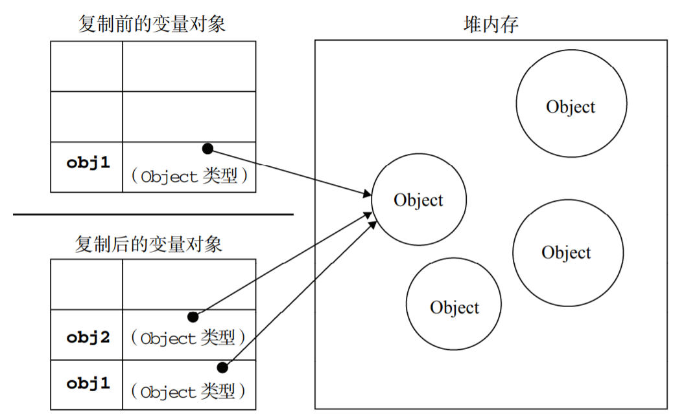
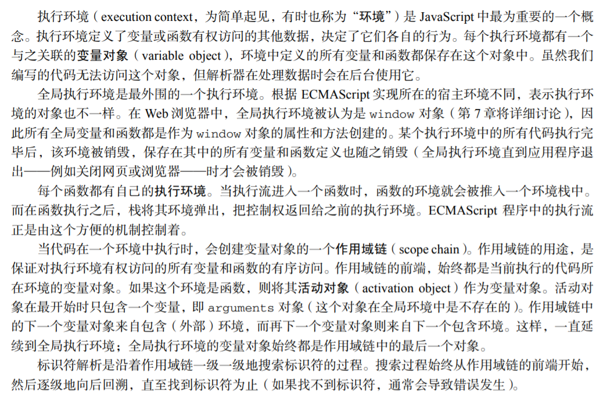
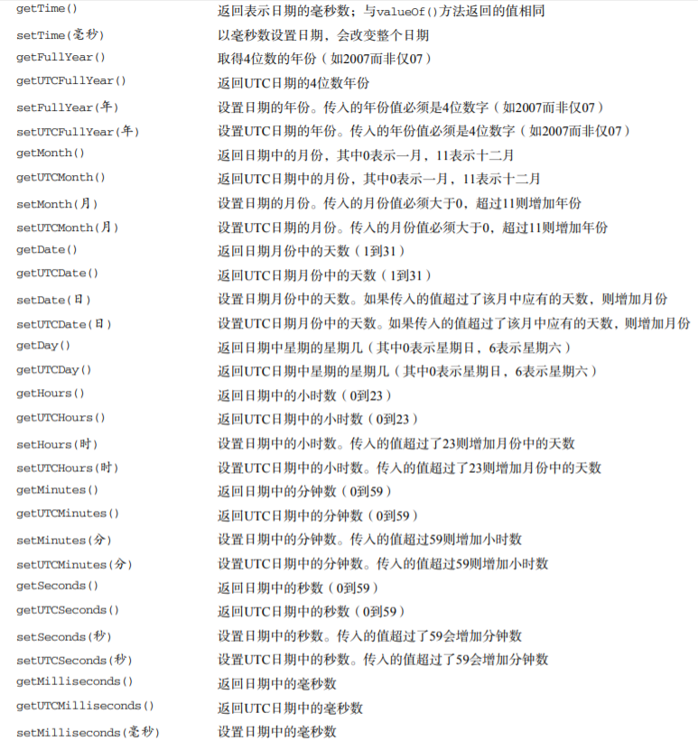
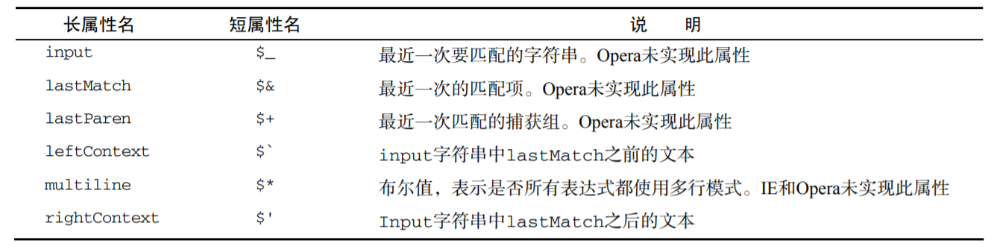
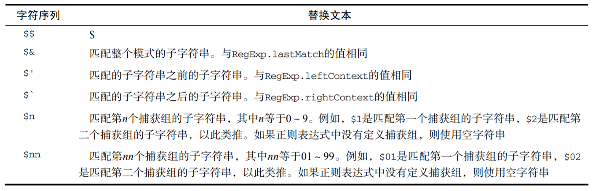
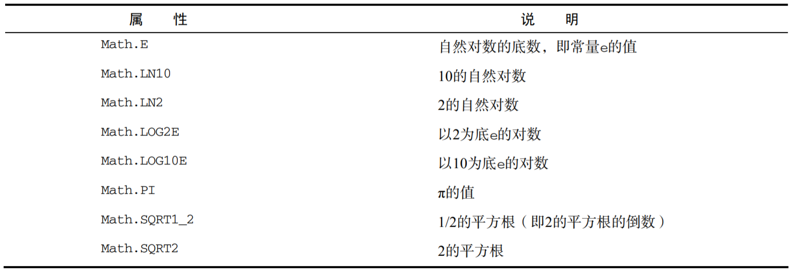
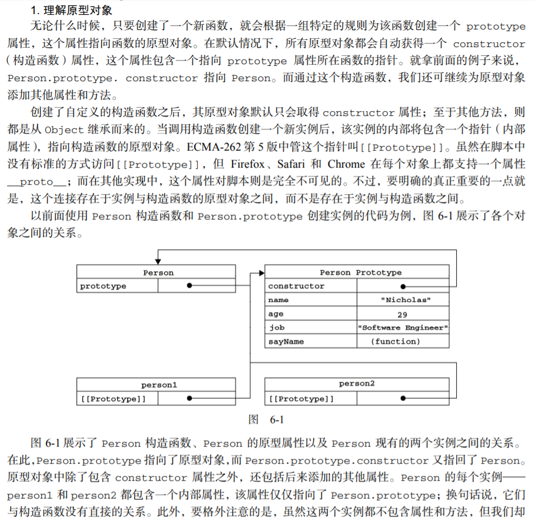
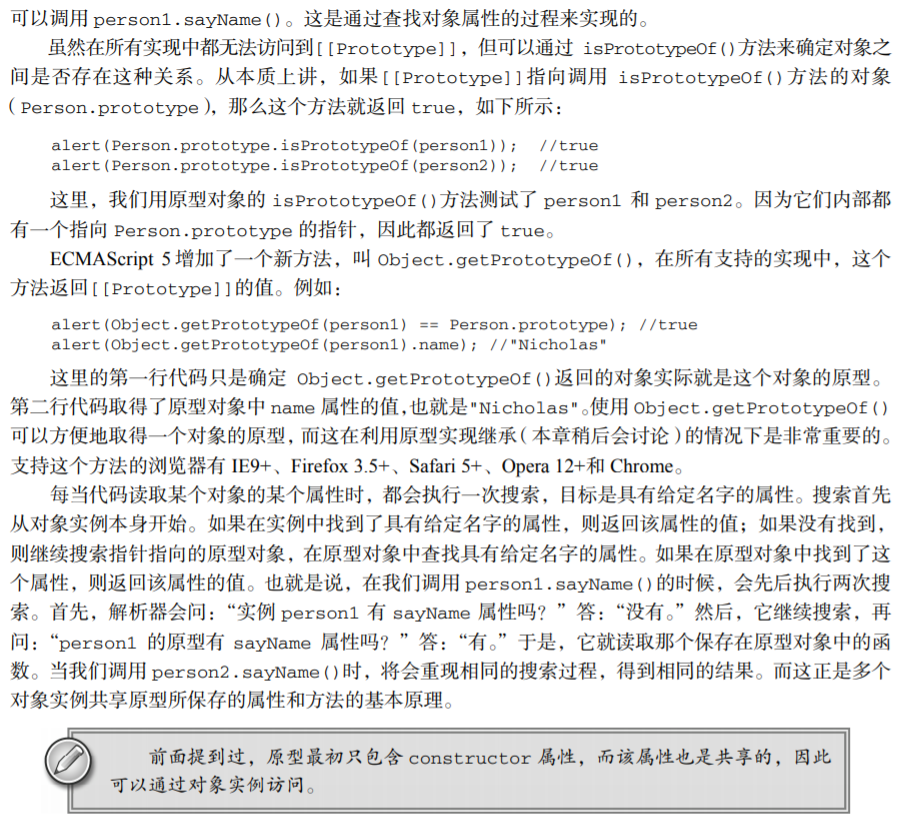

# JavaScript高级程序设计


## 简介

> 这是在学习《JavaScript高级程序设计》过程中记下的笔记，方便自己查漏补缺，温故知新。
>
> 本文中内容基本摘录自原书。

## 目录

1. [第一章 JavaScript简介](#1)

2. [第二章 在HTML中使用JavaScript](#2)

	- [script元素](#2a)

	- [嵌入脚本与外部脚本](#2b)

	- [文档模式对JavaScript的影响](#2c)

	- [小结](#2d)

3. [第三章 基本概念](#3)

	- [语法](#3a)

	- [数据类型](#3b)

	- [操作符](#3c)

	- [语句](#3d)

	- [函数](#3e)

	- [小结](#3f)

4. [第四章 变量、作用域和内存问题](#4)

	- [基本类型和引用类型](#4a)
	
	- [执行环境及作用域](#4b)
	
	- [垃圾收集](#4c)

	- [小结](#4d)

5. [第五章 引用类型](#5)

	- [Object类型](#5a)
	
	- [Array类型](#5b)
	
	- [Date类型](#5c)
	
	- [RegExp类型](#5d)
	
	- [Function类型](#5e)
	
	- [基本包装类型](#5f)
	
	- [单体内置对象](#5g)
	
	- [小结](#5h)

6. [第六章 面向对象的程序设计](#6)

	- [理解对象](#6a)
	
	- [创造对象](#6b)
	
	- [继承](#6c)
	
	- [小结](#6d)


***

<a name="1">

## 第一章 JavaScript简介

### JavaScript实现

1. 一个完整的JavaScript实现应该由以下三个不同部分组成:

	- 核心（ECMAScript）:提供核心语言功能
	- 文档对象模型（DOM）:提供访问和操作网页内容的方法和接口
	- 浏览器对象模型（BOM）:提供与浏览器交互的方法和接口

2. ECMAScript第5版于2009年发布，新功能包括:

	- 原生JSON对象（用于解析和序列化JSON数据）
	- 继承的方法和高级属性定义
	- 严格模式，对ECMAScript引擎解释和执行代码进行了补充说明

3. ECMAScript受主流Web浏览器支持情况:

	


4. **文档对象模型（DOM）**

	- 是针对XML但经过扩展用于HTML的应用程序编程接口（API）
	- 把整个页面映射为一个多层节点结构
	- 借助DOM提供的API，开发人员可以轻松的删除、添加、替换、修改任何节点

	- 由于Netscape和IE对DHTML各持己见，负责制定Web通信标准的W3C着手规划DOM
		1. DOM1级
			- 由两个模块组成:DOM核心和DOM HTML
			- DOM核心规定的是如何映射基于XML的文档结构，简化对文档中任意部分的操作
			- DOM HTML模块则是在DOM核心的基础上加以扩展，添加了针对HTML的对象和方法

		2. DOM2级
			- 如果说DOM1级的目标主要是映射文档的结构，那么DOM2级的目标就宽泛多了
			- DOM2 级在原来 DOM 的基础上又扩充了（DHTML 一直都支持的）鼠标和用户界面事件、范围、遍历（迭代 DOM文档的方法）等细分模块，而且通过对象接口增加了对 CSS的支持。
			- 引入了DOM视图、DOM事件、DOM样式、DOM遍历和范围 等新模块

		3. DOM3级
			- 进一步扩展了DOM，引入了以统一方式加载和保存文档的方法（DOM加载和保存模块）
			- 新增验证文档的方法（DOM验证模块）


	- Web浏览器对DOM的支持
		- 目前支持DOM已经成为浏览器开发商的首要目标，Mozilla开发团队的目标更是构建与标准100%兼容的浏览器
		- 主流浏览器对DOM标准的支持情况:
		
		


5. **浏览器对象模型（BOM）**

	- 开发人员可以使用BOM控制浏览器显示的页面以外的部分
	- BOM真正与众不同的地方（也是经常会导致问题的地方），是它作为JavaScript实现的一部分却没有相关的标准
	- 在HTML5中，这个问题得到了解决，HTML5致力于把BOM功能写入正式规范
	
	- BOM的一些部分：
		- 弹出新浏览器窗口的功能
		- 移动、缩放和关闭浏览器窗口的功能
		- 提供浏览器所加载页面的详细信息的location对象
		- 提供浏览器详细信息的navigator对象
		- 提供用户显示器分辨率详细信息的screen对象
		- 对cookies的支持
		- 像XMLHttpRequest和IE的ActiveXObject这样的自定义对象


***

<a name="2">


## 第二章 在HTML中使用JavaScript

<a name="2a">

### `<script>`元素

1. **`<script>`元素**
	- HTML 4.01 为其定义了6个属性:
		1. `async`, 可选，表示应立即下载脚本，但不应妨碍页面中其他操作，只对外部脚本文件有效
		2. `charset`, 可选，表示通过src属性指定的代码的字符集，由于大多数浏览器会忽略它的值，故很少用
		3. `defer`, 可选，表示脚本可以延迟到文档完全被解析和显示之后再执行，只对外部脚本文件有效
		4. `language`, 可选，原来用于表示编写代码使用的脚本语言，大多数浏览器会忽略这个属性，因此没有必要再用
		5. `src`, 可选，表示包含要执行代码的外部文件
		6. `type`, 可选， 可以看成是language的替代属性，表示编写代码使用的脚本语言的内容类型（也称为MIME类型）
			- 虽然`text/javascript`已经不被推荐使用，但人们一直以来使用的都还是它
			- 实际上，服务器在传送JavaScript文件时使用的MIME类型通常是`application/x-javascript`，但在type中设置这个值却可能导致脚本被忽略
			- 另外，在非IE浏览器中还可以使用`application/javascript`和`application/ecmascript`
			- 考虑到约定俗成和兼容，目前type的属性值依旧还是`text/javascript`，如果没有指定这个属性，其默认值仍是`text/javascript`

	- 使用`<script>`元素的方式有两种:
	
		- 直接在页面中嵌入。包含在其中的JavaScript代码将被从上而下依次解释，在浏览器对`<script>`元素内部的所有代码求值完毕之前，页面中的其余内容都不会被浏览器加载或显示
		
		- 包含外部JavaScript文件，那么src属性就是必须的了，这个属性的值是一个指向外部JavaScript文件的链接
	
	- 需要注意，带有src属性的`<script>`元素不应该在其内再包含额外的JavaScript代码，如果包含了嵌入的代码，则只会下载并执行外部脚本文件，嵌入的代码会被忽略

	- 通过src属性，还可以包含来自外部域的JS文件，这一点上，和img非常相似，即它的src属性可以是指向当前HTML页面所在域之外的某个域中的完整URL

	- 无论如何包含代码，只要不存在`defer`和`async`属性，浏览器都会按照script元素在页面中出现的先后顺序对其依次进行解析

2. **标签的位置**

	- 按照传统的做法，所有的script元素都应该放在页面的head元素中，这种做法的目的是把所有外部文件（包括CSS文件和JavaScript文件）的引用都放在相同的地方
	
	- 这意味着必须等到所有的js代码都被下载、解析和执行完成后，才能开始呈现页面的内容（浏览器在遇到body标签才开始呈现内容），这会导致浏览器呈现页面出现明显的延迟
	
	- 为了避免延迟的问题，现在Web应用程序一般都把全部JavaScript引用放在`body`元素中页面内容的后面

3. **延迟脚本**

	- script标签defer属性的用途是表明脚本在执行时，不会影响页面的构造，也就是说，脚本会被延迟到整个页面都解析完毕后再运行
	- 因此，在`<script>`元素中设置defer属性，相当于告诉浏览器立即下载，但延迟执行
	- `<script type="text/javascript" defer="defer" src="example1.js"></script>`
	- 该延迟脚本会等浏览器遇到</html>标签后再执行，但会先于 `DOMContentLoaded` 事件执行（详见第13章）
	- 现实中，多个延迟脚本不一定会按照顺序执行，也不一定会在`DOMContentLoaded`事件触发前执行，因此最好只包含一个延迟脚本
	
4. **异步脚本**

	- async属性告诉浏览器立即下载文件，但与defer不同的是，标记为async的脚本并不保证按照指定它们的先后顺序执行，因此确保多个async脚本之间互不依赖非常重要
	- 指定async属性的目的是不让页面等待脚本下载和执行，从而异步加载页面其他内容，为此，建议异步脚本不要在加载期间修改DOM
	- `<script type="text/javascript" async src="example1.js"></script>`
	- 异步脚本一定会在页面的`load`事件前执行，但可能会在`DOMContentLoaded`事件触发之前或之后执行
	- 在XHTML文档中，要把async属性设置为`async="async"`(defer同理)


<a name='2b'>

### 嵌入脚本与外部脚本

1. 在HTML中嵌入 JavaScript 代码虽然没有问题，但一般认为最好的做法还是尽可能使用外部文件来包含 JavaScript 代码

2. 使用外部脚本有以下优点:
	- 可维护性: 不触及HTML标记的情况下集中精力编辑js代码
	- 可缓存: 加快页面加载的速度
	- 适应未来: 通过外部文件来包含js无须使用XHTML或注释hack。HTML和XHTML包含外部文件的语法是相同的


<a name="2c">

### 文档模式对JavaScript的影响

1. 文档模式，通过文档类型（doctype）切换实现

2. 最初的两种文档模式是**混杂模式**和**标准模式**

3. 如果在文档开始处没有发现文档类型声明，则所有浏览器都会默认开启混杂模式，不同浏览器在这种模式下的行为差异非常大，如果不使用某些hack技术，跨浏览器的行为根本没有一致性可言

4. 虽然这两种模式主要影响CSS内容的呈现，但在某些情况下也会影响到JavaScript执行的情况


<a name="2d">


### 小结

把 JavaScript 插入到 HTML 页面中要使用`<script>`元素。使用这个元素可以把 JavaScript 嵌入到 HTML 页面中，让脚本与标记混合在一起；也可以包含外部的 JavaScript 文件。而我们需要注意的地方有：

- 在包含外部 JavaScript 文件时，必须将 src 属性设置为指向相应文件的 URL。而这个文件既可以是与包含它的页面位于同一个服务器上的文件，也可以是其他任何域中的文件。

- 所有`<script>`元素都会按照它们在页面中出现的先后顺序依次被解析。在不使用 `defer` 和 `async` 属性的情况下，只有在解析完前面`<script>`元素中的代码之后，才会开始解析后面`<script>`元素中的代码。

- 由于浏览器会先解析完不使用 `defer` 属性的`<script>`元素中的代码，然后再解析后面的内容，所以一般应该把`<script>`元素放在页面最后，即主要内容后面，`</body>`标签前面。

- 使用 `defer` 属性可以让脚本在文档完全呈现之后再执行。延迟脚本总是按照指定它们的顺序执行。

- 使用 `async` 属性可以表示当前脚本不必等待其他脚本，也不必阻塞文档呈现。不能保证异步脚本按照它们在页面中出现的顺序执行。


***


<a name="3">

## 第三章 基本概念

<a name="3a">

### 语法

1. 区分大小写: ECMAScript中的一切（变量、函数名、操作符）都区分大小写

2. 标识符: 指变量、函数、属性的名字，或者函数的参数
	- 第一个字符必须是一个字母、下划线、或者一个美元符号
	- 其他字母可以是字母、下划线、美元符号或数字
	- 按照惯例，标识符采用驼峰大小写格式
	- 不能把关键字、保留字、true、false和null用作标识符

3. 严格模式: ES5引入，是为JS定义的一种不同的解析和执行模型
	- 在严格模式下ES3的一些不确定的行为将得到处理，对于不安全的操作会报错
	- 在函数内部上方添加 `use strict`或在页面顶部添加，可以指定在严格模式下执行
	- 严格模式下，JS的执行结果会有很大不同，接下来会随时指出严格模式下的区别
	- 支持严格模式的浏览器包括: IE 10+、Firefox 4+、Safari 5.1+ 和 Chrome

4. 语句
	- ES中的语句以一个分号结尾，如果省略分号，则由解析器确定语句的结尾，建议任何时候都不要省略它

5. 关键字和保留字

	- 关键字可用于表示控制语句的开始或结束，或者执行特定操作等:
	- 
	
	- 保留字在语言中还没有特定用途，但将来可能用作关键字:
	- 
	
	- 此外ES5新增保留字 `let`,`yield` 

6. 变量

	- ES的变量是松散类型的，可以用来保存任何类型的数据
	- 定义变量时要使用var: `var message;`该变量可以用来保存任何值
	- 未经过初始化的变量，会保存一个特殊的值——`undefined`，支持在声明的同时初始化变量
	- 用`var`操作符定义的变量将成为定义该变量的作用域中的局部变量，也就是说，如果在一个函数中使用var声明一个变量，那么这个变量会在函数退出后销毁

	```
	function test(){
		var message = "hi"; // 局部变量
	}
	test();
	alert(message); // 错误！
	```

	- 虽然省略 var 操作符可以定义全局变量，但这也不是我们推荐的做法。
	- 因为在局部作用域中定义的全局变量很难维护，而且如果有意地忽略了 var 操作符，也会由于相应变量不会马上就有定义而导致不必要的混乱。
	- 给未经声明的变量赋值在严格模式下会导致抛出 `ReferenceError` 错误。

	- 可以使用一条语句定义多个变量，只要用逗号分开即可
	
	```
	var message = "hi",
		found = false,
		age = 29;
	```


<a name="3b">

### 数据类型

1. ES中有5种简单数据类型(`Undefined`、`Null`、`Boolean`、`Number`、`String`)还有一种复杂数据类型——`Object`，`Object`本质上是由一组无序的名值对组成

2. ES中不支持任何创建自定义类型的机制，所有值最终都将是上述6种数据类型之一

3. `typeof`操作符: 鉴于ES的松散类型，因此需要有一种手段来检测变量的数据类型

	- `undefined`——如果这个值未定义
	- `boolean`——如果这个值是布尔值
	- `string`——如果这个值是字符串
	- `number`——如果这个值是数值
	- `object`——如果这个值是对象或null
	- `function`——如果这个值是函数

#### `null` 和 `undefined`

- 实际上，`undefined` 值是派生自 `null` 值的，因此在进行相等性测试时返回`true`
- 无论在什么情况下都没有必要把一个变量的值显式地设置为 undefined
- 如果定义的变量准备在将来用于保存对象，那么最好将该变量初始化为 `null` 而不是其他值
- 不仅可以体现`null`作为空对象指针的惯例，也有助于进一步区分`null`和`undefined`


#### `Boolean`类型

- `Boolean`类型是ES中使用的最多的一种类型，该类型只有两个字面值: true和false

- 虽然该类型字面值只有两个，但是ES中所有类型的值都有与这两个Boolean值等价的值，通过调用`Boolean()`得到

#### `Number`类型

- 整数
	- 最基本的数值字面量格式是十进制整数，八进制字面值可以通过加上前导0来表示，如果字面值中的数值超出了范围，那么前导0将被忽略，后面的数值被当做十进制解析
	- 八进制字面量在严格模式下是无效的，会导致JS引擎报错
	- 十六进制字面值的前两位必须是0x，后跟十六进制数字，A~F可以大写，也可以小写

- 浮点数	
	- 由于保存浮点数值需要的内存空间是保存整数值的两倍，因此 ECMAScript 会不失时机地将浮点数值转换为整数值。
	- 如果小数点后面没有跟任何数字，那么这个数值就可以作为整数值来保存。同样地，如果浮点数值本身表示的就是一个整数（如 1.0），那么该值也会被转换为整数

- 科学计数法:
	- ECMAScript 中的格式: 前面是一个数值（可以是整数也可以是浮点数），中间是一个大写或小写的字母 E，后面是 10 的幂中的指数，该幂值将用来与前面的数相乘
	- `var floatNum = 3.125e7; // 等于 31250000 `
	- 在默认情况下，ECMASctipt 会将那些小数点后面带有 6 个零以上的浮点数值转换为以 e 表示法表示的数值
	- 浮点数值的最高精度是17位小数，但在进行算术运算时其精确度远远不如整数，例如0.1 加 0.2的结果不是 0.3，而是 0.30000000000000004。

- 关于浮点数值计算产生舍入误差的问题，有一点需要明确，这是使用基于IEEE754数值的浮点计算的通病，其他使用相同数值格式的语言也存在这个问题

- 数值范围:
	- 由于内存限制，ES并不能保存所有的数值
	- ES能表示的最小数值保存在`Number.MIN_VALUE`中，最大数值保存在`Number.MAX_VALUE`中
	- 如果某次计算的结果得到了一个超出JS数值范围的值，那么这个值将被自动转换为特殊的Infinity值（负数则是-Infinity）
	- Infinity无法参与计算，要想确定一个数值是否有穷，可以使用`isFinity()`函数，这个函数在参数位于最小和最大数值之间时会返回true

- `NaN`	
	- 是一个特殊的数值，用来表示一个本来要返回数值的操作数未返回数值的情况（这样就不会抛出错误了）
	- 在其他编程语言中，任何数值除以0都会报错，从而停止运行，但在ES中，0除以0会返回NaN，正数除以0返回Infinity，因此不会影响其他代码的运行
	- 任何涉及NaN的操作都会返回NaN，并且，NaN与任何值都不相等，包括NaN本身
	- 针对NaN，定义了`isNaN()`函数，用来判断这个参数是否“不是数值”
		- `isNaN`在接收到一个值后，会尝试将其转换为数值，任何不能转换为数值的值都会导致这个函数返回true
		- 注意，`isNaN()`也适用于对象，在基于对象调用`isNaN()`函数时，会首先调用对象的`valueOf()`方法，然后确定该方法的值是否可以转换为数值
		- 如果不能，则基于这个返回值再调用`toString()`方法，再测试返回值
		- 这个过程也是ES中内置函数和操作符的一般执行流程

- 数值转换
	- 有三个函数可以把非数值转换为数值: `Number()`、`parseInt()`、`parseFloat()`
	- `Number()`可以用于任何数据类型
	- 
	- **一元加操作符**的操作与`Number()`函数相同

	- `parseInt()`
		- parseInt()函数在转换字符串时，更多的是看其是否符合数值模式。它会忽略字符串前面的空格，直至找到第一个非空格字符。如果第一个字符不是数字字符或者负号，`parseInt()`就会返回 NaN；也就是说，用 parseInt()转换空字符串会返回 NaN（Number()对空字符返回 0）。
		
		- 如果第一个字符是数字字符，parseInt()会继续解析第二个字符，直到解析完所有后续字符或者遇到了一个非数字字符。例如，"1234blue"会被转换为 1234，因为"blue"会被完全忽略。类似地，"22.5"会被转换为 22，因为小数点并不是有效的数字字符。
		
		- 如果字符串中的第一个字符是数字字符，parseInt()也能够识别出各种整数格式（即前面讨论的十进制、八进制和十六进制数）。也就是说，如果字符串以"0x"开头且后跟数字字符，就会将其当作一个十六进制整数；如果字符串以"0"开头且后跟数字字符，则会将其当作一个八进制数来解析

	- 注意: 在ES5中，parseInt()已经不具有解析八进制的能力，前导0会被认为无效，作为替代，可以指定第二个参数为进制，使其按要求转换，建议在任何情况下都指定基数

	- `parseFloat()`
		- 与`parseInt()`类似，从第一个字符开始解析，一致解析到末尾，或者遇到一个无效的浮点数字字符为止
		- 字符串中的第一个小数点是有效的，而第二个就无效了，因此后面的字符串将被忽略

#### `string`类型

字符串可以由双引号或单引号表示，在PHP中双引号和单引号会影响对字符串的解释方式，ES中这两种语法形式并没有什么区别

1. 字符字面量，一些特殊的字符字面量，也叫转义序列，用于表示非打印字符，或者具有其他用途的字符
	- 
	- 这些字符字面量可以出现在字符串的任意位置，也被当做一个字符来解析
	- `var text = "This is the letter sigma: \u03a3.";`这个例子的text有28个字符，其中6个字符长的转义序列表示1个字符
	- 任何字符串的长度都可以通过访问其length属性得到
	
2. 字符串一旦创建，他们的值就不能改变，要改变某个变量保存的字符串，首先要销毁原来的字符串，然后再用另一个包含新值得字符串填充该变量

3. 把一个值转换为字符串有两种方式
	1. 第一种使用toString方法，但是null和undefined没有这个方法
		- 多数情况调用toString不必传递参数，但是对于数值，可以传递一个参数，作为输出数值的基数
		- 默认情况下，toString方法以十进制格式返回数值的字符串表示
	
	2. 在不知道要转换的值是不是null或undefined的情况下，可以使用String()
		- 这个函数能够将任何类型的值转换为字符串
		- null返回"null", undefined返回"undefined"


#### `Object`类型

ECMAScript 中的对象其实就是一组数据和功能的集合。对象可以通过执行 new 操作符后跟要创建的对象类型的名称来创建。而创建 Object 类型的实例并为其添加属性和（或）方法，就可以创建自定义对象

在 ECMAScript 中，如果不给构造函数传递参数，则可以省略后面的那一对圆括号。也就是说，在像前面这个示例一样不传递参数的情况下，完全可以省略那对圆括号（但这不是推荐的做法）：

`var o = new Object; // 有效，但不推荐省略圆括号`

Object的每个实例都具有下列属性和方法:

- `constructor`: 保存着用于创建当前对象的函数，对于前面的例子而言，构造函数(constructor)就是Object()

- `hasOwnProperty()`: 用于检查给定的属性在当前对象实例中是否存在

- `isPrototypeOf(object)`: 用于检查传入的对象是否是传入对象的原型

- `propertyIsEnumerable(propertyName)`: 用于检查给定的属性是否能够使用for-in语句来枚举

- `toLocaleString()`: 返回对象的字符串表示，该字符串与执行环境的地区对应

- `toString()`: 返回对象的字符串表示

- `valueOf()`: 返回对象的字符串、数值或布尔值表示，通常与`toString()`方法的返回值相同

由于Object是所有对象的基础，因此所有对象都具有这些基本的属性和方法，第5章和第6章将详细介绍Object

注意: ES中对象的行为不一定适合JS中的其他对象，比如说宿主对象，是由宿主实现和定义的，可能不会继承Object


<a name="3c">

### 操作符

#### 布尔操作符

1. 逻辑非
	- 可以应用于ES中的任何值，无论这个值是什么类型，都会返回一个布尔值，首先会将其转换为一个布尔值，再对其求反
	- 遵循以下规则:
	- 

	- 如果同时使用两个逻辑非操作符，实际上就是模拟Boolean()函数的行为

2. 逻辑与
	- 逻辑与(&&)也可以应用于任何类型的操作数
		- 如果有一个操作数是 null，则返回 null；
		- 如果有一个操作数是 NaN，则返回 NaN；
		- 如果有一个操作数是 undefined，则返回 undefined

	- 逻辑与操作属于短路操作，如果第一个操作数能够决定结果，就不会再对第二个操作数求值

3. 逻辑或
	- 逻辑或(||)与逻辑与相似，也是属于短路操作
	- 我们可以利用逻辑或的行为来避免为一个变量赋null或undefined值
	- `var event = event || window.event`


#### 乘性操作符

1. 乘法:
	- 如果有一个操作数是NaN，结果是NaN
	- **如果是Infinity与0相乘，结果是NaN**
	- 如果Infinity与非0相乘，则结果是Infinity或-Infinity
	- **Infinity与Infinity相乘，结果也是Infinity**
	- 如果有一个操作数不是数值，则在后台调用Number()将其转换为数值，再应用上面的规则

2. 除法:
	- 如果有一个操作数是NaN，结果是NaN
	- **如果是 Infinity 被 Infinity 除，则结果是 NaN**
	- **如果是零被零除，则结果是 NaN**
	- 如果是非零的有限数被零除，则结果是 Infinity 或-Infinity
	- 如果是 Infinity 被任何非零数值除，则结果是 Infinity 或-Infinity
	- 如果有一个操作数不是数值，则在后台调用Number()将其转换为数值，再应用上面的规则

```
console.log(Infinity*0); //NaN
console.log(Infinity/0); //Infinity
console.log(0/Infinity); //0
console.log(Infinity == Infinity); //true
console.log(0/0); //NaN
console.log(Infinity/Infinity); //NaN
console.log(Infinity*Infinity); //Infinity
console.log(1/0); //Infinity
console.log(1%0); //NaN
console.log(Infinity%0);//NaN
console.log(Infinity%Infinity);//NaN
```


#### 加性操作符

1. 加法:
	- 如果两个操作符都是数值:
		- 如果有一个操作数是 NaN，则结果是 NaN
		- 如果是 Infinity 加-Infinity，则结果是 NaN
		- 如果是 Infinity 加 Infinity，则结果是 Infinity
		- 如果是-Infinity 加-Infinity，则结果是-Infinity

	- 如果有一个操作数是字符串
		- 如果两个都是字符串，那么会进行拼接
		- 如果只有一个是字符串，会将另一个操作数转换为字符串，然后再进行拼接
	
	- 如果有一个操作数是对象、数值或布尔值
		- 则调用他们的toString()方法取得相应的字符串值，然后再应用前面的规则
		- 对于undefined和null，则分别调用String()函数并取得字符串"undefined"和"null"

2. 减法:
	- 如果两个操作符都是数值:
		- 如果有一个操作数是 NaN，则结果是 NaN
		- 如果是 Infinity 减 Infinity，则结果是 NaN
		- 如果是-Infinity 减-Infinity，则结果是 NaN
		- 如果是 Infinity 减-Infinity，则结果是 Infinity
		- 如果是-Infinity 减 Infinity，则结果是-Infinity

	- 如果有一个操作数是字符串、布尔值、null 或 undefined，则先在后台调用 Number()函数将其转换为数值，然后再根据前面的规则执行减法计算。如果转换的结果是 NaN，则减法的结果就是 NaN；
	
	- 如果有一个操作数是对象，则调用对象的 valueOf()方法以取得表示该对象的数值。如果得到的值是 NaN，则减法的结果就是 NaN。如果对象没有 valueOf()方法，则调用其 toString()方法并将得到的字符串转换为数值。


#### 关系运算符

1. 大于、小于、小于等于、大于等于，用于对两个值进行比较，都返回一个布尔值

2. 转换操作:

	- 如果两个操作数都是字符串，则比较两个字符串对应的字符编码值
	
	- 如果一个操作数是数值，则将另一个操作数转换为一个数值，然后执行数值比较
	
	- 如果一个操作数是对象，则调用这个对象的 valueOf()方法，用得到的结果按照前面的规则执行比较。如果对象没有 valueOf()方法，则调用 toString()方法，并用得到的结果根据前面的规则执行比较
	
	- 如果一个操作数是布尔值，则先将其转换为数值，然后再执行比较

	- 任何操作数与NaN进行关系比较，结果都是false
	
	```
	var result1 = NaN < 3; //false
	var result2 = NaN >= 3; //false 
	```


#### 相等操作符

1. 如果有一个操作数是布尔值，则在比较相等性之前先将其转换为数值——false 转换为 0，而true 转换为 1

2. 如果一个操作数是字符串，另一个操作数是数值，在比较相等性之前先将字符串转换为数值

3. 如果一个操作数是对象，另一个操作数不是，则调用对象的 valueOf()方法，用得到的基本类型值按照前面的规则进行比较

4. 注意遵循以下规则:

	- null 和 undefined 是相等的
	- 要比较相等性之前，不能将 null 和 undefined 转换成其他任何值
	- 如果有一个操作数是NaN，则相等操作符返回 false，而不相等操作符返回 true
	- 即使两个操作数都是 NaN，相等操作符也返回 false；因为按照规则，NaN 不等于 NaN
	- 如果两个操作数都是对象，则比较它们是不是同一个对象。如果两个操作数都指向同一个对象，则相等操作符返回 true；否则，返回 false

	```
	undefined == 0 //false
	null == 0 //false
	```

	- 注意将相等转换规则和Boolean转换规则区分开来

5. 对于全等操作符，不会转换类型，所以`undefined` 不全等于 `null`


#### 条件操作符

`variable = boolean_expression ? true_value : false_value;`


#### 逗号操作符

使用逗号操作符可以在一条语句中执行多个操作

`var num1 = 1, num2 = 2, num3 = 3;`

逗号操作符多用于声明多个变量，除此之外，逗号操作符还可以用于赋值，在用于赋值时，逗号操作符总会返回表达式中的最后一项

`var num = (5, 1, 4, 8, 0);` //num的值为0

虽然逗号的这种使用方式并不常见，但这个例子可以帮助我们理解逗号的这种行为


<a name="3d">

### 语句

#### if语句

`if (condition) statement1 else statement2 `

- condition（条件）可以是任意表达式；而且对这个表达式求值的结果不一定是布尔值。

- ECMAScript 会自动调用 Boolean()转换函数将这个表达式的结果转换为一个布尔值

- 这两个语句既可以是一行代码，也可以是一个代码块，推荐始终使用代码块


#### do-while语句

```
var i = 0;
do {
 i += 2;
} while (i < 10); 
```

这种后测试循环语句最常用于循环体中的代码至少要被执行一次的情形


#### while语句

```
var i = 0;
while (i < 10) {
	i += 2;
}

```


#### for语句

for 语句也是一种前测试循环语句，但它具有在执行循环之前初始化变量和定义循环后要执行的代码的能力

使用 while 循环做不到的，使用 for 循环同样也做不到。也就是说，for 循环只是把与循环有关的代码集中在了一个位置


#### for-in语句

for-in 语句是一种精准的迭代语句，可以用来**枚举对象的属性**

```
for (var propName in window) {
 document.write(propName);
} 
```

ES对象的属性没有顺序，因此通过for-in循环输出的属性名的顺序是不可预测的

**但是，如果要迭代的对象的变量值为null或undefined，for-in语句会抛出错误！**

在ES5中更正了这一行为，对这种情况不在报错，而只是不执行循环体，为了保证最大限度的兼容性，建议在使用for-in循环之前，先检测该对象的值不是null或undefined


#### label语句

使用label语句可以在代码中添加标签，以便将来使用

```
start: for (var i=0; i < count; i++) {
 alert(i);
} 
```

这个例子中定义的 start 标签可以在将来由 break 或 continue 语句引用。加标签的语句一般都要与 for 语句等循环语句配合使用

```
var num = 0;
outPoint:
for (var i = 0 ; i < 10 ; i++){
  for (var j = 0 ; j < 10 ; j++){
   if( i == 5 && j == 5 ){
    break outPoint;
   }
  num++;
  }
}
alert(num); // 循环在 i 为5，j 为5的时候跳出双循环，返回到outPoint层继续执行，输出 55
```


#### break和continue语句

break 和 continue 语句用于在循环中精确地控制代码的执行。

其中，break 语句会立即退出循环，强制继续执行循环后面的语句。

而 continue 语句虽然也是立即退出循环，但退出循环后会从循环的顶部继续执行。

结合label标签使用:

```
var num = 0;
outermost:
for (var i=0; i < 10; i++) {
	for (var j=0; j < 10; j++) {
		if (i == 5 && j == 5) {
			continue outermost;
		}
		num++;
	}
}
alert(num); //95 

```

在这种情况下，continue 语句会强制继续执行循环——退出内部循环，执行外部循环。
当 j 是 5时，continue 语句执行，而这也就意味着内部循环少执行了 5 次，因此 num 的结果是 95。


#### with语句

with 语句的作用是将代码的作用域设置到一个特定的对象中

定义 with 语句的目的主要是为了简化多次编写同一个对象的工作:

```
var qs = location.search.substring(1);
var hostName = location.hostname;
var url = location.href; 
```
使用with语句简化如下:

```
with(location){
	var qs = search.substring(1);
	var hostName = hostname;
	var url = href;
} 
```

- 这意味着在 with 语句的代码块内部，每个变量首先被认为是一个局部变量，而如果在局部环境中找不到该变量的定义，就会查询location 对象中是否有同名的属性。如果发现了同名属性，则以 location 对象属性的值作为变量的值。

- 严格模式下不允许使用 with 语句，否则将视为语法错误。

- 大量使用with会导致性能下降，同时给代码调试带来困难，因此不建议使用


#### switch语句

switch 语句中的每一种情形（case）的含义是：“如果表达式等于这个值（value），则执行后面的语句（statement）”。而 break 关键字会导致代码执行流跳出 switch 语句。如果省略 break 关键字，就会导致执行完当前 case 后，继续执行下一个 case。最后的 default 关键字则用于在表达式不匹配前面任何一种情形的时候，执行机动代码（因此，也相当于一个 else 语句）。

从根本上讲，switch语句就是为了让开发人员免于编写如下代码:

```
if (i == 25){
 alert("25");
} else if (i == 35) {
 alert("35");
} else if (i == 45) {
 alert("45");
} else {
 alert("Other");
} 
```

而与此等价的 switch 语句如下所示：

```
switch (i) {
	case 25:
		alert("25");
 		break;
	case 35:
 		alert("35");
		break;
	case 45:
		alert("45");
		break;
	default:
		alert("Other");
} 
```

通过为每个 case 后面都添加一个 break 语句，就可以避免同时执行多个 case 代码的情况。假如确实需要混合几种情形，不要忘了在代码中添加注释，说明你是有意省略了 break 关键字

在ES的switch语句中可以使用任何数据类型，无论是字符串还是对象，每个case的值也不一定是常量，可以是变量甚至是表达式

```
var num = 25;
switch (true) {
	case num < 0:
		alert("Less than 0.");
		break;
	case num >= 0 && num <= 10:
		alert("Between 0 and 10.");
		break;
	case num > 10 && num <= 20:
		alert("Between 10 and 20.");
		break;
	default:
		alert("More than 20.");
} 
```

注意！**switch 语句在比较值时使用的是全等操作符，因此不会发生类型转换**


<a name="3e">

### 函数

严格模式对函数有一些限制：

- 不能把函数命名为 eval 或 arguments；
- 不能出现两个命名参数同名的情况。

如果发生以上情况，就会导致语法错误，代码无法执行

#### 参数

- ES中函数的参数与大多数其他语言中函数的参数有所不同
- ES函数不介意传递进来多少个参数，也不在乎传进来参数是什么数据类型
- 即使定义的函数只接收两个参数，在调用这个函数时也未必一定要传递两个参数，可以传递一个、三个甚至不传递参数，而解析器永远不会有怨言
- 之所以是这样，原因是ES中的参数在内部用数组来表示，函数接收数组，不关心数组中有哪些参数
- 在函数体内可以通过`arguments`对象来访问这个参数数组，从而获取传递给函数的每一个参数

- ES函数中，命名的参数只提供便利，但不是必需的

- 注意arguments:
	1. arguments只是一个类数组，并不是Array的实例，可以用方括号来访问内部元素，用length来确定传递进来的参数个数
	
	2. 在函数内部可以不显式的使用命名参数: 
		```
		function sayHi() {
		 alert("Hello " + arguments[0] + "," + arguments[1]);
		} 
		```
	
	3. arguments的值永远与对应命名参数的值保持同步: 
		```
		function doAdd(num1, num2) {
			arguments[1] = 10;
			alert(arguments[0] + num2);
		} 
		```
	4. 修改了arguments[1]，也就修改了num2。但是，并不是说读取这两个值会访问相同的内存空间，他们的内存空间是独立的，但它们的值会同步
	
	5. arguments 对象的长度是由传入的参数个数决定的，不是由定义函数时的命名参数的个数决定的
	
	6. 没有传递值的命名参数将自动被赋予undefined值，这就跟定义了变量而没有初始化一样。读取arguments中不存在的值也会返回undefined
	
	7. **严格模式**对arguments做出了一些限制，如果没有传入第二个参数，即使把arguments[1]设置为10，num2的值依旧还是undefined，并且重写arguments的值会导致语法错误！


#### 没有重载

- ES函数不能像传统意义上那样实现重载，而在其他语言（如Java）中，可以为一个函数编写两个定义，只要这两个定义的签名（接受的参数的类型和数量）不同即可

- ES中函数参数是由包含了值的数组来表示的，没有函数签名，不可能实现真正的函数重载

- 如果在ES中定义了两个名字相同的函数，则该名字只属于后定义的函数


<a name="3f">

### 小结

- JavaScript 的核心语言特性在 ECMA-262 中是以名为 ECMAScript 的伪语言的形式来定义的。

- ECMAScript 中包含了所有基本的语法、操作符、数据类型以及完成基本的计算任务所必需的对象，但没有对取得输入和产生输出的机制作出规定。理解 ECMAScript 及其纷繁复杂的各种细节，是理解其在Web 浏览器中的实现——JavaScript 的关键。目前大多数实现所遵循的都是 ECMA-262 第 3 版，但很多也已经着手开始实现第 5 版了。以下简要总结了 ECMAScript 中基本的要素。

	- ECMAScript 中的基本数据类型包括 Undefined、Null、Boolean、Number 和 String。

	- 与其他语言不同，ECMScript 没有为整数和浮点数值分别定义不同的数据类型，Number 类型可用于表示所有数值。

	- ECMAScript 中也有一种复杂的数据类型，即 Object 类型，该类型是这门语言中所有对象的基础类型。

	- 严格模式为这门语言中容易出错的地方施加了限制。

- ECMAScript 提供了很多与 C 及其他类 C 语言中相同的基本操作符，包括算术操作符、布尔操作符、关系操作符、相等操作符及赋值操作符等。

- ECMAScript 从其他语言中借鉴了很多流控制语句，例如 if 语句、for 语句和 switch 语句等。

- ECMAScript 中的函数与其他语言中的函数有诸多不同之处。
	- 无须指定函数的返回值，因为任何 ECMAScript 函数都可以在任何时候返回任何值。
	- 实际上，未指定返回值的函数返回的是一个特殊的 undefined 值。
	- ECMAScript 中也没有函数签名的概念，因为其函数参数是以一个包含零或多个值的数组的形式传递的。
	- 可以向 ECMAScript 函数传递任意数量的参数，并且可以通过 arguments 对象来访问这些参数。
	- 由于不存在函数签名的特性，ECMAScript 函数不能重载。


***


<a name="4">

## 第四章 变量、作用域和内存问题


<a name="4a">

### 基本类型和引用类型

基本类型值指的是简单的数据段，而引用类型值指那些可能由多个值构成的对象

#### 动态的属性

定义基本类型值和引用类型值的方式是类似的，创建一个变量并为该变量赋值

- 对于引用类型的值，我们可以为其添加属性和方法，也可以改变和删除其属性和方法

- 但是，我们不能给基本类型的值添加属性，尽管这样不会导致任何错误，比如:

	```
	var name = "Nicholas";
	name.age = 27;
	alert(name.age); //undefined
	```

- 当给基本类型添加属性时，访问的结果是**undefined**，这说明只能给引用类型值动态地添加属性


#### 复制变量值

除了保存的方式不同外，在从一个变量向另一个变量复制基本类型值和引用类型值时，也存在不同。

- 如果从一个变量向另一个变量复制**基本类型**的值，会在变量对象上创建一个新值，然后把该值复制到为新变量分配的位置上

	
	
- 当从一个变量向另一个变量复制**引用类型**的值时，同样也会将存储在变量对象中的值复制一份放到为新变量分配的空间中。不同的是，这个值的副本实际上是一个指针，而这个指针指向存储在堆中的一个对象。复制操作结束后，两个变量实际上将引用同一个对象。因此，改变其中一个变量，就会影响另一个变量

	


#### 传递参数

**ES中所有的参数都是按值传递的**

- 也就是说，把函数外部的值复制给函数内部的参数，就和把值从一个变量复制到另一个变量一样。基本类型值的传递如同基本类型变量的复制一样，而引用类型值的传递，则如同引用类型变量的复制一样。

- 关于基本类型的值传递: [一道面试题](./dailycodes.md/#14a)

- 使用数值等基本类型值来说明按值传递参数比较简单，但如果使用对象，那问题就不怎么好理解了

- 一个例子:

	```
	function setName(obj) {
	 obj.name = "Nicholas";
	}
	var person = new Object();
	setName(person);
	alert(person.name); //"Nicholas"
	```

	> 以上代码中创建一个对象，并将其保存在了变量 person 中。然后，这个变量被传递到 setName()函数中之后就被复制给了 obj。在这个函数内部，obj 和 person 引用的是同一个对象。换句话说，即使这个变量是按值传递的，obj 也会按引用来访问同一个对象。于是，当在函数内部为 obj 添加 name属性后，函数外部的 person 也将有所反映；因为 person 指向的对象在堆内存中只有一个，而且是全局对象。有很多开发人员错误地认为：在局部作用域中修改的对象会在全局作用域中反映出来，就说明参数是按引用传递的。为了证明对象是按值传递的，我们再看一看下面这个经过修改的例子

	```
	function setName(obj) {
		obj.name = "Nicholas";
		obj = new Object();
		obj.name = "Greg";
	}
	var person = new Object();
	setName(person);
	alert(person.name); //"Nicholas"
	```

	> 这个例子与前一个例子的唯一区别，就是在 setName()函数中添加了两行代码：一行代码为 obj重新定义了一个对象，另一行代码为该对象定义了一个带有不同值的 name 属性。在把 person 传递给setName()后，其 name 属性被设置为"Nicholas"。然后，又将一个新对象赋给变量 obj，同时将其 name属性设置为"Greg"。如果 person 是按引用传递的，那么 person 就会自动被修改为指向其 name 属性值为"Greg"的新对象。但是，当接下来再访问 person.name 时，显示的值仍然是"Nicholas"。这说明即使在函数内部修改了参数的值，但原始的引用仍然保持未变。实际上，当在函数内部重写 obj 时，这个变量引用的就是一个局部对象了。而这个局部对象会在函数执行完毕后立即被销毁。

- 总结一下，对于参数是对象的情况，在函数内访问它，修改其属性，实际上作用的都是传进来的参数指向的对象，和外部变量指向的对象一致。但一旦重写该变量，就是指向了另外一个地方（并且是一个局部对象），对其修改，不再对外部产生影响

- 注意：可以把ES函数的参数想象成局部变量！


#### 检测类型

要检测一个变量是否是基本数据类型，用第三章介绍的typeof操作符最佳，但是在一个变量的值是一个对象或null，则typeof操作符会返回`object`

当在检测引用类型的值时，`typeof`的用处并不大，为了知道某个值是什么类型的对象，ES提供了`instanceof`操作符

如果变量是给定引用类型（根据它的原型链来识别；第 6 章将介绍原型链）的实例，那么`instanceof` 操作符就会返回 true

```
alert(person instanceof Object); // 变量 person 是 Object 吗？
alert(colors instanceof Array); // 变量 colors 是 Array 吗？
alert(pattern instanceof RegExp); // 变量 pattern 是 RegExp 吗？
```

根据规定，所有引用类型的值都是Object的实例，因此，在检测一个引用类型值和 Object 构造函数时，instanceof 操作符始终会返回 true。当然，如果使用 instanceof 操作符检测基本类型的值，则该操作符始终会返回 false，因为基本类型不是对象

> 使用 typeof 操作符检测函数时，该操作符会返回`function`。在 Safari 5 及之前版本和 Chrome 7 及之前版本中使用 typeof 检测正则表达式时，由于规范的原因，这个操作符也返回"function"。ECMA-262 规定任何在内部实现`[[Call]]`方法的对象都应该在应用 typeof 操作符时返回`function`。由于上述浏览器中的正则表达式也实现了这个方法，因此对正则表达式应用 typeof 会返回 `function`。在IE 和 Firefox 中，对正则表达式应用 `typeof` 会返回`object`


<a name="4b">

### 执行环境和作用域



请理解**执行环境**、**作用域链**、**变量对象**这几个名词

内部环境可以通过作用域链访问所有的外部环境，但外部环境不能访问内部环境中的任何变量和函数。

这些环境之间的联系是线性、有次序的。每个环境都可以向上搜索作用域链，以查询变量和函数名；但任何环境都不能通过向下搜索作用域链而进入另一个执行环境。


#### 延长作用域链

虽然执行环境的类型总共只有两种——全局和局部（函数），但还是有其他办法来延长作用域链。

这么说是因为有些语句可以在作用域链的前端临时增加一个变量对象，该变量对象会在代码执行后被移除。在两种情况下会发生这种现象。

具体来说，就是当执行流进入下列任何一个语句时，作用域链就会得到加长：

- try-catch 语句的 catch 块
- with 语句

这两个语句都会在作用域链的前端添加一个变量对象。

- 对 with 语句来说，会将指定的对象添加到作用域链中。
	
	- 若在with 语句内部，定义一个新的变量，那么它就成了函数执行环境的一部分, 可以在函数里返回
	```
	function buildUrl() {
	 var qs = "?debug=true";
	 with(location){
	 var url = href + qs;
	 }
	 return url;
	} 
	```
	- 新的作用域仅限于location内部属性访问

- 对 catch 语句来说，会创建一个新的变量对象，其中包含的是被抛出的错误对象的声明。

> 在 IE8 及之前版本的 JavaScript 实现中，存在一个与标准不一致的地方，即在catch 语句中捕获的错误对象会被添加到执行环境的变量对象，而不是 catch 语句的变量对象中。换句话说，即使是在 catch 块的外部也可以访问到错误对象。IE9 修复了这个问题。


#### 没有块级作用域

JS中没有块级作用域，对于有块级作用域的语言来说，for 语句初始化变量的表达式所定义的变量，只会存在于循环的环境之中。而对于 JavaScript 来说，由 for 语句创建的变量 i 即使在 for 循环执行结束后，也依旧会存在于循环外部的执行环境中

1. 声明变量

	- 使用var声明的变量会自动被添加到最接近的环境中，在函数内部，最接近的环境就是该函数的局部环境
	- 在with语句中，最接近的环境是函数环境
	- 如果初始化变量时没有使用var声明，该变量会自动被添加到全局环境中

	- 建议在初始化变量前，一定要先声明。在严格模式下，初始化未经声明的变量会导致错误

2. 查询标识符

当在某个环境中为了读取或写入而引用一个标识符时，必须通过搜索来确定该标识符实际代表什么。搜索过程从作用域链的前端开始，向上逐级查询与给定名字匹配的标识符


<a name="4c">

### 垃圾收集

JS具有自动垃圾回收机制，会找出那些不再继续使用的变量，然后释放其占用的内存。

函数中局部变量的正常生命周期: 

- 局部变量只在函数执行的过程中存在。而在这个过程中，会为局部变量在栈（或堆）内存上分配相应的空间，以便存储它们的值。然后在函数中使用这些变量，直至函数执行结束。此时，局部变量就没有存在的必要了，因此可以释放它们的内存以供将来使用。


垃圾收集器必须跟踪每个变量，对不再有用的变量打上标记，以备将来收回其占用的内存

用于标记无用变量的策略，在浏览器中的实现，通常有两种: 标记清除和引用计数。

#### 标记清除

JS中最常用的垃圾收集方式是标记清除，当变量进入环境（例如，在函数中声明一个变量）时，就将这个变量标记为“进入环境”。从逻辑上讲，永远不能释放进入环境的变量所占用的内存，因为只要执行流进入相应的环境，就可能会用到它们。而当变量离开环境时，则将其标记为“离开环境”

垃圾收集器在运行的时候会给存储在内存中的所有变量都加上标记（当然，可以使用任何标记方式）。然后，它会去掉环境中的变量以及被环境中的变量引用的变量的标记。而在此之后再被加上标记的变量将被视为准备删除的变量，原因是环境中的变量已经无法访问到这些变量了。最后，垃圾收集器完成内存清除工作，销毁那些带标记的值并回收它们所占用的内存空间。

2008 年为止，IE、Firefox、Opera、Chrome 和 Safari 的 JavaScript 实现使用的都是标记清除式的垃圾收集策略（或类似的策略），只不过垃圾收集的时间间隔互有不同。


#### 引用计数

另一种不太常见的垃圾收集策略叫做引用计数

引用计数的含义是跟踪记录每个值被引用的次数。当声明了一个变量并将一个引用类型值赋给该变量时，则这个值的引用次数就是 1。

如果同一个值又被赋给另一个变量，则该值的引用次数加 1。相反，如果包含对这个值引用的变量又取得了另外一个值，则这个值的引用次数减 1。

当这个值的引用次数变成 0 时，则说明没有办法再访问这个值了，因而就可以将其占用的内存空间回收回来。这样，当垃圾收集器下次再运行时，它就会释放那些引用次数为零的值所占用的内存。


> Netscape Navigator 3.0 是最早使用引用计数策略的浏览器，但它很快就遇到了一个严重的问题：循环引用。
> 对象 A 中包含一个指向对象 B 的指针，而对象 B 中也包含一个指向对象 A 的引用。
> 在采用标记清除策略的实现中，由于函数执行之后，这两个对象都离开了作用域，因此相互引用不是问题。
> 但在采用引用计数策略的实现中，当函数执行完毕后，objectA 和 objectB 还将继续存在，因为它们的引用次数永远不会是 0。假如这个函数被重复多次调用，就会导致大量内存得不到回收。
> 因此，Netscape 在 Navigator 4.0 中放弃了引用计数方式，转而采用标记清除来实现其垃圾收集机制
>
> 但在IE8中，有一部分对象并不是原生JS对象，比如BOM和DOM中的对象是用C++以COM对象的形式实现的，因此采用了引用计数策略。
> 因此只要在IE中涉及COM对象，就会存在循环引用问题。好在IE9解决了这个问题，把BOM和DOM对象都转换成了真正的JS对象

为了避免类似的循环引用问题，最好在不使用他们的时候手工断开原生JS对象与DOM元素之间的连接，比如把变量指向的引用设为null


#### 性能问题


#### 管理内存


优化内存占用的最佳方式，就是为执行中的代码只保存必要的数据。一旦数据不再有用，最好通过将其值设置为 null 来释放其引用


<a name="4d">

### 小结

JavaScript 变量可以用来保存两种类型的值：基本类型值和引用类型值。基本类型的值源自以下 5种基本数据类型：Undefined、Null、Boolean、Number 和 String。基本类型值和引用类型值具有以下特点：
 
- 基本类型值在内存中占据固定大小的空间，因此被保存在栈内存中；
- 从一个变量向另一个变量复制基本类型的值，会创建这个值的一个副本；
- 引用类型的值是对象，保存在堆内存中；
- 包含引用类型值的变量实际上包含的并不是对象本身，而是一个指向该对象的指针；
- 从一个变量向另一个变量复制引用类型的值，复制的其实是指针，因此两个变量最终都指向同一个对象；
- 确定一个值是哪种基本类型可以使用 typeof 操作符，而确定一个值是哪种引用类型可以使用instanceof 操作符。

所有变量（包括基本类型和引用类型）都存在于一个执行环境（也称为作用域）当中，这个执行环境决定了变量的生命周期，以及哪一部分代码可以访问其中的变量。以下是关于执行环境的几点总结：
 
- 执行环境有全局执行环境（也称为全局环境）和函数执行环境之分；
- 每次进入一个新执行环境，都会创建一个用于搜索变量和函数的作用域链；
- 函数的局部环境不仅有权访问函数作用域中的变量，而且有权访问其包含（父）环境，乃至全局环境；
- 全局环境只能访问在全局环境中定义的变量和函数，而不能直接访问局部环境中的任何数据；
- 变量的执行环境有助于确定应该何时释放内存。

JavaScript 是一门具有自动垃圾收集机制的编程语言，开发人员不必关心内存分配和回收问题。可以对 JavaScript 的垃圾收集例程作如下总结。

- 离开作用域的值将被自动标记为可以回收，因此将在垃圾收集期间被删除。
- “标记清除”是目前主流的垃圾收集算法，这种算法的思想是给当前不使用的值加上标记，然后再回收其内存。
- 另一种垃圾收集算法是“引用计数”，这种算法的思想是跟踪记录所有值被引用的次数。JavaScript引擎目前都不再使用这种算法；但在 IE 中访问非原生 JavaScript 对象（如 DOM 元素）时，这种算法仍然可能会导致问题。
- 当代码中存在循环引用现象时，“引用计数”算法就会导致问题。
- 解除变量的引用不仅有助于消除循环引用现象，而且对垃圾收集也有好处。为了确保有效地回收内存，应该及时解除不再使用的全局对象、全局对象属性以及循环引用变量的引用。


***

<a name="5">


## 第五章 引用类型

引用类型的值（对象）是引用类型的一个实例。引用类型是一种数据结构，用于将数据和功能组织在一起，它看起来和类相似，但它们并不是相同的概念，JS中没有类和接口等基本结构

对象是某个特定引用类型的实例。新对象是使用 new 操作符后跟一个构造函数来创建的。

构造函数本身就是一个函数，只不过该函数是出于创建新对象的目的而定义的。


<a name="5a">

### Object类型

1. 创建Object实例的方式有两种:
	- 使用new操作符后跟Object构造函数: `var person = new Object();`
	- 使用对象字面量表示法: 
		```
		var person = {
		 name : "Nicholas",
		 age : 29
		};
		```

2. 对象字面量

	- 在使用对象字面量语法时，属性名也可以使用字符串, 如果属性名是数值，会自动转换为字符串
	- `var person = {}; //与 new Object()相同`
	
	- 在通过对象字面量定义对象时，实际上不会调用Object构造函数
	
	- 对象字面量也是向函数传递大量可选参数的首选方式，使用对象字面量来封装多个可选参数


3. 访问对象属性

一般来说，访问对象属性时使用的都是点表示法，这也是很多面向对象语言中通用的语法。

不过，在 JavaScript 也可以使用方括号表示法来访问对象的属性。在使用方括号语法时，应该将要访问的属性以字符串的形式放在方括号中，

```
alert(person["name"]); //"Nicholas"
alert(person.name); //"Nicholas" 
```

从功能上看，这两种访问对象属性的方法没有任何区别。但方括号语法的主要优点是可以通过变量来访问属性

如果属性名中包含会导致语法错误的字符，或者属性名使用的是关键字或保留字，也可以使用方括号表示法

`person["first name"] = "Nicholas";`

通常，除非必须使用变量来访问属性，否则我们建议使用点表示法。


<a name="5b">

### Array类型

ES中的数组与其他多数语言中的数组有很大区别，ES数组的每一项可以保存任意类型的数据

ECMAScript 数组的大小是可以动态调整的，即可以随着数据的添加自动增长以容纳新增数据


和Object类型一样，创建数组的基本方式也有两种，一种是使用构造函数，另一种使用数组字面量

`var colors = new Array(20);` 创建length值为20的数组

`var colors = new Array("red", "blue", "green");` 创建一个包含三个字符串值的数组

给构造函数传递一个值也可以创建数组:
- 如果传递的是数值，则会按照该数值创建包含给定项数的数组；
- 而如果传递的是其他类型的参数，则会创建包含那个值的只有一项的数组。

```
var colors = new Array(3); // 创建一个包含 3 项的数组
var names = new Array("Greg"); // 创建一个包含 1 项，即字符串"Greg"的数组

```

在使用 Array 构造函数时也可以省略 new 操作符。如下面的例子所示:

```
var colors = Array(3); // 创建一个包含 3 项的数组
var names = Array("Greg"); // 创建一个包含 1 项，即字符串"Greg"的数组
```

```
var colors = ["red", "blue", "green"]; // 创建一个包含 3 个字符串的数组
var names = []; // 创建一个空数组
var values = [1,2,]; // 不要这样！这样会创建一个包含 2 或 3 项的数组
var options = [,,,,,]; // 不要这样！这样会创建一个包含 5 或 6 项的数组
```

在IE8及之前版本的ES实现中存在bug，`values`会成为一个包含3个项且最后一项为undefined的数组，而其他浏览器包含2项

与对象一样，在使用数组字面量表示法时，也不会调用Array构造函数

**数组的长度和索引:**

- 读取和设置数组的值，要使用方括号并提供基于0的数字索引，访问不存在的位置索引会返回undefined，而不会报错

- 如果设置某个值的索引超过了数组现有项数，数组就会自动**增加到该索引值加1的长度**

- 数组的length不是只读的！因此可以通过设置这个属性，从数组的末尾移除项或增加新项

- 如果将length属性设置为大于数组项数的值，则新增的每一项都会取得undefined值


#### 检测数组

在ES3中，可以用`instanceof`操作符来确定某个对象是不是数组: `value instanceof Array`

> instanceof 操作符的问题在于，它假定只有一个全局执行环境。如果网页中包含多个框架，那实际上就存在两个以上不同的全局执行环境，从而存在两个以上不同版本的 Array 构造函数。如果你从一个框架向另一个框架传入一个数组，那么传入的数组与在第二个框架中原生创建的数组分别具有各自不同的构造函数。


为了解决这个问题，ES5新增了`Array.isArray()`方法, 这个方法的目的是最终确定某个值到底是不是数组，而不管它是在哪个全局执行环境中创建的

在IE8中不支持`Array.isArray()`方法，可以创建一个:

```
if (!Array.isArray) {
  Array.isArray = function(arg) {
    return Object.prototype.toString.call(arg) === '[object Array]';
  };
}

```


#### 转换方法

如前所述，所有对象都具有 toLocaleString()、toString()和 valueOf()方法。

其中，调用数组的 toString()方法会返回由数组中每个值的字符串形式拼接而成的一个以逗号分隔的字符串。而调用 valueOf()返回的还是数组。实际上，为了创建这个字符串会调用数组每一项的 toString()方法。

```
var colors = ["red", "blue", "green"]; // 创建一个包含 3 个字符串的数组
alert(colors.toString()); // red,blue,green
alert(colors.valueOf()); // red,blue,green
alert(colors); // red,blue,green 
```

在这里，我们首先显式地调用了 toString()方法，以便返回数组的字符串表示，每个值的字符串表示拼接成了一个字符串，中间以逗号分隔。接着调用 valueOf()方法，而最后一行代码直接将数组传递给了 alert()。由于 alert()要接收字符串参数，所以它会在后台调用 toString()方法，由此会得到与直接调用 toString()方法相同的结果

数组继承的 toLocaleString()、toString()和 valueOf()方法，在默认情况下都会以逗号分隔的字符串的形式返回数组项。

而如果使用 join()方法，则可以使用不同的分隔符来构建这个字符串。join()方法只接收一个参数，即用作分隔符的字符串，然后返回包含所有数组项的字符串。


#### 栈方法

ECMAScript 数组也提供了一种让数组的行为类似于其他数据结构的方法，可以表现得就像栈一样，后者是一种可以限制插入和删除项的数据结构。

ECMAScript 为数组专门提供了 push()和 pop()方法，以便实现类似栈的行为

- push()方法可以接收任意数量的参数，把它们逐个添加到数组末尾，并返回修改后数组的长度。

- pop()方法则从数组末尾移除最后一项，减少数组的 length 值，然后返回移除的项。


#### 队列方法

栈数据结构是后进先出，而队列数据结构的访问规则是先进先出

- shift()方法可以移除数组的第一项并返回该项，同时将数组长度减1

- unshift()方法可以在数组前端添加**任意个项**并返回新数组的长度(IE7及更早版本，IE8的兼容模式，会返回undefined)


#### 重排序方法

- reverse()

- sort()
	- sort()方法可以接收一个比较函数作为参数，以便我们指定哪个值位于哪个值的前面
	- 比较函数接收两个参数，如果第一个参数应该位于第二个之前则返回一个负数，如果两个参数相等则返回 0，如果第一个参数应该位于第二个之后则返回一个正数

	```
	function compare(value1, value2) {
	 if (value1 < value2) {
	 return -1;
	 } else if (value1 > value2) {
	 return 1;
	 } else {
	 return 0;
	 }
	} 
	```


#### 操作方法

- concat(): 基于当前数组中的所有项创建一个新数组
	- 先创建当前数组一个副本，然后将接受到的参数添加到这个副本的末尾，最后返回新构建的数组
	- 在没有给concat()方法传递参数的情况下，它只是复制当前数组并返回副本
	- 如果传递给concat()方法的是一或多个数组，则该方法会将这些数组中的每一项都添加到结果数组中
	- 如果传递的值不是数组，这些值就是简单的被添加到结果数组的末尾

- slice(): 基于当前数组中的一项或多个项创建一个新数组
	- 接受一或两个参数，即要返回项的起始和结束位置，可以接受负数，从末尾开始计算
	- 只有一个参数的情况下，返回从该参数位置到数组末尾的所有项

- splice(): 最强大的数组方法
	- 删除。可以删除任意数量的项，只需指定2个参数，要删除的第一项的位置和要删除的项数
	- 插入。可以向指定位置插入任意数量的项，只需提供 3 个参数：起始位置、0（要删除的项数）和要插入的项。如果要插入多个项，可以再传入第四、第五，以至任意多个项
	- 替换。可以向指定位置插入任意数量的项，且同时删除任意数量的项，只需指定 3 个参数：起始位置、要删除的项数和要插入的任意数量的项。插入的项数不必与删除的项数相等。

	- splice()方法始终都会返回一个数组，该数组中包含从原始数组中删除的项（如果没有删除任何项，则返回一个空数组）

	```
	var colors = ["red", "green", "blue"];
	var removed = colors.splice(0,1); // 删除第一项
	alert(colors); // green,blue
	alert(removed); // red，返回的数组中只包含一项
	
	removed = colors.splice(1, 0, "yellow", "orange"); // 从位置 1 开始插入两项
	alert(colors); // green,yellow,orange,blue
	alert(removed); // 返回的是一个空数组
	
	removed = colors.splice(1, 1, "red", "purple"); // 插入两项，删除一项
	alert(colors); // green,red,purple,orange,blue
	alert(removed); // yellow，返回的数组中只包含一项
	
	```


#### 位置方法

ES5为数组添加了两个位置方法，IE8及以下不支持

`indexOf()`、`lastIndexOf()`

- 返回要查找的项在数组中的位置

- 两个参数: 要查找的项、查找起点位置的索引（可选）

- 没找到的情况下返回-1


#### 迭代方法

ES5为数组定义了5个迭代方法。这些数组迭代方法不支持IE8及以下的浏览器！

- 每个方法都接收两个参数：要在每一项上运行的函数和（可选的）运行该函数的作用域对象——影响 this 的值。

- 传入这些方法中的函数会接收三个参数：数组项的值、该项在数组中的位置和数组对象本身。

- 根据使用的方法不同，这个函数执行后的返回值可能会也可能不会影响方法的返回值。


`every()`: 对数组中的每一项运行给定函数，如果该函数对每一项都返回 true，则返回 true

`filter()`: 对数组中的每一项运行给定函数，返回该函数会返回 true 的项组成的数组

`forEach()`: 对数组中的每一项运行给定函数。这个方法没有返回值, 本质上与使用 for 循环迭代数组一样

`map()`: 对数组中的每一项运行给定函数，返回每次函数调用的结果组成的数组

`some()`: 对数组中的每一项运行给定函数，如果该函数对任一项返回 true，则返回 true。

```
var numbers = [1,2,3,4,5,4,3,2,1];
var filterResult = numbers.filter(function(item, index, array){
 return (item > 2);
});
alert(filterResult); //[3,4,5,4,3]
```

```
var numbers = [1,2,3,4,5,4,3,2,1];
var mapResult = numbers.map(function(item, index, array){
 return item * 2;
});
alert(mapResult); //[2,4,6,8,10,8,6,4,2]
```


#### 归并方法

ES5新增两个归并数组的方法:`reduce()`和`reduceRight()`，不支持IE8及以下浏览器

这两个方法都会迭代数组的所有项，然后构建一个最终返回的值

reduce是从数组的第一项开始，逐个遍历到最后，而reduceRight则从数组的最后一项开始，向前遍历到第一项

这两个方法都接收两个参数:
- 一个在每一项上调用的函数
- 作为归并基础的初始值（可选）

传给方法的函数接收4个参数:前一个值、当前值、项的索引和数组对象。
- 这个函数返回的任何值都会作为第一个参数自动传给下一项。
- 第一次迭代发生在数组的第二项上，因此第一个参数是数组的第一项，第二个参数是数组的第二项


<a name="5c">

### Date类型

1. 要创建一个日期对象，使用 new 操作符和 Date 构造函数即可 `var now = new Date();`

	- 在调用 Date 构造函数而不传递参数的情况下，新创建的对象自动获得当前日期和时间
	
	- 如果想根据特定的日期和时间创建日期对象，必须传入表示该日期的毫秒数（即从 UTC 时间 1970 年 1 月 1 日午夜起至该日期止经过的毫秒数）
	
	- 为了简化这一计算过程，ES提供了两个方法: `Date.parse()` 和 `Date.UTC()`

2. `Date.parse()`方法接收一个表示日期的字符串参数，然后尝试根据这个字符串返回相应日期的毫秒数

	- “月/日/年”，如 6/13/2004；
	- “英文月名 日,年”，如 January 12,2004；
	- “英文星期几 英文月名 日 年 时:分:秒 时区”，如 Tue May 25 2004 00:00:00 GMT-0700。
	- ISO 8601 扩展格式 YYYY-MM-DDTHH:mm:ss.sssZ（例如 2004-05-25T00:00:00）。只有兼容ECMAScript 5 的实现支持这种格式。

	- 例如，要为 2004 年 5 月 25 日创建一个日期对象，可以使用下面的代码：

		- `var someDate = new Date(Date.parse("May 25, 2004")); `

	- 如果传入 Date.parse()方法的字符串不能表示日期，那么它会返回 NaN。实际上，如果直接将表示日期的字符串传递给 Date 构造函数，也会在后台调用 Date.parse()

		- `var d2 = new Date("12/25/2015 12:12:12");`

3. `Date.UTC()`方法同样也返回表示日期的毫秒数，但它与 Date.parse()在构建值时使用不同的信息。

	- Date.UTC()的参数分别是年份、基于 0 的月份（一月是 0，二月是 1，以此类推）、月中的哪一天（1 到 31）、小时数（0 到 23）、分钟、秒以及毫秒数。

	- 在这些参数中，只有前两个参数（年和月）是必需的。如果没有提供月中的天数，则假设天数为 1；如果省略其他参数，则统统假设为 0。

	```
	// GMT 时间 2000 年 1 月 1 日午夜零时
	var y2k = new Date(Date.UTC(2000, 0));
	// GMT 时间 2005 年 5 月 5 日下午 5:55:55
	var allFives = new Date(Date.UTC(2005, 4, 5, 17, 55, 55)); 
	```

	- 如同模仿 Date.parse()一样，Date 构造函数也会模仿 Date.UTC()，但有一点明显不同：日期和时间都基于本地时区而非 GMT 来创建。不过，Date 构造函数接收的参数仍然与 Date.UTC()相同
	
	```
	本地时间 2000 年 1 月 1 日午夜零时
	var y2k = new Date(2000, 0);
	// 本地时间 2005 年 5 月 5 日下午 5:55:55
	var allFives = new Date(2005, 4, 5, 17, 55, 55); 
	```

4. ECMAScript 5 添加了 `Data.now()`方法，返回表示调用这个方法时的日期和时间的毫秒数。这个方法简化了使用 Data 对象分析代码的工作
	```
	//取得开始时间
	var start = Date.now();
	//调用函数
	doSomething();
	//取得停止时间
	var stop = Date.now(),
	 result = stop – start; 
	```

IE8及以下不支持 Data.now()方法，使用+操作符把 Data 对象转换成字符串，也可以达到同样的目的。

	```
	//取得开始时间
	var start = +new Date();
	//调用函数
	doSomething();
	//取得停止时间
	var stop = +new Date(),
	 result = stop - start; 
	```


#### 继承的方法

与其他引用类型一样，Date类型也重写了toLocaleString()、toString()和 valueOf()方法；但这些方法返回的值与其他类型中的方法不同。

- Date 类型的 toLocaleString()方法会按照与浏览器设置的地区相适应的格式返回日期和时间。这大致意味着时间格式中会包含 AM 或 PM，但不会包含时区信息（当然，具体的格式会因浏览器而异）。

	- 而 toString()方法则通常返回带有时区信息的日期和时间，其中时间一般以军用时间（即小时的范围是 0 到 23）表示。

	- 这两个方法在不同的浏览器中返回的日期和时间格式可谓大相径庭。事实上，toLocaleString()和 toString()的这一差别仅在调试代码时比较有用，而在显示日期和时间时没有什么价值。

- Date 类型的 valueOf()方法，则根本不返回字符串，而是返回日期的毫秒表示。
	- 可以方便使用比较操作符（小于或大于）来比较日期值
	```
	var date1 = new Date(2007, 0, 1); //"January 1, 2007"
	var date2 = new Date(2007, 1, 1); //"February 1, 2007"
	alert(date1 < date2); //true
	alert(date1 > date2); //false 
	```


#### 日期格式化方法

Date 类型还有一些专门用于将日期格式化为字符串的方法

- toDateString()——以特定于实现的格式显示星期几、月、日和年；
- toTimeString()——以特定于实现的格式显示时、分、秒和时区；
- toLocaleDateString()——以特定于地区的格式显示星期几、月、日和年；
- toLocaleTimeString()——以特定于实现的格式显示时、分、秒；
- toUTCString()——以特定于实现的格式完整的 UTC 日期。

与 toLocaleString()和 toString()方法一样，以上这些字符串格式方法的输出也是因浏览器而异的，因此没有哪一个方法能够用来在用户界面中显示一致的日期信息。


#### 日期/时间组件方法

到目前为止，剩下还未介绍的Date类型的方法，都是直接取得和设置日期值中特定部分的方法了




<a name="5d">

### RegExp类型

ES通过RegExp类型来支持正则表达式

`var expression = / pattern / flags `

其中的模式（pattern）部分可以是任何简单或复杂的正则表达式，可以包含字符类、限定符、分组、向前查找以及反向引用。

每个正则表达式都可带有一或多个标志（flags），用以标明正则表达式的行为。
正则表达式的匹配模式支持下列 3 个标志。

- g：表示全局（global）模式，即模式将被应用于所有字符串，而非在发现第一个匹配项时立即停止；
- i：表示不区分大小写（case-insensitive）模式，即在确定匹配项时忽略模式与字符串的大小写；
- m：表示多行（multiline）模式，即在到达一行文本末尾时还会继续查找下一行中是否存在与模式匹配的项。

与其他语言中的正则表达式类似，模式中使用的所有元字符都必须转义。正则表达式中的元字符包括：

`( [ { \ ^ $ | ) ? * + .]} `

```
/* 匹配第一个" [bc]at"，不区分大小写
*/
var pattern2 = /\[bc\]at/i;

/*
* 匹配所有以"at"结尾的 3 个字符的组合，不区分大小写
*/
var pattern3 = /.at/gi;

/*
* 匹配所有".at"，不区分大小写
*/
var pattern4 = /\.at/gi; 
```

前面举的这些例子都是以字面量形式来定义的正则表达式。另一种创建正则表达式的方式是使用RegExp 构造函数，它接收两个参数：一个是要匹配的字符串模式，另一个是可选的标志字符串。

可以使用字面量定义的任何表达式，都可以使用构造函数来定义

```
/*
* 匹配第一个"bat"或"cat"，不区分大小写
*/
var pattern1 = /[bc]at/i;

/*
* 与 pattern1 相同，只不过是使用构造函数创建的
*/
var pattern2 = new RegExp("[bc]at", "i"); 
```


要注意的是，传递给 RegExp 构造函数的两个参数都是**字符串**（不能把正则表达式字面量传递给 RegExp 构造函数）。

由于 RegExp 构造函数的模式参数是字符串(反斜杠也要是字符串，而不能是转义符)，所以在某些情况下要对字符进行双重转义。

所有元字符都必须双重转义，那些已经转义过的字符也是如此，例如\n（字符\在字符串中通常被转义为\\，而在正则表达式字符串中就会变成\\\\）

> 因为Js的正则表达式是在字符串里的，“\”是Js字符串中的转义符，“\”也是正则表达式中的转义符。
>
> 那么只加一个“\”的话，只能说明在字符串中转义符，而Js需要进一步把普通字符串中的“\”变成正则表达式中的“\”，像是更深一层转化的意思，这样“\\”以后的意思是正则表达式中的转义符“\”。


使用正则表达式字面量和使用 RegExp 构造函数创建的正则表达式不一样。

在 ECMAScript 3 中，正则表达式字面量始终会共享同一个 RegExp 实例，而使用构造函数创建的每一个新 RegExp 实例都是一个新实例

- 这意味着正则字面量的实例属性不会重置，因此用正则字面量来test字符串时，如果第一次调用在索引为3的地方找到了`hi`, 那么下次再调用这个正则字面量，会继续从索引为5的位置开始匹配

- 在ES5中规定，使用正则字面量必须像直接调用RegExp构造函数一样，每次创建新的实例。IE9据此作出了修改，但IE8仍需要注意这个问题


#### RegExp实例属性

RegExp 的每个实例都具有下列属性，通过这些属性可以取得有关模式的各种信息。

- global：布尔值，表示是否设置了 g 标志。
- ignoreCase：布尔值，表示是否设置了 i 标志。
- lastIndex：整数，表示开始搜索下一个匹配项的字符位置，从 0 算起。
- multiline：布尔值，表示是否设置了 m 标志。
- source：正则表达式的字符串表示，按照字面量形式而非传入构造函数中的字符串模式返回。（source 属性保存的是规范形式的字符串，即字面量形式所用的字符串）


#### RegExp实例方法

RegExp 对象的主要方法是 exec()，该方法是专门为**捕获组**而设计的。

- exec()接受一个参数，即要应用模式的字符串，然后返回包含第一个匹配项信息的数组；或者在没有匹配项的情况下返回 null。

- 返回的数组虽然是 Array 的实例，但包含两个额外的属性：index 和 input。其中，index 表示匹配项在字符串中的位置，而 input 表示应用正则表达式的字符串。

- 在数组中，第一项是与整个模式匹配的字符串，其他项是与模式中的捕获组匹配的字符串（如果模式中没有捕获组，则该数组只包含一项）。

	```
	var text = "mom and dad and baby";
	var pattern = /mom( and dad( and baby)?)?/gi;
	var matches = pattern.exec(text);
	alert(matches.index); // 0
	alert(matches.input); // "mom and dad and baby"
	alert(matches[0]); // "mom and dad and baby"
	alert(matches[1]); // " and dad and baby"
	alert(matches[2]); // " and baby" 
	```

> 这个例子中的模式包含两个捕获组。最内部的捕获组匹配"and baby"，而包含它的捕获组匹配"anddad"或者"and dad and baby"。当把字符串传入 exec()方法中之后，发现了一个匹配项。因为整个字符串本身与模式匹配，所以返回的数组 matchs 的 index 属性值为 0。数组中的第一项是匹配的整个字符串，第二项包含与第一个捕获组匹配的内容，第三项包含与第二个捕获组匹配的内容。


对于 exec()方法而言，即使在模式中设置了全局标志（g），它每次也只会返回一个匹配项。

在不设置全局标志的情况下，在同一个字符串上多次调用 exec()将始终返回第一个匹配项的信息。

**而在设置全局标志的情况下，每次调用 exec()则都会在字符串中继续查找新匹配项**

```
var text = "cat, bat, sat, fat";
var pattern2 = /.at/g;

var matches = pattern2.exec(text);
alert(matches.index); //0
alert(matches[0]); //cat
alert(pattern2.lastIndex); //3 

matches = pattern2.exec(text);
alert(matches.index); //5
alert(matches[0]); //bat
alert(pattern2.lastIndex); //8 
```

> pattern2 是全局模式，因此每次调用 exec()都会返回字符串中的下一个匹配项，直至搜索到字符串末尾为止。此外，还应该注意模式的 lastIndex 属性的变化情况。在全局匹配模式下，lastIndex 的值在每次调用 exec()后都会增加，而在非全局模式下则始终保持不变
>
>IE的JS实现在lastIndex属性上存在偏差，即使在非全局模式下，lastIndex每次也会变化


正则表达式的第二个方法是`test()`

- 它接受一个字符串参数，在模式与该参数匹配的情况下返回true

- 在只想知道目标字符串与某个模式是否匹配，但不需要知道其文本内容的情况下使用这个方法很方便

- test()方法经常被用在if语句中


RegExp 实例继承的 toLocaleString()和 toString()方法都会返回正则表达式的**字面量**，与创建正则表达式的方式无关。例如：
```
var pattern = new RegExp("\\[bc\\]at", "gi");
alert(pattern.toString()); // /\[bc\]at/gi
alert(pattern.toLocaleString()); // /\[bc\]at/gi 
```

> 正则表达式的 valueOf()方法返回正则表达式本身(类型为Object)


#### RegExp构造函数属性

RegExp 构造函数包含一些属性（这些属性在其他语言中被看成是静态属性）。这些属性适用于作用域中的所有正则表达式，并且基于所执行的最近一次正则表达式操作而变化。



```
var text = "this has been a short summer";
var pattern = /(.)hort/g;
/*
 * 注意：Opera 不支持 input、lastMatch、lastParen 和 multiline 属性
 * Internet Explorer 不支持 multiline 属性
 */
if (pattern.test(text)){
 alert(RegExp.input); // this has been a short summer
 alert(RegExp.leftContext); // this has been a
 alert(RegExp.rightContext); // summer
 alert(RegExp.lastMatch); // short
 alert(RegExp.lastParen); // s
 alert(RegExp.multiline); // false
} 

if (pattern.test(text)){
 alert(RegExp.$_); // this has been a short summer
 alert(RegExp["$`"]); // this has been a
 alert(RegExp["$'"]); // summer
 alert(RegExp["$&"]); // short
 alert(RegExp["$+"]); // s
 alert(RegExp["$*"]); // false
} 

```

除了上面介绍的几个属性之外，还有多达 9 个用于**存储捕获组**的构造函数属性。

访问这些属性的语法是 `RegExp.$1`、`RegExp.$2`…`RegExp.$9`，分别用于存储第一、第二……第九个匹配的捕获组。

在调用 `exec()`或 `test()`方法时，这些属性会被自动填充。然后，我们就可以像下面这样来使用它们

```
var text = "this has been a short summer";
var pattern = /(..)or(.)/g;

if (pattern.test(text)){
 alert(RegExp.$1); //sh
 alert(RegExp.$2); //t
} 
```

> 这里创建了一个包含两个捕获组的模式，并用该模式测试了一个字符串。即使 test()方法只返回一个布尔值，但 RegExp 构造函数的属性$1 和$2 也会被匹配相应捕获组的字符串自动填充。


#### 模式的局限性

ES中的正则表达式仍缺少某些高级特性

- 匹配字符串开始和结尾的\A 和\Z 锚	(但支持以插入符号（^）和美元符号（$）来匹配字符串的开始和结尾)
- 向后查找（lookbehind）	(但完全支持向前查找（lookahead）)
- 并集和交集类
- 原子组（atomic grouping）
- Unicode 支持（单个字符除外，如\uFFFF）
- 命名的捕获组	(但支持编号的捕获组\1 \2...)
- s（single，单行）和 x（free-spacing，无间隔）匹配模式
- 条件匹配
- 正则表达式注释


<a name="5e">


### Function类型

函数通常是使用函数声明语法定义的，如下面的例子所示。
```
function sum (num1, num2) {
 return num1 + num2;
}
```

这与下面使用函数表达式定义函数的方式几乎相差无几。

```
var sum = function(num1, num2){
 return num1 + num2;
};
```

以上代码定义了变量 sum 并将其初始化为一个函数。有读者可能会注意到，function 关键字后面没有函数名。这是因为在使用函数表达式定义函数时，没有必要使用函数名——通过变量 sum 即可以引用函数。另外，还要注意函数末尾有一个分号，就像声明其他变量时一样

最后一种定义函数的方式是使用 Function 构造函数。Function 构造函数可以接收任意数量的参数，
但最后一个参数始终都被看成是函数体，而前面的参数则枚举出了新函数的参数。来看下面的例子：

`var sum = new Function("num1", "num2", "return num1 + num2"); // 不推荐`

不推荐使用这种方法定义函数，因为这种语法会导致解析两次代码（第一次是解析常规 ECMAScript 代码，第二次是解析传入构造函数中的字符串），从而影响性能


#### 没有重载（深入理解）

将函数名想象为指针，也有助于理解为什么 ECMAScript 中没有函数重载的概念
```
function addSomeNumber(num){
 return num + 100;
}
function addSomeNumber(num) {
 return num + 200;
}
var result = addSomeNumber(100); //300
```
显然，这个例子中声明了两个同名函数，而结果则是后面的函数覆盖了前面的函数。以上代码实际上与下面的代码没有什么区别。
```
var addSomeNumber = function (num){
 return num + 100;
};
addSomeNumber = function (num) {
 return num + 200;
};
var result = addSomeNumber(100); //300 
```


#### 函数声明与函数表达式

解析器会率先读取函数声明，并使其在执行任何代码之前可用（可以访问）；

至于函数表达式，则必须等到解析器执行到它所在的代码行，才会真正被解释执行。

```
alert(sum(10,10));
var sum = function(num1, num2){
 return num1 + num2;
}; 
```

> 以上代码之所以会在运行期间产生错误，原因在于函数位于一个初始化语句中，而不是一个函数声明。换句话说，在执行到函数所在的语句之前，变量 sum 中不会保存有对函数的引用；而且，由于第一行代码就会导致“unexpected identifier”（意外标识符）错误，实际上也不会执行到下一行


#### 作为值的函数

因为ES中的函数本身就是变量，所以函数也可以作为值来使用

```
function callSomeFunction(someFunction, someArgument){
 return someFunction(someArgument);
} 
```

要访问函数的指针而不执行函数的话，必须去掉函数名后面的那对圆括号

假设有一个对象数组，我们想要根据某个对象属性对数组进行排序。而传递给数组 sort()方法的比较函数要接收两个参数，即要比较的值。

可是，我们需要一种方式来指明按照哪个属性来排序。要解决这个问题，可以定义一个函数，它接收一个属性名，然后根据这个属性名来创建一个比较函数

```
function createComparisonFunction(propertyName) {
	return function(object1, object2){
		var value1 = object1[propertyName];
		var value2 = object2[propertyName];
		if(value1 < value2) {
			return -1;
		} else if (value1 > value2) {
			return 1;
		} else {
			return 0;
		}
	
	};

}


var data = [{name: "Zachary", age: 28}, {name: "Nicholas", age: 29}];
data.sort(createComparisonFunction("name"));
alert(data[0].name); //Nicholas
data.sort(createComparisonFunction("age"));
alert(data[0].name); //Zachary 

```


#### 函数内部属性

在函数内部，有两个特殊的对象：arguments 和 this

1. 虽然 arguments 的主要用途是保存函数参数，但这个对象还有一个名叫 callee 的属性，该属性是一个指针，指向拥有这个 arguments 对象的函数

	```
	function factorial(num){
	 if (num <=1) {
	 return 1;
	 } else {
	 return num * arguments.callee(num-1)
	 }
	} 
	```


2. 函数内部的另一个特殊对象是 this，其行为与 Java 和 C#中的 this 大致类似。换句话说，this引用的是函数据以执行的环境对象——或者也可以说是 this 值（当在网页的全局作用域中调用函数时，this 对象引用的就是 window）

	```
	window.color = "red";
	var o = { color: "blue" };
	function sayColor(){
	 alert(this.color);
	}
	sayColor(); //"red"
	o.sayColor = sayColor;
	o.sayColor(); //"blue" 
	```

> 函数的名字仅仅是一个包含指针的变量而已。
> 因此，即使是在不同的环境中执行，全局的 sayColor()函数与 o.sayColor()指向的仍然是同一个函数


3. ECMAScript 5 也规范化了另一个函数对象的属性：`caller`。

- IE、Firefox、Chrome 和 Safari 的所有版本以及 Opera 9.6 都支持 caller 属性

- 这个属性中保存着调用当前函数的函数的引用，如果是在全局作用域中调用当前函数，它的值为 `null`

```
function outer(){
 inner();
}
function inner(){
 alert(arguments.callee.caller);
}
outer(); 
```


> 以上代码会导致警告框中显示 outer()函数的源代码。因为 outer()调用了 inter()，所以inner.caller 就指向 outer()。


JS的函数是可以无限嵌套的，就构成了一棵树，而function.caller就提供了一个访问父节点的方法，通过灵活应用function.caller，我们甚至可以用脚本画出整棵树，只要我们在任意地方成功插入一段JS代码，又或者是，像网站统计之类的第三方代码，我们就能窥视其他代码，所以为了安全期间，严格模式禁止调用caller、callee、arguments变量


#### 函数属性和方法

1. ES中的函数是对象，因此函数也有属性和方法，每个函数都包含两个属性: `length` 和 `prototype`

	- length 属性表示函数希望接收的命名参数的个数
	
	- 对于ECMAScript 中的引用类型而言，prototype 是保存它们所有实例方法的真正所在
	
		- 诸如toString()和 valueOf()等方法实际上都保存在 prototype 名下，只不过是通过各自对象的实例访问罢了
	
		- 在创建自定义引用类型以及实现继承时，prototype 属性的作用是极为重要的（第 6 章将详细介绍）
	
		- 在 ECMAScript 5 中，prototype 属性是不可枚举的，因此使用 for-in 无法发现


2. 每个函数都包含两个**非继承**而来的方法: `apply()`和`call()`，这两个方法的用途都是用来设置函数体内this对象的值

	- apply()方法接收两个参数：一个是在其中运行函数的作用域，另一个是参数数组。其中，第二个参数可以是 Array 的实例，也可以是arguments 对象
	
	- call()方法与 apply()方法的作用相同，它们的区别仅在于接收参数的方式不同。对于 call()方法而言，第一个参数是 this 值没有变化，变化的是其余参数都直接传递给函数。换句话说，在使用call()方法时，传递给函数的参数必须逐个列举出来


	> 在严格模式下，未指定环境对象而调用函数，则 this 值不会转型为 window。
	> 除非明确把函数添加到某个对象或者调用 apply()或 call()，否则 this 值将是undefined


3. ECMAScript 5 还定义了一个方法：bind()。这个方法会创建一个函数的实例，其 this 值会被绑定到传给 bind()函数的值

```
window.color = "red";
var o = { color: "blue" };
function sayColor(){
 alert(this.color);
}
var objectSayColor = sayColor.bind(o);
objectSayColor(); //blue 
```

> sayColor()调用 bind()并传入对象 o，创建了 objectSayColor()函数。objectSayColor()函数的this 值等于 o，因此即使是在全局作用域中调用这个函数，也会看到"blue"。这种技巧的优点请参考第 22 章。


注意: IE8及以下不支持`bind()`方法


> 每个函数继承的 toLocaleString()和 toString()方法始终都返回函数的代码。返回代码的格式则因浏览器而异——有的返回的代码与源代码中的函数代码一样，而有的则返回函数代码的内部表示，即由解析器删除了注释并对某些代码作了改动后的代码。由于存在这些差异，我们无法根据这两个方法返回的结果来实现任何重要功能；不过，这些信息在调试代码时倒是很有用。另外一个继承的valueOf()方法同样也只返回函数代码。


<a name="5f">


### 基本包装类型

为了便于操作基本类型值，ECMAScript 还提供了 3 个特殊的引用类型：Boolean、Number 和String

每当读取一个基本类型值的时候，后台就会创建一个对应的基本包装类型的对象，从而让我们能够调用一些方法来操作这些数据

```
var s1 = "some text";
var s2 = s1.substring(2); 
```

基本类型值不是对象，因而从逻辑上讲它们不应该有方法。

为了让我们实现这种直观的操作，后台已经自动完成了一系列的处理。当第二行代码访问 s1 时，访问过程处于一种读取模式，也就是要从内存中读取这个字符串的值。而在读取模式中访问字符串时，后台都会自动完成下列处理:

1. 创建 String 类型的一个实例；
2. 在实例上调用指定的方法；
3. 销毁这个实例。

可以将以上三个步骤想象成是执行了下列 ECMAScript 代码:
```
var s1 = new String("some text");
var s2 = s1.substring(2);
s1 = null; 
```

经过此番处理，基本的字符串值就变得跟对象一样了。而且，上面这三个步骤也分别适用于 Boolean和 Number 类型对应的布尔值和数字值

> 引用类型与基本包装类型的主要区别就是对象的生存期。
> 使用 new 操作符创建的引用类型的实例，在执行流离开当前作用域之前都一直保存在内存中。
> 而自动创建的基本包装类型的对象，则只存在于一行代码的执行瞬间，然后立即被销毁。
> 这意味着我们不能在运行时为基本类型值添加属性和方法


```
var s1 = "some text";
s1.color = "red";
alert(s1.color); //undefined （给它添加属性不会报错，但是会是undefined）

```

Object 构造函数也会像工厂方法一样，根据传入值的类型返回相应基本包装类型的实例。例如：

```
var obj = new Object("some text");
alert(obj instanceof String); //true 
```

要注意的是，使用 new 调用基本包装类型的构造函数，与直接调用同名的转型函数是不一样的。
例如：

```
var value = "25";
var number = Number(value); //转型函数
alert(typeof number); //"number"
var obj = new Number(value); //构造函数
alert(typeof obj); //"object" 
```

变量 number 中保存的是基本类型的值 25，而变量 obj 中保存的是 Number 的实例

尽管我们不建议显式地创建基本包装类型的对象，但它们操作基本类型值的能力还是相当重要的。而每个基本包装类型都提供了操作相应值的便捷方法


#### Boolean类型

Boolean 类型是与布尔值对应的引用类型。要创建 Boolean 对象，可以像下面这样调用 Boolean构造函数并传入 true 或 false 值。

`var booleanObject = new Boolean(true); `

Boolean 类型的实例重写了valueOf()方法，返回基本类型值true 或false；重写了toString()方法，返回字符串"true"和"false"

```
var falseObject = new Boolean(false);
var result = falseObject && true;
alert(result); //true
var falseValue = false;
result = falseValue && true;
alert(result); //false 
```

Boolean 对象在 ECMAScript 中的用处不大，因为它经常会造成人们的误解。

基本类型与引用类型的布尔值还有两个区别。

- 首先，typeof 操作符对基本类型返回"boolean"，而对引用类型返回"object"。

- 其次，由于 Boolean 对象是 Boolean 类型的实例，所以使用 instanceof操作符测试 Boolean 对象会返回 true，而测试基本类型的布尔值则返回 false。

```
alert(typeof falseObject); //object
alert(typeof falseValue); //boolean
alert(falseObject instanceof Boolean); //true
alert(falseValue instanceof Boolean); //false 
```


#### Number类型

要创建 Number 对象，可以在调用 Number 构造函数时向其中传递相应的数值。

`var numberObject = new Number(10);`

与 Boolean 类型一样，Number 类型也重写了 valueOf()、toLocaleString()和 toString()方法。重写后的 valueOf()方法返回对象表示的基本类型的数值，另外两个方法则返回字符串形式的数值

我们在第 3 章还介绍过，可以为 toString()方法传递一个表示基数的参数，告诉它返回几进制数值的字符串形式


除了继承的方法之外，Number 类型还提供了一些用于将数值格式化为字符串的方法。

1. `toFixed()`方法会按照指定的小数位返回数值的字符串表示

	```
	var num = 10;
	alert(num.toFixed(2));  //"10.00"
	```
	
	如果数值本身包含的小数位比指定的还多，那么接近指定的最大小数位的值就会舍入
	
	```
	var num = 10.005;
	alert(num.toFixed(2)); //"10.01" 
	
	```
	
	能够自动舍入的特性，使得 toFixed()方法很适合处理货币值。但需要注意的是，不同浏览器给这个方法设定的舍入规则可能会有所不同。
	
	- 在给 toFixed()传入 0 的情况下，IE8 及之前版本不能正确舍入范围在{(-0.94,-0.5],[0.5,0.94)}之间的值。
	
	- 对于这个范围内的值，IE 会返回 0，而不是 -1 或 1；其他浏览器都能返回正确的值。
	
	- IE9 修复了这个问题。


2. 可用于格式化数值的方法是 `toExponential()`

	- 该方法返回以指数表示法（也称 e 表示法）表示的数值的字符串形式。

	- 与 toFixed()一样，toExponential()也接收一个参数，而且该参数同样也是指定输出结果中的小数位数

	```
	var num = 10;
	alert(num.toExponential(1)); //"1.0e+1" 
	```	


3. 如果你想得到表示某个数值的最合适的格式，就应该使用 `toPrecision()` 方法

	- 对于一个数值来说，toPrecision()方法可能会返回固定大小（fixed）格式，也可能返回指数（exponential）格式；具体规则是看哪种格式最合适。

	-这个方法接收一个参数，即表示数值的所有数字的位数（不包括指数部分）

	```
	var num = 99;
	alert(num.toPrecision(1)); //"1e+2"
	alert(num.toPrecision(2)); //"99"
	alert(num.toPrecision(3)); //"99.0" 
	```

**toPrecision()会根据要处理的数值决定到底是调用 toFixed()还是调用 toExponential()**

而这三个方法都可以通过向上或向下舍入，做到以最准确的形式来表示带有正确小数位的值

> 在使用 typeof 操作符测试基本类型数值时，始终会返回"number"，而在测试 Number 对象时，则会返回"object"。类似地，Number 对象是 Number 类型的实例，而基本类型的数值则不是。


#### String类型

String 类型是字符串的对象包装类型，可以像下面这样使用 String 构造函数来创建。

`var stringObject = new String("hello world"); `

String 对象的方法也可以在所有基本的字符串值中访问到。
其中，继承的 `valueOf()`、`toLocaleString()`和`toString()`方法，都返回对象所表示的基本字符串值

每个String实例都有一个`length`属性，表示字符串中包含的字符个数。

	- 即使字符中包含双字节字符(不是占一个字节的 ASCII 字符)，每个字符也仍然算一个字符

1. 字符方法

	- `charAt()`和 `charCodeAt()`
	- 分别返回指定位置的字符和字符编码

	```
	var stringValue = "hello world";
	alert(stringValue.charAt(1)); //"e" 
	
	var stringValue = "hello world";
	alert(stringValue.charCodeAt(1)); //输出"101" 
	```
	
	- ECMAScript 5 还定义了另一个访问个别字符的方法。在支持此方法的浏览器中，可以使用方括号加数字索引来访问字符串中的特定字符
	- `stringValue[1]`


2. 字符串操作方法

	- `concat()`，用于将一或多个字符串拼接起来，返回拼接得到的新字符串
		- 虽然concat专门用来拼接字符串，但是实际中使用更多的还是加号操作符，更加简便
	
	- `slice()`、`substring()`
		- 第一个参数指定子字符串的开始位置，第二个参数表示子字符串到哪里结束
		- 如果没有指定第二个参数，则将字符串长度作为结束位置
		- 注意: `substring()`这个方法会将较小的数作为开始位置，将较大的数作为结束位置
		- 负数的情况:
			- `slice`会将传入的负值与字符串长度相加
			- `substring`会将所有的负值参数都转换为0
	
	- `substr()`
		- 第一个参数指定起始位置，第二个参数指定的是**返回的字符个数**
		- 如果没有指定第二个参数，则将字符串长度作为结束位置
		- 负数的情况:
			- `substr`会将负的第一个参数加上字符串的长度
			- 将负的第二个参数转换为0

	```
	var stringValue = "hello world";
	alert(stringValue.slice(-3)); //"rld"
	alert(stringValue.substring(-3)); //"hello world"
	alert(stringValue.substr(-3)); //"rld"
	alert(stringValue.slice(3, -4)); //"lo w"
	alert(stringValue.substring(3, -4)); //"hel"
	alert(stringValue.substr(3, -4)); //""（空字符串）
	
	```

	> IE 的 JavaScript 实现在处理向 substr()方法传递负值的情况时存在问题，它会返回原始的字符串。IE9 修复了这个问题


3. 字符串位置方法

	- 有两个可以从字符串中查找子字符串的方法：`indexOf()`和 `lastIndexOf()`
	- 返回子字符串的位置，如果没有找到，则返回-1
	-一个从前往后，一个从后往前

	```
	var stringValue = "hello world";
	alert(stringValue.indexOf("o")); //4
	alert(stringValue.lastIndexOf("o")); //7
	```

	- 这两个方法都可以接收可选的第二个参数，表示从字符串中的哪个位置开始搜索
	
	- 在使用第二个参数的情况下，可以通过循环调用 indexOf()或 lastIndexOf()来找到所有匹配的子字符串

	```
	var stringValue = "Lorem ipsum dolor sit amet, consectetur adipisicing elit";
	var positions = new Array();
	var pos = stringValue.indexOf("e");
	while(pos > -1){
	 positions.push(pos);
	 pos = stringValue.indexOf("e", pos + 1);
	}
	
	alert(positions); //"3,24,32,35,52" 
	```


4. `trim()`方法

	- ES5为所有字符串定义了trim()方法
	- 这个方法创建一个字符串的副本，删除前置和后缀的所有空格，然后返回结果

	- IE8及以下不支持
	- Firefox 3.5+、Safari 5+和 Chrome 8+还支持非标准的 trimLeft()和 trimRight()方法，分别用于删除字符串开头和末尾的空格


5. 字符串大小写转换方法

	- `toLowerCase()`、`toLocaleLowerCase()`、`toUpperCase()`和 `toLocaleUpperCase()`


6. 字符串的模式匹配方法

	- String类型定义了几个用于在字符串中匹配模式的方法

	- `match()`，在字符串上调用这个方法，**本质上与调用 RegExp 的 exec()方法相同**。

		- match()方法只接受一个参数，要么是一个正则表达式，要么是一个 RegExp 对象
		
		```
		var text = "cat, bat, sat, fat";
		var pattern = /.at/;

		//返回结果数组与 pattern.exec(text)相同
		var matches = text.match(pattern);
		alert(matches.index); //0
		alert(matches[0]); //"cat"
		alert(pattern.lastIndex); //0 在不设置全局标志的情况下，在同一个字符串上多次调用 exec()将始终返回第一个匹配项的信息
		// 如果pattern是/.at/g, 那么pattern.lastIndex将返回3
		
		```
		
		- 数组的第一项是与整个模式匹配的字符串，之后的每一项（如果有）保存着与正则表达式中的捕获组匹配的字符串

	- `search()`，这个方法的唯一参数与 match()方法的参数相同：由字符串或 RegExp 对象指定的一个正则表达式
	
		- 返回字符串中第一个匹配项的索引；如果没有找到匹配项，则返回-1
		- 始终从字符串的开头向后查找


	- `replace()`，这个方法接受两个参数，第一个是RegExp对象，或者一个字符串，第二个参数是一个字符串或者一个函数
		
		- 如果第一个参数是字符串，那么**只会**替换第一个子字符串！要想替换所有字符串，唯一的办法就是提供一个正则表达式，且要指定全局(g)标志

		- 如果第二个参数是字符串，那么还可以使用一些特殊的字符序列，将正则表达式操作得到的值插入到结果字符串中。

		- 下表列出了 ECMAScript 提供的这些特殊的字符序列
	
		

		```
		var text = "cat, bat, sat, fat";
		result = text.replace(/(.at)/g, "word ($1)");
		alert(result); //word (cat), word (bat), word (sat), word (fat)
		```


		- replace()方法的第二个参数也可以是一个函数
		
			- 在只有一个匹配项（即与模式匹配的字符串）的情况下，会向这个函数传递3个参数：**模式的匹配项**、**模式匹配项在字符串中的位置**和**原始字符串**

			- 在定义了多个捕获组的情况下，传递给函数的参数依次是模式的匹配项、第一个捕获组的匹配项、第二个捕获组的匹配项……，但最后两个参数仍然分别是模式的匹配项在字符串中的位置和原始字符串。

			```
			function htmlEscape(text){
				return text.replace(/[<>"&]/g, function(match, pos, originalText){
					switch(match){
						case "<":
							return "&lt;";
						case ">":
							return "&gt;";
						case "&":
							return "&amp;";
						case "\"":
							return "&quot;";
					}
				});
			} 
			```

	- `split()`，这个方法基于指定的分隔符将一个字符串分割成多个子字符串，并将结果放在一个数组中
		
		- 分割符可以是字符串，也可以是一个RegExp对象
		- split可以接受可选的第二个参数，用于指定数组的大小
		
		```
		var colorText = "red,blue,green,yellow";
		var colors1 = colorText.split(","); //["red", "blue", "green", "yellow"]
		var colors2 = colorText.split(",", 2); //["red", "blue"]
		var colors3 = colorText.split(/[^,]+/); //["", ",", ",", ",", ""] 
		```
		
		- 第一项和最后一项是两个空字符串。之所以会这样，是因为通过正则表达式指定的分隔符出现在了字符串的开头（即子字符串"red"）和末尾（即子字符串"yellow"）


7. `localeCompare()`方法

	- 这个方法比较两个字符串，并返回下列值中的一个：

		- 如果字符串在字母表中应该排在字符串参数之前，则返回一个负数（大多数情况下是-1，具体的值要视实现而定）；

		- 如果字符串等于字符串参数，则返回 0；

		- 如果字符串在字母表中应该排在字符串参数之后，则返回一个正数（大多数情况下是 1，具体的值同样要视实现而定）。

	```
	var stringValue = "yellow";
	alert(stringValue.localeCompare("brick")); //1
	alert(stringValue.localeCompare("yellow")); //0
	alert(stringValue.localeCompare("zoo")); //-1 
	```

	- 所支持的地区（国家和语言）决定了这个方法的行为，在美国，`localeCompare()` 就是区分大小写的，于是大写字母在字母表中排在小写字母前头就成为了一项决定性的比较规则。但在别的国家就不是这样了(如中国)


8. `fromCharCode()`方法

	- String构造函数本身的一个静态方法
	- 接收一或多个字符编码，然后将它们转换成一个字符串，和实例方法`charCodeAt()`执行的是相反的操作
	
	```
	alert(String.fromCharCode(104, 101, 108, 108, 111)); //"hello"
	```


<a name="5g">


### 单体内置对象

**内置对象**: “由 ECMAScript 实现提供的、不依赖于宿主环境的对象，这些对象在 ECMAScript 程序执行之前就已经存在了。

开发人员不必显式地实例化内置对象，因为它们已经实例化了

前面我们已经介绍了大多数内置对象，例如 Object、Array 和 String

两个单体内置对象: `Global`和`Math`


#### Global对象

Global对象又叫全局对象，不属于任何其他对象的属性和方法，最终都是它的属性和方法

实际上没有全局变量或全局函数；所有在全局作用域中定义的属性和函数，都是 Global 对象的属性

诸如 `isNaN()`、`isFinite()`、`parseInt()`以及 `parseFloat()`，实际上全都是 Global对象的方法。除此之外，Global 对象还包含其他一些方法。

1. URI编码方法

	- Global 对象的 `encodeURI()`和 `encodeURIComponent()`方法可以对 URI（Uniform ResourceIdentifiers，通用资源标识符）进行编码，以便发送给浏览器

		- encodeURI()不会对本身属于 URI 的特殊字符进行编码，例如冒号、正斜杠、问号和井字号
		- 而 encodeURIComponent()则会对它发现的任何非标准字符进行编码

	```
	var uri = "http://www.wrox.com/illegal value.htm#start";

	//"http://www.wrox.com/illegal%20value.htm#start"
	alert(encodeURI(uri));

	//"http%3A%2F%2Fwww.wrox.com%2Fillegal%20value.htm%23start"
	alert(encodeURIComponent(uri)); 
	```

	- 可以对整个 URI 使用 encodeURI()，而只能对附加在现有 URI 后面的字符串使用 encodeURIComponent()

	> 一般来说，我们使用 encodeURIComponent() 方法的时候要比使用encodeURI()更多，因为在实践中更常见的是对查询字符串参数而不是对基础 URI进行编码


	- 与 encodeURI()和 encodeURIComponent()方法对应的两个方法分别是 decodeURI()和decodeURIComponent()


2. `eval()`方法

	- 大概是整个 ECMAScript 语言中最强大的一个方法：eval()

	- 只接受一个参数，即要执行的 ECMAScript（或 JavaScript）字符串

	- `eval("alert('hi')");`这行代码的作用等价于这行代码：`alert("hi"); `

	- 在 eval()中创建的任何变量或函数都不会被提升，因为在解析代码的时候，它们被包含在一个字符串中；它们只在 eval()执行的时候创建

	- 严格模式下，在外部访问不到 eval()中创建的任何变量或函数，因此前面的例子都会导致错误。同样，在严格模式下，为 eval 赋值也会导致错误

	> 能够解释代码字符串的能力非常强大，但也非常危险。因此在使用 eval()时必须极为谨慎，特别是在用它执行用户输入数据的情况下。否则，可能会有恶意用户输入威胁你的站点或应用程序安全的代码（即所谓的代码注入）。


3. `Global`对象的属性

	- 特殊的值undefined、NaN 以及 Infinity 都是 Global 对象的属性。此外，所有原生引用类型的构造函数，像Object 和 Function，也都是 Global 对象的属性

	

	- ECMAScript 5 明确禁止给 undefined、NaN 和 Infinity 赋值，这样做即使在非严格模式下也会导致错误


4. `window`对象

	- ES虽然没有指出如何直接访问Global对象，但web浏览器都是将这个全局对象作为window对象的一部分加以实现的，因此在全局作用域里声明的所有变量和函数，都成为了window对象的属性

	- JavaScript中的window对象除了扮演ECMAScript规定的Global对象的角色外，还承担了很多别的任务。第 8 章在讨论浏览器对象模型时将详细介绍 window 对象

	- 另一种取得 Global 对象的方法是使用以下代码

	```
	var global = function(){
	 return this;
	}(); 
	```


#### Math对象

1. Math对象的属性

	


2. `min()`和`max()`方法

	```
	var max = Math.max(3, 54, 32, 16);
	alert(max); //54
	var min = Math.min(3, 54, 32, 16);
	alert(min); //3 
	```

	- 要找到数组中的最大或最小值，可以像下面这样使用 `apply()`方法:

	```
	var values = [1, 2, 3, 4, 5, 6, 7, 8];
	var max = Math.max.apply(Math, values); 
	```


3. 舍入方法

	- Math.ceil()执行向上舍入，即它总是将数值向上舍入为最接近的整数

	- Math.floor()执行向下舍入，即它总是将数值向下舍入为最接近的整数

	- Math.round()执行标准舍入，即它总是将数值四舍五入为最接近的整数


4. `random()`方法

	- `Math.random()`方法返回大于等于 0 小于 1 的一个随机数

	- 自定义一个函数，根据最大值和最小值，来获取一个随机的整数值
	```
	function selectFrom(lowerValue, upperValue) {
		var choices = upperValue - lowerValue + 1;
		return Math.floor(Math.random() * choices + lowerValue);
	}
	
	```

	- 函数 `selectFrom()`接受两个参数：应该返回的最小值和最大值。

	- 利用这个函数，可以方便地从数组中随机取出一项


5. 其他方法

	


<a name="5h">


### 小结

对象在 JavaScript 中被称为引用类型的值，而且有一些内置的引用类型可以用来创建特定的对象，现简要总结如下：

- 引用类型与传统面向对象程序设计中的类相似，但实现不同；

- Object 是一个基础类型，其他所有类型都从 Object 继承了基本的行为；

- Array 类型是一组值的有序列表，同时还提供了操作和转换这些值的功能；

- Date 类型提供了有关日期和时间的信息，包括当前日期和时间以及相关的计算功能；

- RegExp 类型是 ECMAScript 支持正则表达式的一个接口，提供了最基本的和一些高级的正则表达式功能。


函数实际上是 Function 类型的实例，因此函数也是对象；而这一点正是 JavaScript 最有特色的地方。由于函数是对象，所以函数也拥有方法，可以用来增强其行为。

因为有了基本包装类型，所以 JavaScript 中的基本类型值可以被当作对象来访问。

三种基本包装类型分别是：`Boolean`、`Number` 和 `String`。以下是它们共同的特征：

- 每个包装类型都映射到同名的基本类型；

- 在读取模式下访问基本类型值时，就会创建对应的基本包装类型的一个对象，从而方便了数据操作；

- 操作基本类型值的语句一经执行完毕，就会立即销毁新创建的包装对象。

在所有代码执行之前，作用域中就已经存在两个内置对象：Global 和 Math。

在大多数 ECMAScript实现中都不能直接访问 Global 对象；不过，Web 浏览器实现了承担该角色的 window 对象。

全局变量和函数都是 Global 对象的属性。

Math 对象提供了很多属性和方法，用于辅助完成复杂的数学计算任务。


***


<a name="6">


## 第六章 面向对象的程序设计


对象: 无序属性的集合，其属性可以包含基本值、对象或者函数

可以把 ECMAScript 的对象想象成**散列表**: 无非就是一组名值对，其中值可以是数据或函数

每个对象都是基于一个引用类型创建的，这个引用类型可以是第5章讨论的原生类型，也可以是开发人员定义的类型


<a name="6a">


### 理解对象

创建自定义对象的最简单方式就是创建一个 Object 的实例，然后再为它添加属性和方法。

早期的 JavaScript 开发人员经常使用这个模式创建新对象。几年后，对象字面量成为创建这种对象的首选模式。

```
var person = {
 name: "Nicholas",
 age: 29,
 job: "Software Engineer",
 sayName: function(){
 alert(this.name);
 }
}; 
```

> 这些属性在创建时都带有一些特征值（characteristic），JavaScript 通过这些特征值来定义它们的行为


#### 属性类型

ES中有两种属性：数据属性和访问器属性

1. 数据属性: 数据属性包含一个数据值的位置。在这个位置可以读取和写入值。数据属性有4个特性：

	- [[Configurable]]：表示能否通过 delete 删除属性从而重新定义属性，能否修改属性的特性，或者能否把属性修改为访问器属性。像前面例子中那样直接在对象上定义的属性，它们的这个特性默认值为 true。
	
	- [[Enumerable]]：表示能否通过 for-in 循环返回属性。像前面例子中那样直接在对象上定义的属性，它们的这个特性默认值为 true。
	
	- [[Writable]]：表示能否修改属性的值。像前面例子中那样直接在对象上定义的属性，它们的这个特性默认值为 true。
	
	- [[Value]]：包含这个属性的数据值。读取属性值的时候，从这个位置读；写入属性值的时候，把新值保存在这个位置。这个特性的默认值为 undefined。

	要修改属性默认的特性，必须使用 ECMAScript 5 的 `Object.defineProperty()`方法。这个方法接收三个参数：**属性所在的对象**、**属性的名字**和**一个描述符对象**。

	其中，描述符（descriptor）对象的属性必须是：configurable、enumerable、writable 和 value。设置其中的一或多个值，可以修改对应的特性值。

	```
	var person = {};
	Object.defineProperty(person, "name", {
	 writable: false,
	 value: "Nicholas"
	});
	alert(person.name); //"Nicholas"
	person.name = "Greg";
	alert(person.name); //"Nicholas"
	```

	这个例子创建了一个名为 name 的属性，它的值"Nicholas"是只读的。这个属性的值是不可修改的，如果尝试为它指定新值，则在非严格模式下，赋值操作将被忽略；在严格模式下，赋值操作将会导致抛出错误。

	> 在调用 Object.defineProperty()方法时，如果不指定，configurable、enumerable 和writable 特性的默认值都是 false


2. 访问器属性

	- 访问器属性不包含数据值；它们包含一对 `getter` 和 `setter` 函数

	- 访问器属性有4个特性:
		- [[Configurable]]：表示能否通过 delete 删除属性从而重新定义属性，能否修改属性的特性，或者能否把属性修改为数据属性。对于直接在对象上定义的属性，这个特性的默认值为true。
		
		- [[Enumerable]]：表示能否通过 for-in 循环返回属性。对于直接在对象上定义的属性，这个特性的默认值为 true。
		
		- [[Get]]：在读取属性时调用的函数。默认值为 undefined。
		
		- [[Set]]：在写入属性时调用的函数。默认值为 undefined。

	- 访问器属性不能直接定义，必须使用 `Object.defineProperty()`来定义

	```
	var book = {
	 _year: 2004,
	 edition: 1
	};
	Object.defineProperty(book, "year", {
	 get: function(){
	 return this._year;
	 },
	 set: function(newValue){
	 if (newValue > 2004) {
	 this._year = newValue;
	 this.edition += newValue - 2004;
	 }
	 }
	});
	book.year = 2005;
	alert(book.edition); //2 
	```

	- 这是使用访问器属性的常见方式，即设置一个属性的值会导致其他属性发生变化。

	> 不一定非要同时指定 getter 和 setter。只指定 getter 意味着属性是不能写，尝试写入属性会被忽略。在严格模式下，尝试写入只指定了 getter 函数的属性会抛出错误。类似地，只指定 setter 函数的属性也不能读，否则在非严格模式下会返回 undefined，而在严格模式下会抛出错误
	> IE8不支持这个ES5中的方法


	- 旧有方法创建访问器属性:

	```
	var book = {
	 _year: 2004,
	 edition: 1
	};
	//定义访问器的旧有方法
	book.__defineGetter__("year", function(){
	 return this._year;
	});
	book.__defineSetter__("year", function(newValue){
	 if (newValue > 2004) {
	 this._year = newValue;
	 this.edition += newValue - 2004;
	 }
	});
	book.year = 2005;
	alert(book.edition); //2
	```


#### 定义多个属性

由于为对象定义多个属性的可能性很大，ECMAScript 5 又定义了一个 Object.defineProperties()方法。利用这个方法可以通过描述符一次定义多个属性。这个方法接收两个对象参数：第一个对象是要添加和修改其属性的对象，第二个对象的属性与第一个对象中要添加或修改的属性一一对应。

```
var book = {};
Object.defineProperties(book, {
	_year: {
		value: 2004
	},

	edition: {
		value: 1
	},
	year: {
		get: function(){ 
			return this._year;
		},
		
		set: function(newValue){
			if (newValue > 2004) {
				this._year = newValue;
				this.edition += newValue - 2004;
			}
		}
	}
}); 
```

> 以上代码在 book 对象上定义了两个数据属性（_year 和 edition）和一个访问器属性（year）。最终的对象与上一节中定义的对象相同。唯一的区别是这里的属性都是在同一时间创建的
>
> 不支持IE8


#### 读取属性的特性

使用 ECMAScript 5 的 `Object.getOwnPropertyDescriptor()`方法，可以取得给定属性的描述符。

这个方法接收两个参数：**属性所在的对象**和**要读取其描述符的属性名称**，返回值是一个对象

- 如果是访问器属性，这个对象的属性有 configurable、enumerable、get 和 set；

- 如果是数据属性，这个对象的属性有 configurable、enumerable、writable 和 value

```
var book = {};
Object.defineProperties(book, {
	_year: {
		value: 2004
	},
	edition: {
		value: 1
	},
	year: {
		get: function(){
			return this._year;
		},
		set: function(newValue){
			if (newValue > 2004) {
				this._year = newValue;
				this.edition += newValue - 2004;
			}
		}
	}
}); 

var descriptor = Object.getOwnPropertyDescriptor(book, "_year");
alert(descriptor.value); //2004
alert(descriptor.configurable); //false 
alert(typeof descriptor.get); //"undefined"

var descriptor = Object.getOwnPropertyDescriptor(book, "year");
alert(descriptor.value); //undefined
alert(descriptor.enumerable); //false
alert(typeof descriptor.get); //"function"
```


> 对于数据属性_year，value 等于最初的值，configurable 是 false，而 get 等于 undefined。对于访问器属性 year，value 等于 undefined，enumerable 是 false，而 get 是一个指向 getter函数的指针
>
> JavaScript 中，可以针对任何对象——包括 DOM 和 BOM 对象，使用 Object.getOwnPropertyDescriptor()方法。IE8不支持这个方法


<a name="6b">


### 创建对象

虽然 Object 构造函数或对象字面量都可以用来创建单个对象，但这些方式有个明显的缺点：使用同一个接口创建很多对象，会产生大量的重复代码。为解决这个问题，人们开始使用工厂模式的一种变体。

#### 工厂模式

考虑到在 ECMAScript 中无法创建类，开发人员就发明了一种函数，用函数来封装以特定接口创建对象的细节。

```
function createPerson(name, age, job) {
	var o = new Object();
	o.name = name;
	o.age = age;
	o.job = job;
	o.sayName = function() {
		alert(this.name);
	};
	
	return o;
}

var person1 = createPerson("Nicholas", 29, "Software Engineer");

var person2 = createPerson("Greg", 27, "Doctor"); 

```

工厂模式虽然解决了创建多个相似对象的问题，但却没有解决对象识别的问题（即怎样知道一个对象的类型）工厂模式创建的都是Object类型。


#### 构造函数模式

ECMAScript 中的构造函数可用来创建特定类型的对象。我们可以自定义构造函数:

```
function Person(name, age, job){
 this.name = name;
 this.age = age;
 this.job = job;
 this.sayName = function(){
 alert(this.name);
 };
}
var person1 = new Person("Nicholas", 29, "Software Engineer");
var person2 = new Person("Greg", 27, "Doctor"); 
```

用这种方式，存在以下不同:
- 没有显式地创建对象；
- 直接将属性和方法赋给了 this 对象；
- 没有 return 语句。

要创建 Person 的新实例，必须使用 new 操作符。以这种方式调用构造函数实际上会经历以下 4个步骤：
1. 创建一个新对象；
2. 将构造函数的作用域赋给新对象（因此 this 就指向了这个新对象）；
3. 执行构造函数中的代码（为这个新对象添加属性）；
4. 返回新对象。

在前面例子的最后，person1 和 person2 分别保存着 Person 的一个不同的实例。这两个对象都有一个 constructor（构造函数）属性，该属性指向 Person

对象的 constructor 属性最初是用来标识对象类型的。但是，提到检测对象类型，还是 instanceof操作符要更可靠一些。我们在这个例子中创建的所有对象既是 Object 的实例，同时也是 Person的实例，这一点通过 instanceof 操作符可以得到验证

```
alert(person1 instanceof Object); //true
alert(person1 instanceof Person); //true
alert(person2 instanceof Object); //true
alert(person2 instanceof Person); //true 
```

创建自定义的构造函数意味着将来可以将它的实例标识为一种特定的类型；而这正是构造函数模式胜过工厂模式的地方。在这个例子中，person1 和 person2 之所以同时是 Object 的实例，是因为所有对象均继承自 Object。

> 以这种方式定义的构造函数是定义在 Global 对象（在浏览器中是 window 对象）中的


1. 将构造函数当作函数

	- 构造函数与其他函数的唯一区别，就在于调用它们的方式不同。不过，构造函数毕竟也是函数，不存在定义构造函数的特殊语法。任何函数，只要通过 new 操作符来调用，那它就可以作为构造函数；而任何函数，如果不通过 new 操作符来调用，那它跟普通函数也不会有什么两样。
	
	```
	// 当作构造函数使用
	var person = new Person("Nicholas", 29, "Software Engineer");
	person.sayName(); //"Nicholas"
	// 作为普通函数调用
	Person("Greg", 27, "Doctor"); // 添加到 window
	window.sayName(); //"Greg"
	// 在另一个对象的作用域中调用
	var o = new Object();
	Person.call(o, "Kristen", 25, "Nurse");
	o.sayName(); //"Kristen" 
	
	```

	当在全局作用域中调用一个函数时，this 对象总是指向 Global 对象（在浏览器中就是 window 对象）


2. 构造函数的问题

	- 构造函数模式虽然好用，但也并非没有缺点。使用构造函数的主要问题，就是每个方法都要在每个实例上重新创建一遍。在前面的例子中，person1 和 person2 都有一个名为 sayName()的方法，但那两个方法不是同一个 Function 的实例。不要忘了——ECMAScript 中的函数是对象，因此每定义一个函数，也就是实例化了一个对象。

	- 从逻辑角度讲，此时的构造函数也可以这样定义。

	```
	function Person(name, age, job){
	 this.name = name;
	 this.age = age;
	 this.job = job;
	 this.sayName = new Function("alert(this.name)"); // 与声明函数在逻辑上是等价的
	}
	```

	- 每个 Person 实例都包含一个不同的 Function 实例（以显示 name 属性），不同实例上的同名函数是不相等的

	- `alert(person1.sayName == person2.sayName); //false`

	
	然而，创建两个完成同样任务的 Function 实例的确没有必要；况且有 this 对象在，根本不用在执行代码前就把函数绑定到特定对象上面。因此，大可像下面这样，通过把函数定义转移到构造函数外部来解决这个问题。

	```
	function Person(name, age, job){
	 this.name = name;
	 this.age = age;
	 this.job = job;
	 this.sayName = sayName;
	}
	
	function sayName(){
	 alert(this.name);
	}
	
	var person1 = new Person("Nicholas", 29, "Software Engineer");
	var person2 = new Person("Greg", 27, "Doctor"); 
	```


	> 由于 sayName 包含的是一个指向函数的指针，因此 person1 和 person2 对象就共享了在全局作用域中定义的同一个 sayName()函数。这样做确实解决了两个函数做同一件事的问题，可是新问题又来了：在全局作用域中定义的函数实际上只能被某个对象调用，这让全局作用域有点名不副实。而更让人无法接受的是：如果对象需要定义很多方法，那么就要定义很多个全局函数，于是我们这个自定义的引用类型就丝毫没有封装性可言了。好在，这些问题可以通过使用原型模式来解决。


#### 原型模式

我们创建的每个函数都有一个 `prototype`（原型）属性，这个属性是一个指针，指向一个对象，而这个对象的用途是包含可以由特定类型的所有实例共享的属性和方法。

如果按照字面意思来理解，那么 `prototype` 就是通过调用构造函数而创建的那个对象实例的原型对象。使用原型对象的好处是可以让所有对象实例共享它所包含的属性和方法。换句话说，不必在构造函数中定义对象实例的信息，而是可以将这些信息直接添加到原型对象中。


1. 理解原型对象

	
	


	- 虽然可以通过对象实例访问保存在原型中的值，但却不能通过对象实例重写原型中的值。

	- 如果我们在实例中添加了一个属性，而该属性与实例原型中的一个属性同名，那我们就在实例中创建该属性，该属性将会屏蔽原型中的那个属性

	> 当为对象实例添加一个属性时，这个属性就会屏蔽原型对象中保存的同名属性；换句话说，添加这个属性只会阻止我们访问原型中的那个属性，但不会修改那个属性。即使将这个属性设置为 null，也只会在实例中设置这个属性，而不会恢复其指向原型的连接。不过，使用 delete 操作符则可以完全删除实例属性，从而让我们能够重新访问原型中的属性。

	```
	function Person(){
	}

	Person.prototype.name = "Nicholas";
	Person.prototype.age = 29;
	Person.prototype.job = "Software Engineer";
	Person.prototype.sayName = function(){
	 alert(this.name);
	};

	var person1 = new Person();
	var person2 = new Person();

	person1.name = "Greg";
	alert(person1.name); //"Greg"——来自实例
	alert(person2.name); //"Nicholas"——来自原型
	
	delete person1.name;
	alert(person1.name); //"Nicholas"——来自原型
	```


	- 使用 `hasOwnProperty()`方法可以检测一个属性是存在于实例中，还是存在于原型中。这个方法（不要忘了它是从 Object 继承来的）只在给定属性存在于对象实例中时，才会返回 true

	```
	function Person(){
	}

	Person.prototype.name = "Nicholas";
	Person.prototype.age = 29;
	Person.prototype.job = "Software Engineer";
	Person.prototype.sayName = function(){ 
		alert(this.name);
	};

	var person1 = new Person();
	var person2 = new Person();

	alert(person1.hasOwnProperty("name")); //false

	person1.name = "Greg";
	alert(person1.name); //"Greg"——来自实例
	alert(person1.hasOwnProperty("name")); //true

	alert(person2.name); //"Nicholas"——来自原型
	alert(person2.hasOwnProperty("name")); //false

	delete person1.name;
	alert(person1.name); //"Nicholas"——来自原型
	alert(person1.hasOwnProperty("name")); //false 
	```

	- 通过使用 hasOwnProperty()方法，什么时候访问的是实例属性，什么时候访问的是原型属性就一清二楚了


	> ECMAScript 5 的 Object.getOwnPropertyDescriptor()方法只能用于实例属性，要取得原型属性的描述符，必须直接在原型对象上调用 Object.getOwnPropertyDescriptor()方法。


2. 原型与in操作符、属性枚举

	- 有两种方式使用`in`操作符: 单独使用和在for-in循环使用。
	
	- 单独使用时，in操作符会在通过对象能够访问给定属性时返回true，**无论该属性存在于实例还是原型中**
	
		- 可以同时使用`hasOwnProperty()`方法和 `in` 操作符，就可以确定该属性到底是存在于对象中，还是存在于原型中
		
		- 定义一个判断原型属性的函数
	
		```
		function hasPrototypeProperty(object, name){
			return !object.hasOwnProperty(name) && (name in object);
		} 
		```

	- 在使用 for-in 循环时，返回的是所有能够通过对象访问的、可枚举的（enumerated）属性，其中既包括存在于实例中的属性，也包括存在于原型中的属性。
		
		- 屏蔽了原型中不可枚举属性（即将`[[Enumerable]]`标记为 false 的属性）的实例属性也会在 for-in 循环中返回，因为根据规定，所有开发人员定义的属性都是可枚举的——只有在 IE8 及更早版本中例外

		- IE早期版本实现中存在bug，屏蔽了不可枚举属性的实例属性不会出现在for-in循环中

		```
		var o = {
			toString : function(){
				return "My Object";
			}
		};
		
		for (var prop in o){
			if (prop == "toString"){
				alert("Found toString"); //在 IE 中不会显示
			}
		} 
		```

		> 当以上代码运行时，应该会显示一个警告框，表明找到了 toString()方法。这里的对象 o 定义了一个名为 toString()的方法，该方法屏蔽了原型中（不可枚举）的 toString()方法。在 IE 中，由于其实现认为原型的 toString()方法被打上了值为 false 的[[Enumerable]]标记，因此应该跳过该属性，结果我们就不会看到警告框。该 bug 会影响默认不可枚举的所有属性和方法，包括：`hasOwnProperty()`、`propertyIsEnumerable()`、`toLocaleString()`、`toString()`和 `valueOf()`。ECMAScript 5 也将 `constructor` 和 `prototype` 属性的`[[Enumerable]]`特性设置为 false，但并不是所有浏览器都照此实现。


	- 要取得对象上所有可枚举的**实例属性**，可以使用 ECMAScript 5 的 `Object.keys()`方法，返回一个包含所有可枚举属性的字符串数组
	
	- 要取得对象上所有的**实例属性**，无论是否可以枚举，可以使用`Object.getOwnPropertyNames()`方法
	
	```
	function Person(){
	}

	Person.prototype.name = "Nicholas";
	Person.prototype.age = 29;
	Person.prototype.job = "Software Engineer";
	Person.prototype.sayName = function(){
		alert(this.name);
	}; 

	var p1 = new Person();
	p1.name = "Rob";
	p1.age = 31;
	var p1keys = Object.keys(p1);
	alert(p1keys); //"name,age" 
	
	var keys = Object.getOwnPropertyNames(Person.prototype);
	alert(keys); //"constructor,name,age,job,sayName" 
	
	```
	
	> 要往这两个枚举方法中传入正确的对象参数，才能得到想要的"实例"属性。
	>
	> 注意结果中包含了不可枚举的 constructor 属性。`Object.keys()`和 `Object.getOwnPropertyNames()`方法都可以用来替代for-in 循环。IE8及以下不支持这两个方法。


3. 更简单的原型语法

	- 在前面，我们每添加一个属性和方法就要敲一次`Person.prototype`，为了封装和减少不必要的输入，更常见的是用一个包含所有属性和方法的对象字面量来重写整个原型对象。

	```
	function Person(){
	}
	
	Person.prototype = {
		name : "Nicholas",
		age : 29,
		job: "Software Engineer",
		sayName : function () {
			alert(this.name);
		}
	}; 
	```

	- 注意：我们重写了原型对象，此时`constructor` 属性不再指向 `Person` 了。前面曾经介绍过，每创建一个函数，就会同时创建它的 `prototype` 对象，这个对象也会自动获得 `constructor` 属性。

	- 在这里完全重写了默认的`prototype`对象，因此 `constructor` 属性也就变成了新对象的 `constructor` 属性（指向 Object 构造函数）

	- 尽管 `instanceof` 操作符还能返回正确的结果，但通过 `constructor` 已经无法确定对象的类型了

	```
	var friend = new Person();
	alert(friend instanceof Object); //true
	alert(friend instanceof Person); //true
	alert(friend.constructor == Person); //false
	alert(friend.constructor == Object); //true 
	```

	- 如果 constructor 的值真的很重要，可以像下面这样特意将它设置回适当的值。

	```
	function Person(){
	}
	
	Person.prototype = {
		constructor : Person,
		name : "Nicholas",
		age : 29,
		job: "Software Engineer",
		sayName : function () {
			alert(this.name);
		}
	}; 
	```


	> 注意，以这种方式重设 constructor 属性会导致它的[[Enumerable]]特性被设置为 true。默认情况下，原生的 constructor 属性是不可枚举的，因此如果你使用兼容 ECMAScript 5 的 JavaScript 引擎，可以试一试 Object.defineProperty()。


	```
	//重设构造函数，只适用于 ECMAScript 5 兼容的浏览器
	Object.defineProperty(Person.prototype, "constructor", {
	 enumerable: false,
	 value: Person
	}); 
	```


4. 原型的动态性

	- 由于在原型中查找值的过程是一次搜索，因此我们对原型对象所做的任何修改都能够立即从实例上反映出来——即使是先创建了实例后修改原型也照样如此。

	- 其原因可以归结为实例与原型之间的松散连接关系，实例与原型之间的连接只不过是一个指针，而非一个副本，因此就可以在原型中搜索找到属性。

	- 如果重写了原型对象，把原型修改为另外一个对象就等于切断了构造函数与最初原型之间的联系，也切断了现有原型和已存在实例之间的关系，这样原型上所做的修改已经不能在实例中反映出来了。

	- 请记住：**实例中的指针仅指向原型，而不指向构造函数**。


5. 原生对象的原型

	- 原型模式的重要性不仅体现在创建自定义类型方面，就连所有原生的引用类型，都是采用这种模式创建的。所有原生引用类型（Object、Array、String，等等）都在其构造函数的原型上定义了方法。
	
	- 例如，在 `Array.prototype` 中可以找到 `sort()`方法，而在 `String.prototype` 中可以找到`substring()`方法

	- 可以像修改自定义对象的原型一样修改原生对象的原型，因此可以随时添加方法

	> 尽管可以这样做，但我们不推荐在产品化的程序中修改原生对象的原型。如果因某个实现中缺少某个方法，就在原生对象的原型中添加这个方法，那么当在另一个支持该方法的实现中运行代码时，就可能会导致命名冲突。而且，这样做也可能会意外地重写原生方法。


6. 原型对象的问题

	- 原型模式也不是没有缺点。首先，它省略了为构造函数传递初始化参数这一环节，结果所有实例在默认情况下都将取得相同的属性值。虽然这会在某种程度上带来一些不方便，但还不是原型的最大问题。

	- 原型模式的最大问题是由其共享的本性所导致的。

	> 原型中所有属性是被很多实例共享的，这种共享对于函数非常合适。对于那些包含基本值的属性倒也说得过去，毕竟（如前面的例子所示），通过在实例上添加一个同名属性，可以隐藏原型中的对应属性。然而，对于包含引用类型值的属性来说，问题就比较突出了。


	```
	function Person(){
	}

	Person.prototype = {
		constructor: Person,
		name : "Nicholas",
		age : 29,
		job : "Software Engineer",
		friends : ["Shelby", "Court"],
		sayName : function () {
			alert(this.name);
		}
	};

	var person1 = new Person();
	var person2 = new Person();

	person1.friends.push("Van");

	alert(person1.friends); //"Shelby,Court,Van"
	alert(person2.friends); //"Shelby,Court,Van"
	alert(person1.friends === person2.friends); //true 

	```

	- 在这个例子中，任何一个实例修改了原型中的引用类型值，修改结果都会在所有的实例中共享
	
	- 可是，实例一般都是要有属于自己的全部属性的。而这个问题正是我们很少看到有人单独使用原型模式的原因所在。


#### 组合使用构造函数模式和原型模式

创建自定义类型的最常见方式，就是组合使用构造函数模式与原型模式。

构造函数模式用于定义实例属性，而原型模式用于定义方法和共享的属性。

优点：

1. 每个实例都会有自己的一份实例属性的副本
2. 每个实例同时又共享着对方法的引用，最大限度地节省了内存
3. 这种混成模式还支持向构造函数传递参数；可谓是集两种模式之长

```
function Person(name, age, job){
	this.name = name;
	this.age = age;
	this.job = job;
	this.friends = ["Shelby", "Court"];
}

Person.prototype = {
	constructor : Person,
	sayName : function(){
		alert(this.name);
	}
}

var person1 = new Person("Nicholas", 29, "Software Engineer");
var person2 = new Person("Greg", 27, "Doctor");

person1.friends.push("Van");
alert(person1.friends); //"Shelby,Count,Van"
alert(person2.friends); //"Shelby,Count"
alert(person1.friends === person2.friends); //false
alert(person1.sayName === person2.sayName); //true 
```


目前在ES中使用最广泛、认可度最高的一种创建自定义类型的方法，可以说是一种默认模式了。


#### 动态原型模式

> 有其他 OO 语言经验的开发人员在看到独立的构造函数和原型时，很可能会感到非常困惑。动态原型模式正是致力于解决这个问题的一个方案，它把所有信息都封装在了构造函数中，而通过在构造函数中初始化原型（仅在必要的情况下），又保持了同时使用构造函数和原型的优点。换句话说，可以通过检查某个应该存在的方法是否有效，来决定是否需要初始化原型。

```
function Person(name, age, job){

	//属性
	this.name = name;
	this.age = age;
	this.job = job; 

	//方法
	if (typeof this.sayName != "function"){

		Person.prototype.sayName = function(){
			alert(this.name);
		};
	}
} 

var friend = new Person("Nicholas", 29, "Software Engineer");
friend.sayName(); 

```

> 使用动态原型模式时，不能使用对象字面量重写原型。前面已经解释过了，如果在已经创建了实例的情况下重写原型，那么就会切断现有实例与新原型之间的联系。


#### 寄生构造函数模式

> 通常，在前述的几种模式都不适用的情况下，可以使用寄生（parasitic）构造函数模式。这种模式的基本思想是创建一个函数，该函数的作用仅仅是封装创建对象的代码，然后再返回新创建的对象；但从表面上看，这个函数又很像是典型的构造函数。

```
function Person(name, age, job){
 var o = new Object();
 o.name = name;
 o.age = age;
 o.job = job;
 o.sayName = function(){
 alert(this.name);
 };
 return o;
}
var friend = new Person("Nicholas", 29, "Software Engineer");
friend.sayName(); //"Nicholas" 
```


- 除了使用 new 操作符并把使用的包装函数叫做构造函数之外，这个模式跟工厂模式其实是一模一样的。

- 构造函数在不返回值的情况下，默认会返回新对象实例。

- 而通过在构造函数的末尾添加一个return语句，可以重写调用构造函数时返回的值!

- 这个模式可以在特殊的情况下用来为对象构造函数。假设我们想创建一个具有额外方法的特殊数组。由于不能直接修改 Array 构造函数，因此可以使用这个模式。

```
function SpecialArray(){

	//创建数组
	var values = new Array();

	//添加值
	values.push.apply(values, arguments);

	//添加方法
	values.toPipedString = function(){
		return this.join("|");
	};

	//返回数组
	return values;
}

var colors = new SpecialArray("red", "blue", "green");
alert(colors.toPipedString()); //"red|blue|green" 
```


> 关于寄生构造函数模式，有一点需要说明：首先，返回的对象与构造函数或者与构造函数的原型属性之间没有关系；也就是说，构造函数返回的对象与在构造函数外部创建的对象没有什么不同。为此，不能依赖 instanceof 操作符来确定对象类型。由于存在上述问题，我们建议在可以使用其他模式的情况下，不要使用这种模式。


#### 稳妥构造函数模式


稳妥对象: 指的是没有公共属性，而且其方法也不引用this的对象。

- 最适合在一些安全的环境中（这些环境中会禁止使用 this 和 new），或者在防止数据被其他应用程序（如 Mashup程序）改动时使用。

- 稳妥构造函数遵循与寄生构造函数类似的模式，但有两点不同：一是新创建对象的实例方法不引用 this；二是不使用 new 操作符调用构造函数。


```
function Person(name, age, job){

	//创建要返回的对象
	var o = new Object(); 

	//可以在这里定义私有变量和函数

	//添加方法
	o.sayName = function(){
		alert(name);
	};

	//返回对象
	return o;
} 
```


在以这种模式创建的对象中，除了使用 sayName()方法之外，没有其他办法访问 name 的值。

可以像下面使用稳妥的 Person 构造函数:

```
var friend = Person("Nicholas", 29, "Software Engineer");
friend.sayName(); //"Nicholas" 
```


> 这样，变量 friend 中保存的是一个稳妥对象，而除了调用 sayName()方法外，没有别的方式可以访问其数据成员。即使有其他代码会给这个对象添加方法或数据成员，但也不可能有别的办法访问传入到构造函数中的原始数据。稳妥构造函数模式提供的这种安全性，使得它非常适合在某些安全执行环境。
>
> 与寄生构造函数模式类似，使用稳妥构造函数模式创建的对象与构造函数之间也没有什么关系，因此 instanceof 操作符对这种对象也没有意义。


<a name="6c">


### 继承


> 许多OO语言都支持两种继承方式: 接口继承和实现继承。接口继承只继承方法签名，而实现继承则继承实际的方法。如前所述，由于函数没有签名，在 ECMAScript 中无法实现接口继承。ECMAScript 只支持实现继承，而且其实现继承主要是依靠原型链来实现的。


#### 原型链

将原型链作为实现继承的主要方法，基本思想是利用原型让一个引用类型继承另一个引用类型的属性和方法。

简单回顾一下构造函数、原型和实例的关系:

> 每个构造函数都有一个原型对象，原型对象都包含一个指向构造函数的指针，而实例都包含一个指向原型对象的内部指针。

假如我们让原型对象等于另一个类型的实例，此时原型对象将包含一个指向另一个原型的指针，相应的，另一个原型中也包含着一个指向另一个构造函数的指针。

假如另一个原型又是另一个类型的实例，那么上述关系依旧成立，这样层层递进，就构成了实例与原型的链条。


```
function SuperType() {
	this.property = true;
}

SuperType.prototype.getSuperValue = function() {
	return this.property;
}

//继承了 SuperType
SubType.prototype = new SuperType();

SubType.prototype.getSubValue = function (){
 return this.subproperty;
};

var instance = new SubType();
alert(instance.getSuperValue()); //true 

```

实现的本质是重写原型对象，代之以一个新类型的实例。

原来存在于`SuperType`的实例中的所有属性和方法，现在也存在于`SubType`中了。确立了继承关系后，还可以给`SubType.prototype`添加方法，这样就在继承的基础上又新增了一个方法。

最终结果是: 

> `instance`指向`SubType`的原型，`SubType`的原型又指向`SuperType`的原型。`getSuperValue()` 方法仍然还在`SuperType.prototype` 中，但 `property` 则位于 `SubType.prototype` 中。
> 此外，还要注意`instance.constructor`现在指向`SuperType`。


1. 别忘记默认的原型

	> 事实上，前面例子中展示的原型链还少一环。我们知道，所有引用类型默认都继承了 `Object`，而这个继承也是通过原型链实现的。大家要记住，所有函数的默认原型都是 `Object` 的实例，因此默认原型都会包含一个内部指针，指向 `Object.prototype`。这也正是所有自定义类型都会继承`toString()`、`valueOf()`等默认方法的根本原因。


	- 上面的那个例子，SubType继承了SuperType，而SuperType继承了Object。
	
	- 当调用instance.toString()时，实际上调用的是保存在Object.prototype中的那个方法。
	
	
2. 确定原型和实例的关系

	- 可以通过两种方式来确定原型和实例之间的关系。
	
	- 第一种方式使用`instanceof`操作符，只要用这个操作符来测试实例与**原型链中出现过的构造函数**，结果就会返回`true`
	
	```
	alert(instance instanceof Object); //true
	alert(instance instanceof SuperType); //true
	alert(instance instanceof SubType); //true 
	```

	- 第二种方式使用`isPrototypeOf()`方法，同样，只要是原型链中出现过的原型，都可以说是该原型链所派生的实例的原型
	
	```
	alert(Object.prototype.isPrototypeOf(instance)); //true
	alert(SuperType.prototype.isPrototypeOf(instance)); //true
	alert(SubType.prototype.isPrototypeOf(instance)); //true 
	```


3. 谨慎地定义方法

	- 子类型有时候需要重写超类型中的某个方法，或者需要添加超类型中不存在的某个方法。但不管怎样，给原型添加方法的代码一定要放在替换原型的语句之后。

	- 如果给SubType的原型添加或者重写方法，而后再替换原型为SuperType，那么之前进行的改动都将失效，所以记住，一定要先继承完毕，再添加修改。
	

	注意:
	
	> 在通过原型链实现继承时，不能使用对象字面量创建原型方法，否则会重写原型链。宁愿一遍一遍地敲prototye添加属性和方法，也不要用简单原型语法中的一个对象字面量全部概括。
	


4. 原型链的问题

	- 原型链虽然很强大，可以用它来实现继承，但它也存在一些问题。

	- 其中，最主要的问题来自包含引用类型值的原型。

	- 想必大家还记得，我们前面介绍过包含引用类型值的原型属性会被所有实例共享；而这也正是为什么要在构造函数中，而不是在原型对象中定义属性的原因。

	- 而在通过原型来实现继承时，原型实际上会变成另一个类型的实例。于是，原先的实例属性也就顺理成章地变成了现在的原型属性了。


	> 原型链的第二个问题是：在创建子类型的实例时，不能向超类型的构造函数中传递参数。实际上，应该说是没有办法在不影响所有对象实例的情况下，给超类型的构造函数传递参数。有鉴于此，再加上前面刚刚讨论过的由于原型中包含引用类型值所带来的问题，实践中很少会单独使用原型链。


#### 借用构造函数


> 在解决原型中包含引用类型值所带来问题的过程中，开发人员开始使用一种叫做**借用构造函数**（constructor stealing）的技术（有时候也叫做伪造对象或经典继承）。
>
>这种技术的基本思想相当简单，即在子类型构造函数的内部调用超类型构造函数。
>别忘了，函数只不过是在特定环境中执行代码的对象，因此通过使用 apply()和 call()方法也可以在（将来）新创建的对象上执行构造函数，


```
function SuperType(){
	this.colors = ["red", "blue", "green"];
}

function SubType(){
	//继承了 SuperType
	SuperType.call(this);
}

var instance1 = new SubType();
instance1.colors.push("black");
alert(instance1.colors); //"red,blue,green,black"

var instance2 = new SubType();
alert(instance2.colors); //"red,blue,green" 
```


> SubType中的那一行代码“借调”了超类型的构造函数。通过使用 call()方法（或 apply()方法也可以），我们实际上是在（未来将要）新创建的 SubType 实例的环境下调用了 SuperType 构造函数。这样一来，就会在新 SubType 对象上执行 SuperType()函数中定义的所有对象初始化代码。结果，SubType 的每个实例就都会具有自己的 colors 属性的副本了。


1. 传递参数

	- 相对于原型链而言，借用构造函数有一个很大的优势，即可以在子类型构造函数中向超类型构造函数传递参数。

	```
	function SuperType(name){
	 this.name = name;
	}
	
	function SubType(){
	 //继承了 SuperType，同时还传递了参数
	 SuperType.call(this, "Nicholas");
	
	 //实例属性
	 this.age = 29;
	}

	var instance = new SubType();
	alert(instance.name); //"Nicholas";
	alert(instance.age); //29 
	```

	> 以上代码中的 SuperType 只接受一个参数 name，该参数会直接赋给一个属性。在 SubType 构造函数内部调用 SuperType 构造函数时，实际上是为 SubType 的实例设置了 name 属性。为了确保SuperType 构造函数不会重写子类型的属性，可以在调用超类型构造函数后，再添加应该在子类型中定义的属性。


2. 借用构造函数的问题

	- 如果仅仅是借用构造函数，那么也将无法避免构造函数模式存在的问题——方法都在构造函数中定义，因此函数复用就无从谈起了。

	- 而且，在超类型的原型中定义的方法，对子类型而言也是不可见的，结果所有类型都只能使用构造函数模式。

	- 考虑到这些问题，借用构造函数的技术也是很少单独使用的。


#### 组合继承


#### 原型式继承


#### 寄生式继承


#### 寄生组合式继承


<a name="6d">


### 小结


