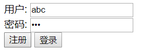
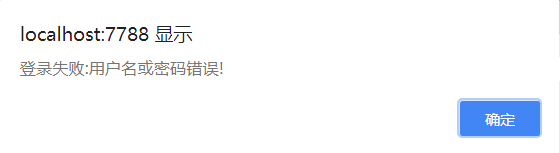
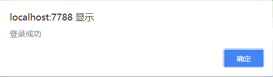

# Node.js 学习笔记


## 目录


1. [Node.js实现第一个HTTPServer](#1)

	- [http模块](#1a)
	- [fs模块](#1b)
	- [querystring模块](#1c)
	- [url模块](#1d)
	- [POST请求](#1e)
	- [实现了用户验证的HTTPServer](#1f)

2. [Node.js模块化、包的制作发布](#2)

3. [Express框架初识](#3)

4. [cookie和session](#4)


***


<a name="1">


## 用Node.js实现第一个httpserver


<a name="1a">

### `http`模块


看一段代码，认识http模块:

```
const http = require('http');

var server = http.createServer(function(req, res){
	// req.url——请求的url资源地址，比如 '/index?abc=123'
    switch (req.url){
        case '/1.html':
            res.write("11111");
            break;
        case '/2.html':
            res.write("2222");
            break;
        default:
            res.write('404');
            break;
    }
    // 结束响应
    res.end();
});
// 不要忘了让服务器保持监听
server.listen(7788);
```

一段官方的实例代码:
```
var http = require('http');
http.createServer(function (req, res) {
	res.writeHead(200, {'Content-Type': 'text/plain'});
	res.end('Hello World\n');
}).listen(1337, '127.0.0.1');
```


***


<a name="1b">


### `fs`模块


**使用方法:**

- `fs.readFile(文件名，回调函数);`

- `fs.writeFile(文件名，内容，回调函数);`

```
fs.readFile('aaa.txt', function (err, data) {
    if(err){
        console.log('读取失败');
    } else {
        console.log(data.toString()); //二进制字节码数据，转换为可见的字符串
    }
});

fs.writeFile("bbb.txt", "hello world", function (err) {
   console.log(err);
});
```


***


<a name="1c">

### `querystring`模块

处理GET请求，需要提取出查询字符串参数。

用最笨的方法:
```
http.createServer(function (req, res) {
    var GET = {}; //存储查询参数键值对
    var url;
    
    if(req.url.indexOf('?') !== -1) {
        var arr = req.url.split('?');
        url = arr[0];
        var arr2 = arr[1].split('&');
        for(var i=0; i < arr2.length; i++){
             var arr3 = arr2[i].split('=');
             GET[arr3[0]] = arr3[1];
        }
    } else {
        url = req.url;
    }
	
	// 这样得到了资源地址url和查询参数GET
    console.log(url, GET); 
    res.write('OK');
    res.end();
}).listen(7788);
```

当然，可以使用`querystring`模块来简化这一操作:

```
const querystring = require('querystring');
var json = querystring.parse("user=hello&pass=123231&age=18");
console.log(json);
// { user: 'hello', pass: '123231', age: '18' }
```

`querystring`模块专门用来解析查询字符串，即?后面的字符串。


***


<a name="1d">


### `url`模块

`querystring`只能解析URL的查询参数部分，而对整个URL进行解析，就需要`url`模块了。

```
const urlLib = require('url');
var obj = urlLib.parse("http://localhost:7788/index?a=123&b=abc");

// 加上true，自动解析query字符串为参数对象
var obj = urlLib.parse("http://localhost:7788/index?a=123&b=abc", true);

console.log(obj); //返回一个对象，如下

Url {
  protocol: 'http:',
  slashes: true,
  auth: null,
  host: 'localhost:7788',
  port: '7788',
  hostname: 'localhost',
  hash: null,
  search: '?a=123&b=abc',
  query: { a: '123', b: 'abc' }, // 不加true的时候值为'a=123&b=abc'
  pathname: '/index',
  path: '/index?a=123&b=abc',
  href: 'http://localhost:7788/index?a=123&b=abc' }

// 可以从中提取出路径和查询参数对象
console.log(obj.pathname, obj.query);
// /index { a: '123', b: 'abc' }
```


***


<a name="1e">


### POST请求

一般用url模块获取pathname和解析GET请求数据，用querystring解析POST请求数据。

```
const http = require('http');
// querystring用来解析post请求的数据，post过来的数据也是类似a=1&b=2的形式
const querystring = require('querystring'); 

http.createServer(function (req, res) {
    //post可以传输很大的数据，并且分块传输

    var str = '';//接收的数据

	// 可能触发两个事件: data和end

    //data——有一段数据到达（很多次）
    var i = 1;
    req.on('data', function (data) {
        console.log('第${i++}次收到数据');
        str += data;
    });

    //end——数据全部到达（一次）
    req.on('end', function () {
        var POST = querystring.parse(str);
        console.log(POST);
    });

}).listen(7788);
```


***


<a name="1f">


### 实现了用户验证的HTTPServer

```
const http = require('http');
const fs = require('fs');
const querystring = require('querystring');
const urlLib = require('url');

// 模拟数据库表
var users = {};

var server = http.createServer(function(req, res){
	// GET数据
	var obj = urlLib.parse(req.url, true)
	var url = obj.pathname;
	var GET = obj.query;
	
	// 存储POST过来的数据
	var str = '';

	req.on('data', function(data){
		str += data;
	});
	req.on('end', function(){
		var POST = querystring.parse(str);
	});
	
	// 分别处理接口、资源文件
	if(url === '/user'){
		// 自定义一个处理用户身份的接口
		switch (GET.act){
			case 'reg':
				// 注册
				if(users[GET.user]){
					res.write('{"ok":false, "msg":"用户名已存在!"}');
				} else {
					users[GET.user] = GET.pass;
					res.write('{"ok":true, "msg":"注册成功!"}');
				}
				break;
			case 'login':
				//登录
				if(!users[GET.user]){
					res.write('{"ok":false, "msg":"该用户不存在!"}');
				} else if(users[GET.user] != GET.pass){
					res.write('{"ok":false, "msg":"用户名或密码错误!"}');
				} else {
					res.write('{"ok":true, "msg":"登录成功"}');
				}
				break;
			default:
				res.write('{"ok":false, "msg":"未知的act"}')
		}
		res.end();
	} else {
		// 读取静态资源文件
		var file_name = './www' + url;
		fs.readFile(file_name, function(err, data){
			if(err){
				res.write('404');
			} else {
				res.write(data);
			}
			res.end();
		});
	}
});

server.listen(7788);
```

后台的简易服务器及身份验证接口基本完成，前台如何协调完成数据传输？

用户注册或登录验证，考虑采用ajax请求。需引入一个封装了ajax请求的工具包: [ajax](./nodejs/ajax.js) 。

```
// user.html
<!doctype html>
<html>
	<head>
		<meta charset="utf-8">
		<title>用户注册登录</title>	
		<script src='ajax.js'></script>
		<script src='getAjax.js'></script>
	</head>
	<body>
		用户: <input type="text" id="user"/><br/>
		密码: <input type="password" id="pass"/><br/>
			<input type="button" value="注册" id="reg_btn">
			<input type="button" value="登录" id="log_btn">
	</body>
</html>

// getAjax.js。调用ajax.js并获取响应数据
window.onload = function(){
	var oTxtUser = document.getElementById('user');
	var oTxtPass = document.getElementById('pass');
	var oBtnReg = document.getElementById('reg_btn');
	var oBtnLog = document.getElementById('log_btn');
	
	oBtnReg.onclick = function(){
		ajax({
			url: '/user',
			type: 'get',
			data: {act: "reg", user: oTxtUser.value, pass: oTxtPass.value},
			success: function(str){
				// 解析从后台传输过来的json响应信息
				var json = eval('(' + str + ')');
				if(json.ok){
					alert("注册成功");
				} else {
					alert("注册失败:" + json.msg);
				}
			},
			error: function(status) {
				alert("通信错误! 错误代码:" + status);
			}
		});
	};
	
	oBtnLog.onclick = function(){
		ajax({
			url: '/user',
			type: 'get',
			data: {act: "login", user: oTxtUser.value, pass: oTxtPass.value},
			success: function(str){
				var json = eval('(' + str + ')');
				if(json.ok){
					alert('登录成功');
				} else {
					alert('登录失败:' +  json.msg);
				}
			},
			error: function(status){
				alert('通信错误! 错误代码:' + status);
			}
		});
	};
};
```


经过以上步骤，一个简易的HTTPServer搭建完毕。

下面测试一下，进入user页面:


在输入框中输入，然后点击注册:




因为初始时用户数据表为空，所以注册成功。

当再次点击时:


测试登录也运行正常:







因为是ajax交互，所以整个过程url不会变化。


***


<a name="2">


## Node.js模块化、包的制作发布


***


<a name="3">


## Express框架初识


***


<a name="4">


## cookie和session


