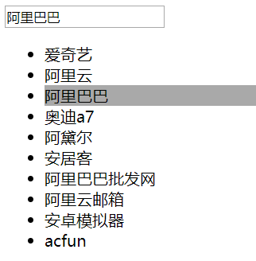

# Vue


## 目录

1. [Vue基本指令、属性及事件](#1)

    - [常用指令、属性绑定及事件绑定](#1a)
    - [bootstrap + Vue实现简易留言](#1b)
    - [模板及过滤器](#1c)
    - [数据交互:vue-resource](#1d)
    - [百度搜索下拉列表](#1e)
    
2. [Vue实例、钩子函数、自定义过滤器及指令](#2)

    - [Vue钩子函数](#2a)
    - [v-text、v-html、v-cloak](#2b)
    - [计算属性computed](#2c)
    - [Vue实例属性及方法](#2d)
    - [循环数据排序处理及自定义过滤器](#2e)


***


<a name="1">


## Vue基本属性及事件


Vue是一个mvvm框架，一套用于构建用户界面的渐进式框架，Vue的核心库只关注视图层，易于上手。

```
<div id="box">
    {{msg}}
</div>

var app = new Vue({
    el: '#box', //选择器
    data: {
        msg: 'hello Vue'
    },
    methods: {
    
    }
});
```

数据和DOM都是关联的、双向绑定的，所有东西都是响应式的，在控制台修改`app.msg`的值，可以看到上例会相应地更新。


<a name="1a">


### 常用指令、属性绑定及事件绑定


`v-model`: 一般表单元素(input)，双向数据绑定


**循环:**

```
v-for="name in arr"
    获取索引：{{$index}}

v-for="name in json"
    获取索引和key：{{$index}}  {{$key}}

v-for="(k,v) in json"
    获取同时获取key和value：k、v
```


#### 事件触发及绑定

```
v-on:click="函数"

v-on:click/mouseout/mouseover/dblclick/mousedown.....

new Vue({
    el:'#box',
    data:{ //数据
        arr:['apple','banana','orange','pear'],
        json:{a:'apple',b:'banana',c:'orange'}
    },
    methods:{
        show:function(ev){    //方法
            alert(1);
        }
    }
});
```

**简写**的事件绑定:`@click=''`

**事件对象**: `@click='show($event)'`——`$event`

**事件冒泡**:

- 阻止冒泡的方式:
    - `ev.cancelBubble = true;`
    - `@click.stop='show($event)';`

**默认行为(默认事件)**:

- 阻止默认行为的方式:
    - `ev.preventDefault();`
    - `@contextmenu.prevent='show($event)';`

**键盘事件**:

- `@keydown`、`@keyup`
- `ev.keyCode`——键码
- 常用键:
    - 回车:`@keyup.13/@keyup.enter`
    - 上下左右: `@keyup.up/@keyup.down/@keyup.left/@keyup.right`


#### 显示或隐藏

`v-show='true/false'`


#### 属性绑定

`v-bind:src=''`，当然还可以绑定width/height/title...

属性绑定可以简写为`:src=''`

注意:

- `` ——效果可以实现，但是会报404错误。
- `` ——效果可以实现，而且不会发404请求。


**两个特殊的属性绑定:**

`class`: 

- `:class="[red]"`
    - red是data中的数据
    - `:class="[red,a,b,c]"`
  
- `:class="{red:a, blue:false}"`
    - red和blue是类名
    - json格式，key为类名，value为布尔值

- `:class="json"`
    
    ```
    data:{
        json:{red:true, blue:false}
    }
    ```

`style`:

- `:style="[c]"`
- `:style="[c,d]"`
- `:style="json"`
- 注意：复合样式，采用驼峰命名法。


***


<a name="1b">


### bootstrap + Vue实现简易留言


[todolist](./Vuejs/todolist.html)


效果图:


***


<a name="1c">

### 模板及过滤器


#### 模板

`{{msg}}` --> 数据更新、模板变化

`{{*msg}}` --> 数据只绑定一次

`{{{msg}}}` --> HTML不转义输出


#### 过滤器

`{{msg| filterA 参数 | filterB 参数}}`

系统提供一些过滤器，用来过滤模板数据。

```
uppercase // 大写 {{'welcome'| uppercase}}
lowercase // 小写
capitalize // 首字母大写
currency // 转换为相同数目的钱 {{amount | currency ￥}}

```

Vue2.0以后可以将过滤器用在v-bind表达式中:

`<div v-bind:id="rawId | formatId"></div>`


***


<a name="1d">


### 数据交互:vue-resource

如果vue想与后台进行数据交互，需要引入插件`vue-resource`。


用法一:

`$http.get/post/jsonp(url[,data][,options]).then(success,error);`

用法二:

```
`$http({
    url:URL,
    data:{},
    method:'get/post/jsonp',
    jsonp:'cb'//cbName
});`
```


#### GET

获取一个普通文本数据:
```
this.$http.get("a.txt").then(function(res){
    alert(res.data); //请求成功，打印数据
}, function(res){
    alert(res.status); //请求失败
});
```

给服务器发送数据:
```
this.$http.get('get.php', {
    a:1,
    b:2
}).then(function(res){
    alert(res.data);
}, function(res){
    alert(res.status);
});
```


#### POST

```
this.$http.post('post.php', {
    a:1,
    b:2
}, {
    //模拟表单提交
    emulateJSON:true //这一行相当于设置Content-Type为application/x-www-form-urlencoded
}).then(function(res){
    alert(res.data); //-1
}, function(res){
    alert(res.status);
});


//post.php
<?php
$a = $_POST['a'];
$b = $_POST['b'];
echo $a - $b; //php通过echo来返回ajax请求的数据
?>
```


#### jsonp

百度搜索的接口:`https://sp0.baidu.com/5a1Fazu8AA54nxGko9WTAnF6hhy/su?wd=a&cb=jshow`

```
this.$http.jsonp('https://sp0.baidu.com/5a1Fazu8AA54nxGko9WTAnF6hhy/su',{
        wd:'a'
    },{
        jsonp:'cb'  //回调函数的名字(key)，默认key就是"callback"，百度的接口key为cb
    }).then(function(res){
        alert(res.data.s);
    },function(res){
        alert(res.status);
    });
```


***


<a name="1e">

### 百度搜索下拉列表

利用jsonp制作一个简单的搜索功能:

[百度搜索下拉列表](./Vuejs/baidu_search.html)


实现效果图:




***


<a name="2">


## Vue实例、钩子函数、自定义指令


<a name="2a">


### Vue钩子函数

在Vue的整个生存周期中，有这么一些钩子函数，来标志不同状态的Vue:

- `created` ——> 实例已经创建

- `beforeCompile` ——> 编译之前

- `compiled` ——> 编译之后

- `ready` ——> 插入到文档中

- `beforeDestroy` ——> 销毁之前

- `destroyed` ——> 销毁之后

注意：此处是Vue 1.0

```
var vm = new Vue({
    el: '#box',
    data:{
        msg:'well'
    },
    methods:{
    },
    created:function(){
        alert('实例已经创建');
    },
    beforeCompile:function(){
        alert('编译之前');
    },
    compiled:function(){
        alert('编译之后');
    },
    ready:function(){
        alert('插入到文档中');
    }
    
    // 下面两个钩子函数只有销毁vue实例对象时才会执行
    // 销毁方法: vm.$destroy();
    beforeDestroy:function(){
        alert('销毁之前');
    },
    destroyed:function(){
        alert('销毁之后');
    }
});
```


生命周期图示:


<a name="2b">


### v-text、v-html、v-cloak

某些时候运行卡顿，向文档插入比较大的段落时，用户可能会看到文档插入之前的花括号标记闪烁，影响体验。

有以下几种途径解决:

- `v-cloak`: 这个指令保持在元素上直到关联实例结束编译。

    示例:常与display进行连用
    
    ```
    [v-cloak] {
        display:none;
    }
    
    <div v-cloak>
        {{message}}
    </div>
    ```

- `v-text`: 这个用来进行数据绑定，更新元素的textContent，用户不会看到花括号。

    ```
    <span v-text="msg"></span>
    <!-- 和下面的一样 -->
    <span>{{msg}}</span>
    ```


- `v-html`: 用来更新元素的innerHTML，内容按照普通HTML插入，而不会作为Vue模板进行编译。

    ```
    <div v-html="html"></div>
    <!-- 和下面的一样 -->
    <div>{{{html}}}</div>
    ```


<a name="2c">


### 计算属性computed

适用于一些场景: 改变a的值，b的值也要自动相应进行变化。

```
var vm = new Vue({
    el:'#box',
    data:{
        a:1
    },
    computed: {
        //这里面放的是b属性，而不是方法
        b:function(){
            //业务逻辑代码
            return this.a + 1;
        }
    }
});
```


**计算属性的操作方法:**

```
computed: {
    // 计算属性实际上是一个对象
    b:{
        get:function(){
            return this.a + 1;
        },
        set: function(val){
            this.a = val;
        }
    }
}
```

当直接给b设置function(){return a+1}，调用的是get方法，值为return的结果。

当给b重新赋值，调用的是set方法，如`vm.b=10`会将`this.a`设置为10，接着b也会变化为11。


***


<a name="2d">


### Vue实例属性

- `vm.$el`: Vue实例使用的根DOM元素。

- `vm.$data`: Vue实例观察的数据对象。Vue 实例代理了对其 data 对象属性的访问，即可以通过vm.attr来访问。

- `vm.$options`: 包含了自定义的属性或方法(即定义在data之外的属性)，获取自定义属性需要通过vm.$options.attr来访问。


#### 实例方法:

- `vm.$mount()`: 用来手动的挂载一个未挂载的实例(即没有指定el选项的实例)。返回值为实例自身，可以链式调用其他实例方法。

    示例: `var vm = new Vue().$mount('#box');`


- `vm.$destroy()`: 完全销毁一个实例。清理它与其它实例的连接，解绑它的全部指令及事件监听器。


- `vm.$log()`: 查看现在data中数据的状态。


***


<a name="2e">


### 循环数据排序处理及自定义过滤器


#### v-for的数据处理

`v-for="value in data"`

如果有重复数据，不会显示，并且会报错。

可以使用`track-by='索引'`来提高循环性能或排序。

```
data:{
  items: [
    { _uid: '88f869d', ... },
    { _uid: '7496c10', ... }
  ]
}

<div v-for="item in items" track-by="_uid">
  <!-- content -->
</div>
```

如果没有一个独特的key，可以使用`track-by='$index'`。

**性能的改善:**

无track-by情况：数据修改时，无论值是否被修改，dom都被重新渲染（控制台可以看到）。

加入track-by属性：数据修改时，不变数据所在的dom不被重新渲染，已改变的数据所在dom才被重新渲染。


#### vue过滤器及自定义过滤器


除了之前介绍的capitalize、lowercase、uppercase、currency过滤器，还有一些强大的过滤器。


`debounce` —— 配合事件、延迟执行。

如:`@keyup="showMsg | debounce 2000"` 将事件触发的函数延迟2秒执行。


**配合数据使用的过滤器:**

- `limitBy <取几个> <从何处开始>`

    如：取数组中最后两条数据。

    `v-for="val in arr | limitBy 2 arr.length-2"`

- `filterBy <keyword>` 用来过滤数据。

    可以用来在数组中获取含有关键字kw的数据。

- `orderBy <kw> 1/-1` 用来给数据按关键字进行排序。

    1为正序，2为倒序。不加关键字，默认按首字母排序。


**自定义过滤器:**

`Vue.filter(name, function(input){});`

使用示例:
```
Vue.filter('toDou', function(input, a, b){
    alert(a + ',' + b);
    return input<10?'0'+input:''+input;
});
```

以上代码自定义了一个过滤器名为`toDou`，用来将个位数格式化为两位数。

在过滤器后可以跟多个参数: `{{a | toDou 1 2}}` ，a为第一个参数，1为第二个，2为第三个...


**自定义一个过滤器，用来将时间戳转换为日期时间:**

```
Vue.filter('date', function(time){
    //注意这里传入的时间戳单位是毫秒
    var oDate = new Date(time);
    return oDate.getFullYear()+'-'+(oDate.getMonth()+1)+'-'+oDate.getDate()+' '+oDate.getHours()+':'+oDate.getMinutes()+':'+oDate.getSeconds();
})
```

还可以结合之前的`toDou`来将日期时间格式化为两位数。


**一般过滤器: model --> 过滤 --> view**

**双向过滤器:**

    ```
    Vue.filter('filterHtml',{
                read:function(input){ //model -> view
                    return input.replace(/<[^<]+>/g,'');
                },
                write:function(val){ //view -> model
                    return val;
                }
    });
    ```

数据和视图双向过滤:

    model -> view

    view -> model


