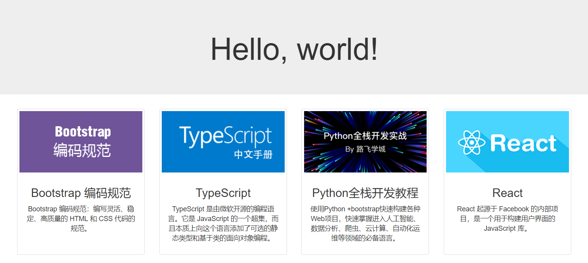

# bootstrap


## 最简单的Bootstrap页面

```
<!DOCTYPE html>
<html lang="zh-CN">
  <head>
    <meta charset="utf-8">
    <meta http-equiv="X-UA-Compatible" content="IE=edge">
    <meta name="viewport" content="width=device-width, initial-scale=1">
    <!-- 上述3个meta标签*必须*放在最前面，任何其他内容都*必须*跟随其后！ -->
    <title>Bootstrap 101 Template</title>

    <!-- Bootstrap -->
    <link href="https://cdn.bootcss.com/bootstrap/3.3.7/css/bootstrap.min.css" rel="stylesheet">

    <!-- HTML5 shim 和 Respond.js 是为了让 IE8 支持 HTML5 元素和媒体查询（media queries）功能 -->
    <!-- 警告：通过 file:// 协议（就是直接将 html 页面拖拽到浏览器中）访问页面时 Respond.js 不起作用 -->
    <!--[if lt IE 9]>
      <script src="https://cdn.bootcss.com/html5shiv/3.7.3/html5shiv.min.js"></script>
      <script src="https://cdn.bootcss.com/respond.js/1.4.2/respond.min.js"></script>
    <![endif]-->
  </head>
  <body>
    <h1>你好，世界！</h1>

    <!-- jQuery (Bootstrap 的所有 JavaScript 插件都依赖 jQuery，所以必须放在前边) -->
    <script src="https://cdn.bootcss.com/jquery/1.12.4/jquery.min.js"></script>
    <!-- 加载 Bootstrap 的所有 JavaScript 插件。你也可以根据需要只加载单个插件。 -->
    <script src="https://cdn.bootcss.com/bootstrap/3.3.7/js/bootstrap.min.js"></script>
  </body>
</html>
```


***


## 容器


1. 流体容器(`container-fluid`)

    - 容器的width为auto，两边有15px的padding。
    - 注意auto和100%不同，width默认值为auto，如果给其添加padding，会削减content的宽度，盒子的总宽度不会变。

2. 固定容器(`container`)

    - 容器的width会随设备分辨率的不同而变化。
    - 分辨率阈值:
    
    | 分辨率范围        | 容器宽度    |  padding  |
    | --------------- | ----------------:| :-------------------------------: |
    | w >= 1200 (lg 大屏PC)      | 容器的width为1170 | 左右padding为15 （注意是borderBox）|
    | 1200 > w >= 992 (md 中屏PC) | 容器的width为970  | 左右padding为15 （注意是borderBox）|
    | 992 > w >= 768 (sm 平板)  | 容器的width为750  | 左右padding为15 （注意是borderBox）|
    | 768 > w (xs 移动手机)        | 容器的width为auto | 左右padding为15 （注意是borderBox）|

3. 流体容器&固定容器 公共样式

  ```
  margin-right: auto;
  margin-left: auto;
  padding-left:  15px;
  padding-right: 15px;  
  ```

4. 固定容器 特定样式
    
    ```
    //顺序不可变(移动设备优先)
      @media (min-width: @screen-sm-min) {
        width: @container-sm;
      }
      @media (min-width: @screen-md-min) {
        width: @container-md;
      }
      @media (min-width: @screen-lg-min) {
        width: @container-lg;
      }
    ```


***


## 栅格系统


1. **行**的设计

    ```
    margin-left: -15px;
    margin-right: -15px;
    ```

2. **列**的源码

    ```
    .make-grid-columns()--->
    
        .col-xs-1, .col-sm-1, .col-md-1, .col-lg-1,
        .col-xs-2, .col-sm-2, .col-md-2, .col-lg-2,
        ...
        .col-xs-12, .col-sm-12, .col-md-12, .col-lg-12{
          position: relative;
          min-height: 1px;
          padding-left: 15px;
          padding-right: 15px;
        }
    
    .make-grid(xs)--->
    
      float-grid-columns(@class);
             * .col-xs-1,.col-xs-2,.col-xs-3,.col-xs-4,...col-xs-12{
             *     float: left;
             * }
      .loop-grid-columns(@grid-columns, @class, width);
             * .col-xs-12{
             *     width:12/12;
             * }
             * .col-xs-11{
             *     width:11/12;
             * }
             * ...
             * .col-xs-1{
             *     width:1/12;
             * } 
      
      //列排序
      .loop-grid-columns(@grid-columns, @class, pull);
      .loop-grid-columns(@grid-columns, @class, push);
             *push                      pull:
             * .col-xs-push-12{         .col-xs-pull-12{      
             *     left:12/12;              right:12/12;
             * }                        }
             * .col-xs-push-11{
             *     left:11/12;
             * }
             * ...                      ...
             * .col-xs-push-1{
             *     left:1/12;
             * } 
             * .col-xs-push-0{           .col-xs-pull-0{
             *     left:auto;               right:auto;
             * }                         }
       //列偏移   
      .loop-grid-columns(@grid-columns, @class, offset);
            * .col-xs-offset-12{
            *  margin-left: 12/12;   
            * }
            * 
            * ...
            *
            * .col-xs-offset-0{
            *  margin-left: 0;   
            * }
    ```


3. 栅格实例

    [响应式栅格布局示例](./demos/栅格实例/index.html)

    效果图:

    

    如果这时候需求变化: 当屏幕尺寸变小时，从左边第一个开始往下掉。
    
    则要在结构上颠倒4块区域，然后利用列偏移使其恢复原样。
    
    [响应式栅格布局示例2](./demos/栅格实例/index02.html)

    **注意一个小坑**: 第三块区域在col-sm-6的时候要偏移col-sm-pull-6，而在col-md-4的时候不需调换位置，但也要写上col-md-pull-0，表示right为auto，由文档流来控制，否则会发生错位。


4. 响应式工具

    给元素设置某个分辨率下隐藏或显示:
    
    如设置768px以下隐藏或显示:
    
    ```
    <div class='hidden-xs'></div>
    <div class='visible-xs'></div>
    ```


5. 栅格盒模型设计的巧妙之处:

    - 容器两边具有15px的padding
    
        - 为了让容器可以包裹住行
    
    - 行两边具有-15px的margin
    
        - 为了能使列嵌套行
    
    - 列两边具有15px的padding
    
        - 为了维护槽宽的规则
        
    


***


## bootstrap定制化


某些时候需要基于bootstrap来定制化设计。

如需要修改栅格系统的槽宽:

- 方法一: 
    
    - 找到less文件夹中的variable.less，将其中@grid-gutter-width设置为自己想要的值，然后去找到入口文件bootstrap.less，重新执行编译即可。

- 方法二:

    - 不动源码，新建一个new.less文件，在原来基础上混合引入新的槽宽:
    
    ```
    @import './less/bootstrap.less';
    @grid-gutter-width: 50px;
    ```

对于后台管理界面，还可以使用一些现成的基于bootstrap的ui组件模板。如:[17素材网](http://www.17sucai.com/search/bootstrap?)


