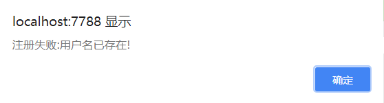

# Node.js 学习笔记


## 目录


1. [Node.js实现第一个HTTPServer](#1)

    - [http模块](#1a)
    - [fs模块](#1b)
    - [querystring模块](#1c)
    - [url模块](#1d)
    - [POST请求](#1e)
    - [实现了用户验证的HTTPServer](#1f)

2. [Node.js模块化、包的制作发布](#2)

3. [Express框架初识](#3)
    
    - [请求处理](#3a)
    - [中间件](#3b)
    - [中间件及链式操作](#3c)

4. [cookie和session](#4)
    
    - [cookie-parser](#4a)
    - [cookie-session](#4b)

5. [模板引擎](#5)

    - [jade](#5a)
        - [jade语法](#5aa)
        - [jade添加内容](#5ab)
        - [demo](#5ac)
    - [ejs](#5b)

6. [Express构建项目](#6)

    - [文件上传](#6a)
    - [模板引擎整合](#6b)
    - [路由](#6c)
    - [Nodejs连接MySQL](#6d)
    - [Express结合模板引擎](#6e)

7. [nodejs中异步操作的代码演进](#nodejs中异步操作的代码演进)

    - [嵌套回调函数](#1-嵌套回调函数)
    - [Promise](#2-promise)
    - [Promisify](#3-promisify)
    - [Generator](#4-generator)
    - [async/await](#5-asyncawait)

***

<br>

<a name="1">


## 用Node.js实现第一个httpserver


<a name="1a">

### `http`模块


看一段代码，认识http模块:

```js
const http = require('http');

var server = http.createServer(function(req, res){
    // req.url——请求的url资源地址，比如 '/index?abc=123'
    switch (req.url){
        case '/1.html':
            res.write("11111");
            break;
        case '/2.html':
            res.write("2222");
            break;
        default:
            res.write('404');
            break;
    }
    // 结束响应
    res.end();
});
// 同时不要忘了让服务器保持监听
server.listen(7788);
```

一段官方的实例代码:
```js
var http = require('http');
http.createServer(function (req, res) {
    res.writeHead(200, {'Content-Type': 'text/plain;charset=utf-8'});
    res.end('Hello World\n');
}).listen(1337, '127.0.0.1');
```


***
<br>


<a name="1b">


### `fs`模块


**简单文件的读取写入:**

- `fs.readFile(文件名，[options，]回调函数);`

- `fs.writeFile(文件名，内容，[options，]回调函数);`

- `fs.rename(旧名字, 新名字, function(err){});`

```js
fs.readFile('aaa.txt', function (err, data) {
    if(err){
        console.log('读取失败');
    } else {
        console.log(data.toString()); //二进制字节码数据，转换为可见的字符串
    }
});

fs.writeFile("bbb.txt", "hello world", function (err) {
   console.log(err);
});
```


<br/>


**流式文件读取与写入:**

当遇到一些大文件的时候，使用简单的读取和写入性能较差，容易导致内存溢出，需要使用流式读取与写入。

`fs.createWriteStream(path[,options])`

- 用来创建一个可写流

- path，文件路径

- options，配置参数

```js
var ws = fs.createWriteStream('hello.txt');

//可以通过监听流的open和close事件来监听流的打开和关闭
//on绑定事件，once绑定一次性的事件
ws.once('open', function(){
    console.log('流打开了');
});

ws.once('close', function(){
    console.log('流关闭了');
});

//通过ws来向文件中写入内容
ws.write('1');
ws.write('2');
ws.write('3');
ws.write('4');

//关闭流
ws.end();
//此处不能用ws.close()，这样的话会发现只写入了1，因为接收端过早关闭。应该使用end()，让发送端关闭。
```

<br>

流式文件读取适用于一些比较大的文件，分多次将文件读取到内存中。

```js
//创建一个可读流
var rs = fs.createReadStream("demo.mp3");

//监听流的开启和关闭
rs.once('open',function(){
    console.log('可读流打开');
});
rs.once('close',function(){
    console.log('可读流关闭');
    //ws.end();当可读流关闭将可写流也关闭
});

//如果要读取一个可读流中的数据，必须要为可读流绑定一个data事件，绑定完后开始分多次读取数据
rs.on('data',function(){
    console.log(data);
    //ws.write(data);可以将读取到的数据写入到可写流中
});

//如果要从可读流中读取数据直接输出到可写流中，有个方便的方法为pipe()
//并且也不必监听流的开启和关闭，会自动在可读流和可写流之间架起一个管道
var ws = fs.createWriteStream('demo2.mp3');
rs.pipe(ws);
```


<br/>

**fs模块的其他方法:**

- `fs.existsSync(path)` —— 检查一个文件是否存在。

- `fs.stat(path, callback)` —— 获取文件的状态。

    - 同步的方法为:`fs.statSync(path)`

    - 返回一个对象，这个对象中保存了当前文件状态的相关信息。

    ```js
    fs.stat('a.mp3',function(err, stat){
        //size 文件的字节大小
        //isFile() 是否是一个文件
        //isDirectory() 是否是一个目录
        console.log(stat.isDirectory());
    });
    ```

- `fs.unlink(path, callback)` —— 删除文件。同步方法为`fs.unlinkSync(path)`。

- `fs.readdir(path[,options], callback)` —— 读取一个文件夹的目录结构。

    - 同步的方法为:`fs.readdirSync(path[,options])`
    
    ```js
    fs.readdir('.', function(err, files){
        //files为一个字符串数组，每一个元素就是一个文件或文件夹的名字
        if(!err){
            console.log(files);
        }
    })
    ```

- `fs.truncate(path, len, callback)` —— 截断文件，将文件修改为指定大小。

    - 同步的方法为:`fs.truncateSync(path, len)`
    
    ```js
    //截取，只留下hello.txt文件中的前10个字节，如果是汉字，占3个字节，可能出现乱码
    fs.truncateSync('hello.txt', 10);
    ```

- `fs.mkdir(path[,mode], callback)` —— 创建一个目录。同步方法为:`fs.mkdirSync(path[,mode])`

- `fs.rmdir(path, callback)` —— 删除一个目录。同步方法为:`fs.rmdirSync(path)`

- `fs.rename(oldPath, newPath, callback)` —— 对文件进行重命名。

    - 同步方法为:`fs.renameSync(oldPath, newPath)`
    
    - 可以在newPath中传入路径，然后将oldPath的文件**剪切**到新路径。

- `fs.watchFile(filename[, options], listener)` —— 监视文件的修改。

    - `options`是配置选项，可以设置监控周期`interval`的毫秒数，注意会影响性能。

    - `listener`是回调函数，当文件发生变化时会调用。
    
    - 回调函数中的两个参数，`curr`是当前文件的状态，`prev`是修改前文件的状态，这两个状态都是`stat`对象。

    ```js
    fs.watchFile('hello.txt', {interval:1000}, function(curr, prev){
        console.log("修改前文件大小:"+prev.size);
        console.log("修改后文件大小:"+curr.size);
    })
    ```


<br/>

**Buffer缓冲区模块**

- `Buffer`的结构和数组很像，操作的方法也和数组类似

- 数组中不能存储二进制的文件，而`Buffer`专门用来存储二进制数据

- 使用`Buffer`不需要引入模块，直接就可使用

- 在`Buffer`中存储的都是二进制数据，但是在显示时都是以16进制的形式显示

- `Buffer`中每一个元素的范围是从`00 ~ ff`、`0 ~ 255`、`00000000 ~ 11111111`

- `Buffer`中的一个元素，占内存中的一个字节

```js
var str = 'Hello world';

//将一个字符串保存到buffer中（可以再通过buf.toString()将缓冲区中的数据转换为字符串）
var buf = Buffer.from(str);

console.log(buf.length); //占用内存的大小（字节数），一个汉字占3个字节。
console.log(str.length); //字符串的长度
console.log(buf); // <Buffer 48 65 6c 6f 20 ...>

//创建一个指定字节的Buffer，一旦指定，不能改变
var buf2 = Buffer.alloc(10); //10个字节的Buffer

//通过索引来操作buf中的元素
buf2[0] = 88;
buf2[1] = 255;
buf2[2] = 0xaa;
buf2[3] = 556; // 超过的位数会舍去，只留下最后8位

//buffer中的元素在内存中的位置都是连续的
//只要数字在控制台或页面中输出，一定是10进制，可以通过toString()来转换进制
```


***
<br>

<a name="1c">

### `querystring`模块

处理GET请求，需要提取出查询字符串参数。

用最笨的方法:
```js
http.createServer(function (req, res) {
    var GET = {}; //存储查询参数键值对
    var url;
    
    if(req.url.indexOf('?') !== -1) {
        var arr = req.url.split('?');
        url = arr[0];
        var arr2 = arr[1].split('&');
        for(var i=0; i < arr2.length; i++){
             var arr3 = arr2[i].split('=');
             GET[arr3[0]] = arr3[1];
        }
    } else {
        url = req.url;
    }
    
    // 这样得到了资源地址url和查询参数GET
    console.log(url, GET); 
    res.write('OK');
    res.end();
}).listen(7788);
```

当然，可以使用`querystring`模块来简化这一操作:

```js
const querystring = require('querystring');
var json = querystring.parse("user=hello&pass=123231&age=18");
console.log(json);
// { user: 'hello', pass: '123231', age: '18' }
```

`querystring`模块专门用来解析查询字符串，即?后面的字符串。


***
<br>

<a name="1d">


### `url`模块

`querystring`只能解析URL的查询参数部分，而对整个URL进行解析，就需要`url`模块了。

```js
const urlLib = require('url');
var obj = urlLib.parse("http://localhost:7788/index?a=123&b=abc");

// 加上true，自动解析query字符串为参数对象
var obj = urlLib.parse("http://localhost:7788/index?a=123&b=abc", true);

console.log(obj); //返回一个对象，如下

Url {
  protocol: 'http:',
  slashes: true,
  auth: null,
  host: 'localhost:7788',
  port: '7788',
  hostname: 'localhost',
  hash: null,
  search: '?a=123&b=abc',
  query: { a: '123', b: 'abc' }, // 不加true的时候值为'a=123&b=abc'
  pathname: '/index',
  path: '/index?a=123&b=abc',
  href: 'http://localhost:7788/index?a=123&b=abc' }

// 可以从中提取出路径和查询参数对象
console.log(obj.pathname, obj.query);
// /index { a: '123', b: 'abc' }
```


***
<br>

<a name="1e">


### POST请求

一般用url模块获取pathname和解析GET请求数据，用querystring解析POST请求数据。

```js
const http = require('http');
// querystring用来解析post请求的数据，post过来的数据也是类似a=1&b=2的形式
const querystring = require('querystring'); 

http.createServer(function (req, res) {
    //post可以传输很大的数据，并且分块传输

    var str = '';//接收的数据

    // 可能触发两个事件: data和end

    //data——有一段数据到达（很多次）
    var i = 1;
    req.on('data', function (data) {
        console.log('第${i++}次收到数据');
        str += data;
    });

    //end——数据全部到达（一次）
    req.on('end', function () {
        var POST = querystring.parse(str);
        console.log(POST);
    });

}).listen(7788);
```

**Node.js作为客户端向第三方接口发送请求:**

```js
var http = require('http');
var util = require('util');

http.get('http://www.xxx',function(res){
  let data = '';
  res.on('data',function(chunk){
    data += chunk;
  });
  res.on('end',function(){
    let result = JSON.parse(data);
    //util.inspect能够将对象转换为字符串，便于调试
    console.log(util.inspect(result));
  })
  //监听error
}).on('error', (e)=>{console.log('错误')});
```

***

<br>

<a name="1f">


### 实现了用户验证的HTTPServer

```js
const http = require('http');
const fs = require('fs');
const querystring = require('querystring');
const urlLib = require('url');

// 模拟数据库表
var users = {};

var server = http.createServer(function(req, res){
    // GET数据
    var obj = urlLib.parse(req.url, true)
    var url = obj.pathname;
    var GET = obj.query;
    
    // 存储POST过来的数据
    var str = '';

    req.on('data', function(data){
        str += data;
    });

    // 数据传输完毕
    req.on('end', function(){
        var POST = querystring.parse(str);
    
        // 分别处理接口、资源文件
        if(url === '/user'){
            // 自定义一个处理用户身份的接口
            switch (GET.act){
                case 'reg':
                    // 注册
                    if(users[GET.user]){
                        res.write('{"ok":false, "msg":"用户名已存在!"}');
                    } else {
                        users[GET.user] = GET.pass;
                        res.write('{"ok":true, "msg":"注册成功!"}');
                    }
                    break;
                case 'login':
                    //登录
                    if(!users[GET.user]){
                        res.write('{"ok":false, "msg":"该用户不存在!"}');
                    } else if(users[GET.user] != GET.pass){
                        res.write('{"ok":false, "msg":"用户名或密码错误!"}');
                    } else {
                        res.write('{"ok":true, "msg":"登录成功"}');
                    }
                    break;
                default:
                    res.write('{"ok":false, "msg":"未知的act"}')
            }
            res.end();
        } else {
            // 读取静态资源文件
            var file_name = './www' + url;
            fs.readFile(file_name, function(err, data){
                if(err){
                    res.write('404');
                } else {
                    res.write(data);
                }
                res.end();
            });
        }
    });
});

server.listen(7788);
```

后台的简易服务器及身份验证接口基本完成，前台如何协调完成数据传输？

用户注册或登录验证，考虑采用ajax请求。需引入一个封装了ajax请求的工具包: [ajax](./nodejs/ajax.js) 。

```html
// user.html
<!doctype html>
<html>
    <head>
        <meta charset="utf-8">
        <title>用户注册登录</title>    
        <script src='ajax.js'></script>
        <script src='getAjax.js'></script>
    </head>
    <body>
        用户: <input type="text" id="user"/><br/>
        密码: <input type="password" id="pass"/><br/>
            <input type="button" value="注册" id="reg_btn">
            <input type="button" value="登录" id="log_btn">
    </body>
</html>
```

```js
// getAjax.js。调用ajax.js并获取响应数据
window.onload = function(){
    var oTxtUser = document.getElementById('user');
    var oTxtPass = document.getElementById('pass');
    var oBtnReg = document.getElementById('reg_btn');
    var oBtnLog = document.getElementById('log_btn');
    
    oBtnReg.onclick = function(){
        ajax({
            url: '/user',
            type: 'get',
            data: {act: "reg", user: oTxtUser.value, pass: oTxtPass.value},
            success: function(str){
                // 解析从后台传输过来的json响应信息
                var json = eval('(' + str + ')');
                if(json.ok){
                    alert("注册成功");
                } else {
                    alert("注册失败:" + json.msg);
                }
            },
            error: function(status) {
                alert("通信错误! 错误代码:" + status);
            }
        });
    };
    
    oBtnLog.onclick = function(){
        ajax({
            url: '/user',
            type: 'get',
            data: {act: "login", user: oTxtUser.value, pass: oTxtPass.value},
            success: function(str){
                var json = eval('(' + str + ')');
                if(json.ok){
                    alert('登录成功');
                } else {
                    alert('登录失败:' +  json.msg);
                }
            },
            error: function(status){
                alert('通信错误! 错误代码:' + status);
            }
        });
    };
};
```


经过以上步骤，一个简易的HTTPServer搭建完毕。

下面测试一下，进入user页面:


在输入框中输入，然后点击注册:


因为初始时用户数据表为空，所以注册成功。而当再次点击时:




测试登录也运行正常:


由于是ajax交互，所以整个过程url不会变化。

***

<br>

<a name="2">


## Node.js模块化、包的制作发布


之前已经学过了Node.js中的`fs`、`http`、`querystring`、`url`等模块，这些都是系统模块。

当然我们也可以制作自定义模块，注意自定义模块在当前路径下也必须要加`./`，否则会被认为是系统模块或第三方模块，然后找不到，会报错。

也可以把自定义模块放到`node_modules`中，这样系统会把它当成是已安装的第三方模块，可以直接用包名引入。

`const mod1 = require('./mod'); //可以不写.js后缀名`

创建自定义模块:

- 对外输出:`exports.xxx = value;`

- 批量输出:`module.exports = {};`

`exports == module.exports // true`


### NPM

`Node.js`的包管理器是`npm`，可以用它来安装和发布各种模块包。

1. 统一下载途径

2. 自动下载依赖

`npm`的命令:

- `npm -v` —— 查看npm的版本。

- `npm version` —— 查看所有模块的版本

- `npm search 包名` —— 搜索包

- `npm install / i 包名` —— 安装包

- `npm remove / r 包名` —— 删除包

- `npm install` —— 下载当前项目所依赖的包

- `npm install 包名 -g` —— 全局安装包(一般是一些工具包)

- `npm install 包名 --save` —— 安装包并添加到依赖中

- `npm install 包名 --save-dev` —— 安装包并添加到开发环境依赖中


<br/>

`node_modules`用来放置安装的模块。

require引入顺序:
1. 如果有`./`，从当前目录中找.
2. 如果没有`./`，先从系统模块中找，再从`node_modules中`找.

<br/>

当制作完成一个模块包后，可以发布到Node.js官网。

发布流程:

1. `npm init`初始化，设置模块的参数，如包名、版本号等。
2. 在模块中写入js文件。
3. 发布:`npm publish`。

取消发布: `npm --force unpublish`

<br/>

配置`cnpm`:

通过`npm`来下载包有时候会特别慢，可以使用淘宝的`npm`镜像`cnpm`来下载安装。

使用`cnpm`代替`npm`：

`npm install -g cnpm --registry=https://registry.npm.taobao.org`

***

<br>

<a name="3">


## Express框架初识


<a name="3a">


### 请求处理

首先安装这个nodejs的web框架: `npm install express`

这是一个非侵入式的框架，保留了http原生的`res.write()`,`res.end()`等方法，并在此基础上增强了一些功能。

比如: `res.write({a:1, b:2})`会报错，因为该方法只能传输`String`或`Buffer`数据。

而Express中新增方法`res.send()`可以传输众多类型的数据，当然也可以传输对象。


Express有三种方法接收用户的请求:
1. `.get('/', function(req, res){});`
2. `.post('/', function(req, res){});`
3. `.use('/', function(req, res){});` // get、post请求都可接受


例如:

```js
const express = require('express');
var server = express();
server.listen(7788);

var users = {};

server.get('/login', function (req, res) {
    // Express提供了req.query来获取查询参数对象
    var user = req.query['user'];
    var pass = req.query['pass'];
    
    //req.originalUrl是请求的资源路径（包括参数）: /login?a=1&b=2
    //req.path是不包括请求参数的资源路径 : /login
    
    if(users[user] == null){
        res.send({ok: false, msg: "此用户不存在"});
    } else {
        if(users[user] !== pass) {
            res.send({ok: false, msg: "密码错误"});
        } else {
            res.send({ok: true, msg: "成功"});
        }
    }
});
```

***

<br>

<a name="3b">


### 中间件

Express中有许多中间件(类似于插件)，比如`express-static`，用来帮助处理静态文件:

```js
const express = require('express');
//中间件需要下载: npm install express-static
const static = require('express-static');

//创建一个基于express的服务器
var server = express();
server.listen(7788);

// 用express-static处理静态资源
server.use(static('./www'));
```

这样我们就不要操心静态资源的路径匹配问题，只需要传入静态资源目录名，`express-static`中间件会自动进行处理，并响应给浏览器。

注意中间件对象需要传递给`use()`作为参数，而不能是`get()`或`post()`，并且也只有use才能接收路由对象作为参数。

***

<br>

<a name="3c">


### 中间件及链式操作

中间件简化了很多我们用原生http需要进行的操作。

接收请求有两种写法，一般第一种是中间件的写法，对所有url都有效。
- `server.use(function () {});`
- `server.use('/', function () {});`

GET请求不需要中间件，直接`req.query`即可得到请求参数。

介绍一个处理POST请求数据的中间件: `body-parser`:

```js
//当然也需要安装:npm install body-parser
const express = require('express');
const bodyParser = require('body-parser');

var server = express();
server.listen(7788);

server.use(bodyParser.urlencoded({
    // 可以设置两个参数
    extended: true, //扩展模式，false为普通模式
    limit: 2*1024*1024 //对数据的大小限制，单位为1Byte
})); //内部进行了链式操作，可以通过req.body来获取中间件处理后的数据

server.use('/', function(req, res){
    console.log(req.body); //POST
});
```

注意: 在该中间件内部进行了**链式操作**，因此后面的use也会执行，可以获取req.body。

如果没有链式操作，两个针对同一个请求的use方法，只会执行前一个。


**链式操作原理(body-parser内部实现):**

```js
// 其实每个方法还有一个next参数，这是一个函数，可以执行它来进行下一步链式操作。
server.use(function(req, res, next){
    var str = '';
    req.on('data', function(data){
        str += data;
    });
    req.on('end', function(){
        req.body = querystring.parse(str);
        next(); // 因为接收数据是异步操作，next要写在这里。
    });
});
```


**链式操作应用场景:**

比如前一个操作是读取数据库，后一个操作是获取数据渲染页面，如果前一个操作失败了，就没有必要next，如果成功，理应next，进行链式操作。


***

<br>

<a name="4">


## cookie和session


HTTP是无状态的，cookie、session，用来保持用户的会话状态。

cookie: 在浏览器中保存一些数据，每次请求都会带过来，可以修改，不安全。存储大小有限（4k）。

session: 保存数据，保存在服务端，安全。基于cookie，不能独立存在，sessionid在cookie中存放。

需要安装的模块:

- 读取cookie: `cookie-parser`

- session: `cookie-session`


***
<br>

<a name="4a">


### `cookie-parser`

```js
const express = require('express');
const cookieParser = require('cookie-parser');

var server = express();
server.listen(7788);

//一个方便读取cookie的中间件
server.use(cookieParser()); //可以通过req.cookies访问cookie属性

server.use('/', function(req, res){
    // 给cookie添加签名，虽然不能加密，但是可以防止篡改(可以decodeURIComponent看出只是后面加了一串字符而已)
    // 设置密钥，如果在cookieParser中传入了密钥，这里就会自动设置，并且可以用signedCookies读取去除签名后的cookie
    //req.secret = 'abcdefg';

    // 设置签名
    res.cookie('user', 'Tom', {signed:true});
    
    // 添加cookie的同时可以设置路径、过期时间
    // res.cookie('user', 'Tom', {path:'/aaa', maxAge:30*24*3600*1000});
    
    console.log(req.cookies);
    /*{user: 's:Tom.JdV+YMqRTlDDUg7VsmfMBbf5xGIrFuyTy58SCi0qjys',
       *session: 'eyJjb3VudCI6M30=',
       *'session.sig': '3jqK3jKkcSkWMWc-AQ00oFW3FY4' }
       */
      console.log(req.signedCookies);
      // {} 因为没有往cookieParser中传入密钥，所以不会去除签名，signedCookies为空。
    res.send('OK');
});
```


**设置cookie:**

- 参数分别为，key、value、options。
- path规定了在某个路径下才能获取的cookie（注意往上级目录、直到根目录也可以访问该cookie，但不同分支的不能访问）
- maxAge以毫秒为单位
- `res.cookie('user', 'Tom', {path: '/aaa', maxAge: 30*24*3600*1000, signed:true});`


**那么我们如何获取去掉签名的cookie呢？**

可以通过cookie-parser，往里面传入密钥参数，得到原cookie: 

`server.use(cookieParser('abcdefg'));`

```js
console.log(req.cookies);// {session: 'eyJjb3VudCI6M30=','session.sig': '3jqK3jKkcSkWMWc-AQ00oFW3FY4'}
console.log(req.signedCookies); // {user:'Tom'}

```

同时内部也进行了校验，确认cookie没有经过篡改。

cookie一般不需要全部签名，否则占用太大空间，
需要注意: `req.cookies`得到的是没有签名和没有去除签名的cookie，去除签名的cookie要用`req.signedCookies`获取。


**删除cookie:**

`res.clearCookie('user');`

由于cookie存在浏览器端，所以不能简单的通过delete删除。


***
<br>

<a name="4b">


### `cookie-session`


```js
const express = require('express');
const cookieParser = require('cookie-parser');
const cookieSession = require('cookie-session');

var server = express();
server.listen(7788);

server.use(cookieParser());
server.use(cookieSession({
    //为了安全必须给session指定密钥
    name: 'sess', //可以给sessionID指定在cookie中的名字
    keys: ['aaa', 'bbb', 'ccc'], //必选参数，会循环使用数组中的密钥对session数据进行加密
    maxAge: 2*3600*1000  //session有效期，单位毫秒
}));

server.use('/', function (req, res) {
    // console.log(req.session);
    if(req.session['count'] == null){
        req.session['count'] = 1;
    } else {
        req.session['count']++;
    }
    console.log(req.session['count']);
    res.send('ok');
});
```


**删除session**: `delete req.session`


***

<br>

<a name="5">


## 模板引擎

模板引擎: 渲染生成页面

两种常见的:

- `jade` -- 破坏式、侵入式、强依赖

- `ejs` -- 保留式、非侵入式、弱依赖


<a name="5a">


### jade

```js
const jade = require('jade');
const fs = require('fs');

// 可以自动补全标签
// var str = jade.render('html');
// console.log(str); // <html></html>

// renderFile读取渲染文件
// pretty增加了换行和缩进效果
var str = jade.renderFile('./www/1.jade', {pretty: true}); //读取文件，渲染内容
console.log(str);

// 可以写入html，看看效果
fs.writeFile('./build/jade1.html', str, function (err) {
    if(err){
        console.log("写入失败");
    } else {
        console.log("写入成功");
    }
});
```


***
<br>

<a name="5aa">


#### jade语法

1. 根据缩进规定层级
2. 属性放在()里面，逗号分隔
3. 内容空一格，跟在标签后


例如:

- `script(src='a.js')`
- `link(href='a.css', rel='stylesheet')`
- `a(href='http://www.baidu.com/') 百度`
- `script alert('hello')`

一个jade文件:
```js
html
    head
        style
        script(src='ajax.js')
        link(href='a.css', rel='stylesheet')
    body
        ul
            li
                input(type='text', id='txt1')
            li
            li
        div
```


**对于style属性，有两种写法:**

1. 普通属性写法:
    - `div(style='width:200px; height:200px; background:red;')`
2. json形式
    - `div(style={width: '200px', height:'200px', background:'red'})`

**对于class属性，也有两种写法:**

1. 普通写法
    - `div(class='fl left-wrap active')`
2. 数组形式
    - `div(class=['fl', 'left-wrap', 'active'])`


**一些简写属性写法:**

- `div.box //<div class="box"></div>`

- `div#div1 // <div id="div1"></div>`


若非要给元素传入json格式属性: `div&attributes({title: 'aaa', id: 'div1'})`。


***

<br>

<a name="5ab">

#### jade添加内容


- 如果要在标签内加入多行内容，可以使用 `|`:

    ```js
    html
        head
            script
                |window.onload = function(){
                | var oBtn = document.getElementById('id');
                |};
        body
    ```

- 也可以使用`.`，代表该标签内所有下一级内容都原样输出:

    ```js
    html
        head
            script.
                window.onload = function(){
                    var oBtn = document.getElementById('id');
                };
        body
    ```

- 可以使用`include`来引入外部js，增加复用性:

    ```js
    html
        head
            script
                include a.js
        body
            |abc
            |123
    ```

- 如果需要在模板内容中引入变量，在渲染时传入参数:

    ```js
    // demo.jade
    html
        head
        body
            div 我的名字: #{name}
            div(style=json)
            div(class=arr)
            div(class=arr class='active') // 会自动融合属性
    
    // demo.js
    const jade = require('jade');
    console.log(jade.renderFile('demo.jade', {pretty: true, 
        name: 'Tom',
        json: {width:'200px', height:'200px', background:'red'},
        arr: ['aaa', 'left-wrap']
    }));
    ```


- 在jade模板中编写js代码:

    ```js
    // demo.jade
    html
        head
        body
            // 前面加-，会让这行代码执行，而不会显示出来
            -var a = 1;
            -var b = 2;
            div 结果是: #{a+b} // 会输出3

            span #{a}
            span=a // 简写，效果和 span #{a}一样

            // 使用for循环
            -for(var i=0;i<arr.length;i++)
                div=arr[i]

            // if/else语句
            -if(a%2==0)
                div(style={background:'red'})
            -else
                div(style={background:'green'})
            
            // switch语句
            case a
                when 0
                    div aaa
                when 1
                    div bbb
                default
                    |匹配失败
    
    // demo.js
    jade.renderFile('demo.jade', {pretty:true, arr:['hello', '123', 'abc']})
    ```


- 向模板中输出不转义的html标签:

    ```js
    // demo.jade
    html
        head
        body
            div!=content
    
    // demo.js
    jade.renderFile('demo.jade', {pretty:true, content:'<h2>hello world<h2>'})
    ```

***

<br>

<a name="5ac">


#### demo

通过一个demo来了解jade的用法:

**demo.jade:**

```
doctype
html
    head
        meta(charset='utf-8')
        title jade测试页面
        style.
            div {
                width:100px;
                height: 100px;
                background: red;
                float: left;
                margin: 10px;
                text-align: center;
                line-height: 100px;
            }
            div.last {clear:both}
    body
        - var a=0
        while a < 12
            if a%4===0 && a!==0
                div.last #{a++}
            else
                div=a++
```


**jade.js:**

```js
const jade = require('jade');
const fs = require('fs');

var str = jade.renderFile('./www/demo.jade', {pretty: true});

fs.writeFile('./build/jade_demo.html', str, function (err) {
    if (err){
        console.log("写入失败");
    } else {
        console.log("写入成功");
    }
});
```


**jade_demo.html:**


**html网页效果:**


***

<br>

<a name="5b">


### ejs


demo.js:

```js
const ejs = require('ejs');

ejs.renderFile('demo.ejs', {name: 'Tom'}, function(err, data){
    console.log(data);
});
```


#### ejs语法

- 传入变量

    - `<%= name %>`
    
    - `<%= json.arr[0].user %>`
    
    - `<%= 12+5 %>`
    

- ejs中插入js代码

    ```html
    <!doctype html>
    <html>
    <head>
        <meta charset="UTF-8">
        <title>ejs插入js代码</title>
    </head>
    <body>
        <%
        var str = '<div></div>';
        %>
        <%= str %> //会将str标签转义输出
        <%- str %> // 不会转义，将str原样输出
    
        // if/else语句
        <% if(type == 'admin'){ %>
        <% include ./style/admin.css %> //出现了include，并不是js中的语法，所以要单独的<%%>
        <% } else { %>
        <% include ./style/user.css %>
        <% } %>
        
    </body>
    </html>
    ```

- ejs中引入外部文件

    ```html
    <!doctype html>
    <html>
    <head>
        <meta charset="UTF-8">
        <title>ejs插入js代码</title>
    </head>
    <body>
    
        <% for(var i=0; i<5; i++){ %>
        
        <% include a.txt %> //会循环输出5次a.txt中的内容
        
        // 注意不能往include中传入变量， 如 include css_path，否则无法找到。
        
        <% } %>
    
    </body>
    </html>
    ```

***

<br>


<a name="6">

## Express构建项目


前面已经初步学习了Express和模板引擎的使用，下面将它们结合一起进行应用。

1.主体
2.cookie、session
3.数据
4.模板引擎
5...


**快速构建:**

想要快速构建一个Express项目的框架，可以使用`express-generator`来生成，就像Vue中的`vue-cli`一样。

安装: `npm install -g express-generator`

生成: `express server`

这样就生成一个目录名为server的Express项目框架。


***
<br>

<a name="6a">


### 文件上传

先填补之前留下的一个坑，`body-parser`为什么不是很好的解析post数据的模块？

因为它只能解析`application/x-www-form-urlencoded`类型的数据，对于包含上传文件的`multipart/form-data`表单，
则需要使用`multer`中间件。

- `body-parser` ——解析post数据
    - `server.use(bodyParser.urlencoded());`
    - `req.body`获取数据

- `multer` ——解析post文件
    - `var obj = multer({dest:'upload/'});`
    - `server.use(obj.any());`
    - `req.files`获取文件

下面通过一个例子来展现如何使用`multer`处理上传文件，如何用`path`解析出文件扩展名，如何用`fs`来重命名上传的文件。


**upload_form.html:**
```html
<!DOCTYPE html>
<html lang="en">
<head>
    <meta charset="UTF-8">
    <title>upload</title>
</head>
<body>
<form action="http://localhost:7788/" method="post" enctype="multipart/form-data">
    <input type="file" name="f1"><br>
    <input type="submit" value="上传">
</form>
</body>
</html>
```

**file_upload.js:**

[file_upload](./nodejs/file_upload.js)


解决了数据的处理问题后，我们可以简单的把之前学过的整合到一起:

```js
const express = require('express');
const expressStatic = require('express-static');
const cookieParser = require('cookie-parser');
const cookieSession = require('cookie-session');
const bodyParser = require('body-parser');
const multer = require('multer');


var server = express();
server.listen(7788);

//解析cookie
server.use(cookieParser('adasdasfadqw'));

//使用session
var arr=[];
for(var i=0; i<10000; i++){
    arr.push('keys_' + Math.random());
}
server.use(cookieSession({name: 'sess_id', keys:arr, maxAge: 20*3600*1000}));

//post数据
server.use(bodyParser.urlencoded({extended: false}));
server.use(multer({dest:'./www/upload'}).any());

//用户请求
server.use('/', function (req, res, next) {
    console.log(req.query, req.body, req.files, req.cookies, req.session);
    next();
});

//static数据
server.use(expressStatic('./www'));
```

***

<br>

<a name="6b">


### 模板引擎整合

接下来处理模板问题。

通过一个中间件`consolidate`来整合所有的模板引擎，以便和Express进行交互。

```js
// 配置模板引擎
// 输出何种格式
server.set('view engine', 'html');
// 模板文件放在哪里
server.set('views', '/views');
// 使用哪种模板引擎
server.engine('html', consolidate.ejs);

// 渲染模板文件
server.use(function(req, res){
    res.render(模板文件, {数据});
});
```

**使用示例:** [consolidate](./nodejs/consolidate_demo.js)

***

<br>

<a name="6c">


### 路由

router——路由

把不同的目录对应到不同的模块。

比如:
```
xxx.com/user —— mod_users
xxx.com/news —— mod_news
...
```

Router可以看做一个迷你的server，它也可以get、post、use。

**操作流程:**

1. 创建router

    `var router = express.Router();`

2. 把router添加到server

    `server.use('/user', router);`

3. router内部

    `router.get('/1.html', function(){});`


**使用示例:** [server_router](./nodejs/server_router.js)


**注意: Router中还可以嵌套Router**

```js
var router = express.Router();
server.use('/user', router);

var r = express.Router();
router.use('/user_mod', r);
```

***

<br>

<a name="6d">


### Node.js连接MySQL


**操作流程:**

1. 电脑安装mysql(server)

2. npm下载mysql模块(client)

3. 连接mysql: 

    `var db = mysql.createConnection(host, port, user, password, database);`

4. SQL语句: 增删改查


**使用示例:**

```js
// 使用MySQL，安装后，下载Navicat来进行数据库操作

// NodeJS默认不支持mysql，所以需要安装第三方模块: mysql

// SQL标准写法:
// 1. 关键字大写
// 2. 库、表、字段都需要加上``

const mysql = require('mysql');

//创建连接
var db = mysql.createConnection({host:'localhost', user:'root', password:'mysql', database:'demo01'});

//数据库操作: query(SQL, callback)
db.query("SELECT * FROM `user_table`;", function (err, data) {
    if(err){
        console.log('出错了', err);
    } else {
        console.log('成功了', data);
        // 可以将查询数据转成JSON传输给前台
        console.log(JSON.stringify(data));
    }
});
```


**注意: 一般为了避免频繁地建立连接，会创建一个数据库连接池，让连接缓存并可重新利用，提高效率。**

```js
const db = mysql.createPool({});
```


***

<br>

<a name="6e">


### Express结合模板引擎


简单归纳一下Express构建一个项目的大致流程:


以一个新闻app首页为例:

1. 确定数据字典，根据数据字典来设计数据表，将数据导入MySQL。

    - 比如上面的新闻首页，可以看出需要创建至少两个表: banner和article.
    - banner数据表需要字段: id、img_src、title、sub_title.
    - article数据表需要字段: id、title、summary、content、author、author_img、post_time.

2. nodejs连接数据库。

    `const db = mysql.createPool({host:'localhost', user:'root', password:'mysql', database:'app'});`

3. Express创建服务器、监听端口并配置模板引擎。

    - 当然还可以加入中间件来设置解析cookie和session、解析post数据，这些前面都已经学过，此处不是必要。

    - 配置模板引擎:

        ```js
        server.set('view engine', 'html');
        server.set('views', './templates');
        server.engine('html', consolidate.ejs);
        ```

4. 处理URL，返回不同的页面。

    - 用户进入首页时: 先查询banner数据、再查询article数据、最后渲染，需要设置成链式操作。

        ```js
        // 查询banner
        server.get('/', (req,res,next)=>{
            db.query('SELECT * FROM banner', (err,data)=>{
                if(err){
                    res.status(500).send('database error').end();
                } else {
                    res.banners = data;
                    // banner查询正常才进行下一步article的查询
                    next();
                }
            });
        });
        // 查询articles数据
        server.get('/', (req,res,next)=>{
            db.query('SELECT ID,title,summary FROM article',(err,data)=>{
                if(err){
                    res.status(500).send('database error').end();
                } else {
                    res.news = data;
                    // banner和article数据都正常，接下来进行渲染
                    next();
                }
            });
        });
        // 渲染index
        server.get('/',(req,res)=>{
            res.render('index.ejs', {banners:res.banners, news:res.news});
        });
        ```

    - 首页点击，进入文章详情页面

        ```js
        //文章详情页面，考虑将url请求设置为 /article?id=1 这种
        server.get('/article', function(req, res){
            //检查url是否带有id
            if(req.query.id){
                //去数据库查询对应id的文章是否存在
                db.query(`SELECT * FROM article WHERE ID=${req.query.id}`, (err,data)=>{
                    if(err){
                        //数据查询出错
                        res.status(500).send('database error').end();
                    } else {
                        //数据不存在
                        if(data.length === 0){
                            res.status(404).send('文章找不到').end()
                        } else {
                            var artData = data[0];
                            // 自己写一个common.js，引入用来将时间戳格式化为日期，将内容分段
                            artData.pDate = common.time2date(artData.post_time);
                            artData.pCon = common.con2p(artData.content);
                            res.render('context.ejs', {article:artData});
                        }
                    }
                });
            } else {
                res.status(404).send('请求的文章找不到').end();
            }
        });
        ```

5. 静态资源处理。

    `server.use(expressStatic('./www'));`


***

<br>

## nodejs中异步操作的代码演进

`node.js` 4.x版本增加了许多ES6语法特性（如`const`/`let`/`class`/箭头函数）的支持

`node.js` 6.x版本囊括了绝大多数的ES6语法特性以及部分ES7特性

`node.js` 8.x版本更支持了ES8语法（如`async`/`await`）

此后的版本也在频繁不断地更新，纳入许多新特性。

关于NodeJS中异步函数的写法，也在不断进行改善优化：


### 1. 嵌套回调函数
```js
const fs = require('fs')

fs.readFile('demo.json', (err, data) => {
  if(err) return console.log(err)
  data = JSON.parse(data)
  console.log(data.name)
})
```
这是`NodeJS`中比较原始的一种写法，将回调函数作为异步函数的参数，当异步操作过多，函数不断嵌套，很容易形成回调地狱。

### 2. Promise
```js
function readFileAsync(path){
  return new Promise((resolve, reject) => {
    fs.readFile(path, (err, data) => {
      if(err) reject(err)
      else resolve(data)
    })
  })
}

readFileAsync('demo.json')
  .then(data => {
    data = JSON.parse(data)
    console.log(data.name)
  })
  .catch(err => {
    console.log(err)
  })
```
当`NodeJS`中开始原生支持`Promise`，我们可以将异步函数封装成`Promise`，方便后续异步操作，摆脱了不断嵌套的回调函数。

### 3. Promisify
```js
const util = require('util')

util.promisify(fs.readFile)('demo.json')
  .then(JSON.parse)
  .then(data => {
    console.log(data.name)
  })
  .catch(err => {
    console.log(err)
  })
```
`NodeJS`8.x版本在`util`模块中新增了一个工具函数`promisify`，它将一个接收回调函数参数的函数转换成一个返回`Promise`的函数。这样一来我们可以省略自己封装`Promise`函数的过程，大大减少了代码体积。

### 4. Generator
`Promise`的出现解决了回调函数地狱问题，将函数嵌套改成了链式调用，但是紧接着又迎来了新的问题：`Promise`使用了`then`方法来加载执行回调函数，当业务比较复杂的时候，一连串的`then`让代码显得比较冗余，并且语义也不清楚。
```js
readFile(fileA)
.then(function (data) {
  console.log(data.toString())
})
.then(function () {
  return readFile(fileB)
})
.then(function (data) {
  console.log(data.toString())
})
.catch(function (err) {
  console.log(err)
})
```

ES6中的`generator`函数就是一个初步的解决方案，和`Promise`一起让异步代码能写得更加清晰明确。

`generator`函数可以暂停执行和恢复执行，这是它能封装异步任务的根本原因。它可以交出函数的执行权，并与函数体内外进行数据交换。
```js
var fetch = require('node-fetch')

// ----generator函数----
function* gen(){
  var url = 'https://api.github.com/users/github'
  var result = yield fetch(url)
  console.log(result.bio)
}

// ----执行器----
//返回迭代器对象
var g = gen()
//执行next获取结果对象
var result = g.next()
//response对象是一个Promise
result.value.then(function(data){
  //data.json()也是一个Promise
  return data.json()
}).then(function(data){
  // 往next()传入参数，会进入函数体，作为上阶段异步任务的返回结果（变量result）
  g.next(data)
})
```

从以上代码可以看出，虽然`generator`函数将异步操作表示得很清晰，但是需要编写执行器来进行流程管理，使其自动运行。

著名程序员TJ Holowaychuk发布了`co`模块来帮助执行`generator`函数，模块内部针对`yield`命令后的各种数据类型分别编写了自动执行器，此时我们定义完`generator`函数后，只需要`co(gen)`即可自动执行。
```js
const co = require('co')

var gen = function* (){
  var f1 = yield readFile('demo1.json')
  var f2 = yield readFile('demo2.json')
  console.log(f1.toString())
  console.log(f2.toString())
}

co(gen)
```

此后出现的`async`函数其实就是`generator`函数的语法糖，语义更加明确，并且内置执行器，不需要`co`模块或手动调用`next`方法，所以当`async/await`出现后，被称为是异步操作的终极解决方案，`generator`函数自然就被取代了。

`co.js`也是著名`Node.js`框架`Koa1`的核心依赖库，而当`async/await`在`Node.js`中原生支持后，`co.js`也停止了维护，依赖于`async/await`的`Koa2`开始普及。

关于`generator`详细请参考[Generator 函数的异步应用](http://es6.ruanyifeng.com/#docs/generator-async)。


### 5. async/await
随着ES8规范中明确了`async/await`的语法，`NodeJS`8.x版本也加入了相应特性的支持，我们可以使用这个异步操作的“终极解决方案”来让代码更加简洁、清晰、易读。
```js
const fs = require('fs')
const util = require('util')
const readAsync = util.promisify(fs.readFile)

async function read(){
  try {
    let data = await readAsync('demo.json')
    data = JSON.parse(data)
    console.log(data.name)
  } catch (err) {
    console.log(err)
  }
}

read()
```

如果服务器上的`NodeJS`版本较低，并不支持这些新的语法特性，那么我们可以使用`Babel`来将含有较新语法的代码向下编译为兼容运行环境的代码。


### 5. asyncawait


